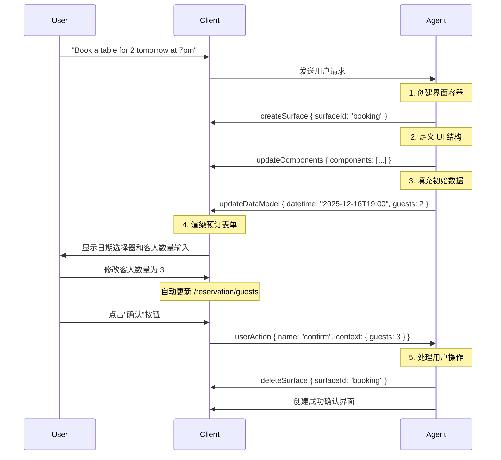

# @ant-design/x-card

`@ant-design/x-card` 是一个基于 [A2UI 协议](https://a2ui.org/concepts/data-flow/) 的动态卡片渲染组件，让 AI Agent 能够通过结构化的 JSON 消息流，动态构建和渲染交互式界面。

## 什么是 A2UI？

A2UI（Agent-to-User Interface）是一个开放协议，允许 AI Agent 通过声明式的 JSON 消息序列描述交互意图，由前端运行时动态渲染为原生 UI 组件。

### 核心设计理念

A2UI 建立在三个核心思想之上：

1. **流式消息（Streaming Messages）**：UI 更新以 JSON 消息序列的形式从 Agent 流向客户端
2. **声明式组件（Declarative Components）**：UI 以数据形式描述，而非代码编程
3. **数据绑定（Data Binding）**：UI 结构与应用状态分离，实现响应式更新

### 为什么选择 A2UI？

与传统让 AI 直接生成 HTML 不同，A2UI 采用结构化数据流的方式，具有显著优势：

| 特性         | A2UI                                            | AI 生成 HTML                            |
| ------------ | ----------------------------------------------- | --------------------------------------- |
| **安全性**   | 仅使用预定义组件目录（Catalog），无代码执行风险 | 可能包含恶意脚本，存在注入风险          |
| **跨平台**   | 一套数据结构自动适配 Web、移动端等多端原生组件  | HTML 需额外适配不同设备，易出现样式错乱 |
| **流式渲染** | 支持渐进式渲染，用户体验流畅                    | 需等待完整响应，加载时间长              |
| **LLM 友好** | 扁平 JSON 结构，支持增量生成，降低 AI 负担      | 需生成完整 HTML 结构，易出现语法错误    |
| **维护成本** | 组件统一管理，更新只需修改客户端库              | 每个 HTML 界面需单独调试                |

## 数据流架构

A2UI 遵循单向数据流原则，确保数据流向清晰可预测：

```
Agent (LLM) → A2UI Generator → Transport (SSE/WebSocket/A2A)
                    ↓
Client (Stream Reader) → Message Parser → Renderer → Native UI
```

### 数据流生命周期

以餐厅预订为例，展示完整的数据流过程：



## 协议版本

`@ant-design/x-card` 同时支持 A2UI 协议的 v0.8 和 v0.9 两个版本。了解两个版本的差异有助于选择合适的协议版本并进行迁移。

### 版本对比

| 特性             | v0.8                                       | v0.9                          |
| ---------------- | ------------------------------------------ | ----------------------------- |
| **版本标识**     | 无显式 version 字段                        | 显式的 `version: 'v0.9'` 字段 |
| **Surface 创建** | 隐式创建（首个 updateComponents 自动创建） | 显式 `createSurface` 命令     |
| **数据模型更新** | 使用 `contents` 数组                       | 使用 `path` 和 `value` 字段   |
| **组件定义**     | 较复杂的嵌套结构                           | 更简洁的扁平结构              |
| **推荐程度**     | 已弃用，仅用于兼容                         | **推荐使用**                  |

### v0.8 消息格式（已弃用）

v0.8 使用隐式的 Surface 创建方式，当 Agent 发送第一个 `updateComponents` 时自动创建 Surface：

```typescript
// v0.8 没有显式的 version 字段
{
  updateComponents: {
    surfaceId: 'booking',
    catalogId: 'https://example.com/catalogs/booking/v1/catalog.json',
    components: [
      {
        id: 'root',
        component: 'Column',
        children: ['header', 'content']
      }
    ]
  }
}
```

**数据模型更新**使用 `contents` 数组：

```typescript
{
  updateDataModel: {
    surfaceId: 'booking',
    contents: [
      {
        op: 'replace',
        path: '/reservation/guests',
        value: 3
      }
    ]
  }
}
```

### v0.9 消息格式（推荐）

v0.9 引入显式的版本标识和 Surface 创建命令，使协议更加清晰和可控：

```typescript
// 显式创建 Surface
{
  version: 'v0.9',
  createSurface: {
    surfaceId: 'booking',
    catalogId: 'https://example.com/catalogs/booking/v1/catalog.json'
  }
}

// 更新组件
{
  version: 'v0.9',
  updateComponents: {
    surfaceId: 'booking',
    components: [
      {
        id: 'root',
        component: 'Column',
        children: ['header', 'content']
      }
    ]
  }
}
```

**数据模型更新**使用更直观的 `path` 和 `value` 字段：

```typescript
{
  version: 'v0.9',
  updateDataModel: {
    surfaceId: 'booking',
    path: '/reservation/guests',
    value: 3
  }
}
```

### 迁移指南

如果您正在使用 v0.8，建议按以下步骤迁移到 v0.9：

#### 1. 添加版本标识

所有消息添加 `version: 'v0.9'` 字段：

```typescript
// v0.8
{ updateComponents: { ... } }

// v0.9
{ version: 'v0.9', updateComponents: { ... } }
```

#### 2. 显式创建 Surface

在发送 `updateComponents` 之前，先发送 `createSurface`：

```typescript
// v0.8：隐式创建
{ updateComponents: { surfaceId: 'booking', catalogId: '...', components: [...] } }

// v0.9：显式创建
[
  { version: 'v0.9', createSurface: { surfaceId: 'booking', catalogId: '...' } },
  { version: 'v0.9', updateComponents: { surfaceId: 'booking', components: [...] } }
]
```

#### 3. 简化数据模型更新

将 `contents` 数组改为 `path` + `value`：

```typescript
// v0.8
{
  updateDataModel: {
    surfaceId: 'booking',
    contents: [
      { op: 'replace', path: '/guests', value: 3 }
    ]
  }
}

// v0.9
{
  version: 'v0.9',
  updateDataModel: {
    surfaceId: 'booking',
    path: '/guests',
    value: 3
  }
}
```

#### 4. 批量更新数据

v0.9 支持更新整个对象，减少消息数量：

```typescript
// v0.8：需要多条消息
[
  { updateDataModel: { surfaceId: 'booking', contents: [{ op: 'add', path: '/date', value: '2025-12-16' }] } },
  { updateDataModel: { surfaceId: 'booking', contents: [{ op: 'add', path: '/guests', value: 2 }] } }
]

// v0.9：一条消息即可
{
  version: 'v0.9',
  updateDataModel: {
    surfaceId: 'booking',
    path: '/reservation',
    value: { date: '2025-12-16', guests: 2 }
  }
}
```

### 向后兼容性

`@ant-design/x-card` 同时支持两个版本，您可以：

```tsx
import type { XAgentCommand_v0_8, XAgentCommand_v0_9 } from '@ant-design/x-card';

// 自动检测版本并正确处理
const commands: (XAgentCommand_v0_8 | XAgentCommand_v0_9)[] = [
  // v0.8 消息
  {
    updateComponents: {
      /* ... */
    }
  },

  // v0.9 消息
  {
    version: 'v0.9',
    createSurface: {
      /* ... */
    }
  }
];

<XCard.Box commands={commands}>{/* ... */}</XCard.Box>;
```

组件会根据是否存在 `version` 字段自动判断协议版本，并正确处理消息。

## 核心消息类型

`@ant-design/x-card` 完整实现了 A2UI 协议 v0.9 的核心命令系统：

### 1. createSurface - 创建界面容器

创建一个新的 UI 容器（Surface），每个 Surface 拥有独立的组件树和数据模型。

```typescript
{
  version: 'v0.9',
  createSurface: {
    surfaceId: 'booking',  // 界面唯一标识
    catalogId: 'https://example.com/catalogs/booking/v1/catalog.json'  // 组件目录
  }
}
```

### 2. updateComponents - 更新组件结构

定义或更新 Surface 中的 UI 组件，采用邻接表模型（Adjacency List）。

```typescript
{
  version: 'v0.9',
  updateComponents: {
    surfaceId: 'booking',
    components: [
      // 根容器
      {
        id: 'root',
        component: 'Column',
        children: ['header', 'guests-field', 'submit-btn']
      },
      // 标题
      {
        id: 'header',
        component: 'Text',
        text: 'Confirm Reservation',
        variant: 'h1'
      },
      // 客人数量输入框
      {
        id: 'guests-field',
        component: 'TextField',
        label: 'Guests',
        value: { path: '/reservation/guests' }  // 数据绑定
      },
      // 提交按钮
      {
        id: 'submit-btn',
        component: 'Button',
        variant: 'primary',
        child: 'submit-text',
        action: {
          event: {
            name: 'confirm',
            context: {
              details: { path: '/reservation' }  // 传递上下文
            }
          }
        }
      }
    ]
  }
}
```

### 3. updateDataModel - 更新数据模型

更新 Surface 的应用状态，触发响应式 UI 更新。

```typescript
{
  version: 'v0.9',
  updateDataModel: {
    surfaceId: 'booking',
    path: '/reservation',
    value: {
      datetime: '2025-12-16T19:00:00Z',
      guests: 2
    }
  }
}
```

### 4. deleteSurface - 删除界面

移除指定的 Surface 及其所有组件和数据模型。

```typescript
{
  version: 'v0.9',
  deleteSurface: {
    surfaceId: 'booking'
  }
}
```

## 数据绑定系统

A2UI 将 UI 结构与应用状态分离，通过数据绑定实现响应式更新。

### 数据模型（Data Model）

每个 Surface 拥有独立的 JSON 数据模型：

```json
{
  "user": {
    "name": "Alice",
    "email": "alice@example.com"
  },
  "reservation": {
    "datetime": "2025-12-16T19:00:00Z",
    "guests": 2
  }
}
```

### JSON Pointer 路径

使用 RFC 6901 标准的 JSON Pointer 访问数据：

- `/user/name` → `"Alice"`
- `/reservation/guests` → `2`
- `/reservation/datetime` → `"2025-12-16T19:00:00Z"`

### 字面值 vs. 路径绑定

组件属性可以使用字面值或数据绑定：

```typescript
// 字面值（静态）
{
  id: 'title',
  component: 'Text',
  text: 'Welcome'  // 固定文本
}

// 路径绑定（动态）
{
  id: 'username',
  component: 'Text',
  text: { path: '/user/name' }  // 从数据模型读取
}
```

当 `/user/name` 从 `"Alice"` 变为 `"Bob"` 时，文本自动更新。

### 响应式更新

绑定到数据路径的组件会自动响应数据变化：

```typescript
// 初始状态
updateDataModel({ path: '/order/status', value: 'Processing...' });
// UI 显示 "Processing..."

// 更新数据
updateDataModel({ path: '/order/status', value: 'Shipped' });
// UI 自动更新为 "Shipped"
```

无需重新发送组件定义，只需更新数据即可。

### 动态列表渲染

使用模板（template）渲染数组数据：

```typescript
{
  id: 'product-list',
  component: 'Column',
  children: {
    template: {
      dataBinding: '/products',  // 数组路径
      componentId: 'product-card'  // 模板组件
    }
  }
}
```

数据模型：

```json
{
  "products": [
    { "name": "Widget", "price": 9.99 },
    { "name": "Gadget", "price": 19.99 }
  ]
}
```

结果：自动渲染两个产品卡片。

### 作用域路径

在模板内部，路径相对于当前数组项：

```typescript
{
  id: 'product-name',
  component: 'Text',
  text: { path: 'name' }  // 相对于 /products/0、/products/1 等
}
```

对于 `/products/0`，`name` 解析为 `/products/0/name` → `"Widget"`

### 输入绑定（双向绑定）

交互式组件可以自动更新数据模型：

```typescript
{
  id: 'name-input',
  component: 'TextField',
  value: { path: '/form/name' }  // 读取和写入
}
```

用户输入时，自动更新 `/form/name` 的值。

## Action 事件处理

用户交互通过 action 事件传递回 Agent。

### 定义 Action

组件可以定义 action，在用户交互时触发：

```typescript
{
  id: 'submit-btn',
  component: 'Button',
  child: 'submit-text',
  action: {
    event: {
      name: 'confirm_booking',
      context: {
        date: { path: '/reservation/datetime' },
        guests: { path: '/reservation/guests' }
      }
    }
  }
}
```

### 客户端事件

用户点击按钮时，客户端发送事件：

```typescript
{
  version: 'v0.9',
  action: {
    name: 'confirm_booking',
    surfaceId: 'booking',
    sourceComponentId: 'submit-btn',
    timestamp: '2025-12-16T19:05:00Z',
    context: {
      date: '2025-12-16T19:00:00Z',
      guests: 3
    }
  }
}
```

### Agent 响应

Agent 收到事件后，可以：

1. 更新 UI：发送 `updateComponents` 或 `updateDataModel`
2. 关闭界面：发送 `deleteSurface`
3. 创建新界面：发送新的 `createSurface`

## 组件目录（Catalog）

Catalog 定义了可用的组件及其属性 schema，确保类型安全和验证。

### Catalog 结构

```typescript
{
  "catalogId": "https://example.com/catalogs/booking/v1/catalog.json",
  "components": {
    "Text": {
      "type": "object",
      "properties": {
        "text": { "type": "string" },
        "variant": { "enum": ["h1", "h2", "h3", "body"] }
      },
      "required": ["text"]
    },
    "Button": {
      "type": "object",
      "properties": {
        "variant": { "enum": ["primary", "default"] },
        "action": { "type": "object" }
      }
    }
  }
}
```

### Catalog 协商

Agent 和客户端通过协商确定使用的 Catalog：

1. **客户端声明能力**：发送支持的 `supportedCatalogIds`
2. **Agent 选择 Catalog**：从客户端列表中选择合适的 Catalog
3. **创建 Surface**：在 `createSurface` 中指定 `catalogId`

### 组件映射

客户端将 Catalog 中的组件映射到实际实现：

```tsx
import { registerCatalog } from '@ant-design/x-card';

// 注册 Catalog
registerCatalog(catalog);

// 提供组件实现
<XCard.Box
  components={{
    Text: MyTextComponent,
    Button: MyButtonComponent,
    TextField: MyTextFieldComponent
  }}
>
  {/* ... */}
</XCard.Box>;
```

## 核心特性

### 1. 渐进式渲染

用户无需等待完整响应，界面逐步构建：

```typescript
// 流式发送命令
[createSurfaceCommand, updateComponentsCommand, updateDataModelCommand];
```

客户端收到每条消息后立即处理并渲染，提升用户体验。

### 2. 邻接表模型

采用扁平的组件列表，而非嵌套树结构：

**优势**：

- LLM 友好：可以按任意顺序生成组件
- 增量更新：只需发送新增或修改的组件
- 容错性强：单个组件错误不影响其他组件

```typescript
// 扁平列表
[
  { id: 'root', component: 'Column', children: ['child1', 'child2'] },
  { id: 'child1', component: 'Text', text: 'Hello' },
  { id: 'child2', component: 'Text', text: 'World' }
];
```

### 3. 组件验证

自动根据 Catalog 验证组件属性：

```typescript
validateComponent(catalog, 'Button', {
  variant: 'primary',
  text: 'Click me'
});
// 输出验证结果和警告
```

开发环境下提供友好的错误提示，生产环境下优雅降级。

### 4. 类型安全

完整的 TypeScript 类型定义：

```typescript
import type {
  XAgentCommand_v0_9,
  XAgentCommand_v0_8,
  ActionPayload,
  Catalog,
  CatalogComponent
} from '@ant-design/x-card';
```

## 安装

```bash
npm install @ant-design/x-card
# 或
yarn add @ant-design/x-card
# 或
pnpm add @ant-design/x-card
```

## 快速开始

```tsx
import { XCard, registerCatalog } from '@ant-design/x-card';
import type { XAgentCommand_v0_9, Catalog, ActionPayload } from '@ant-design/x-card';

// 1. 定义 Catalog
const catalog: Catalog = {
  catalogId: 'my-app-catalog',
  components: {
    Text: {
      /* ... */
    },
    Button: {
      /* ... */
    }
  }
};

// 2. 注册 Catalog
registerCatalog(catalog);

// 3. 定义 Agent 命令
const commands: XAgentCommand_v0_9[] = [
  {
    version: 'v0.9',
    createSurface: {
      surfaceId: 'booking',
      catalogId: 'my-app-catalog'
    }
  },
  {
    version: 'v0.9',
    updateComponents: {
      surfaceId: 'booking',
      components: [
        /* ... */
      ]
    }
  }
];

// 4. 渲染卡片
function App() {
  const [currentCommand, setCurrentCommand] = useState<XAgentCommand_v0_9>();

  const handleAction = (payload: ActionPayload) => {
    console.log('Action triggered:', payload.name, payload.context);
    // 处理用户操作，可能触发新的命令
  };

  return (
    <XCard.Box
      commands={currentCommand}
      onAction={handleAction}
      components={{
        Text: MyTextComponent,
        Button: MyButtonComponent
      }}
    >
      <XCard.Card id="booking" />
    </XCard.Box>
  );
}
```

## 适用场景

- **AI 助手界面**：让 AI Agent 动态生成表单、卡片等交互界面
- **智能表单**：根据用户输入动态调整表单结构和验证规则
- **数据可视化**：动态生成图表、列表等数据展示组件
- **工作流编排**：根据业务流程动态渲染不同阶段的 UI
- **多轮对话**：在聊天界面中嵌入动态交互组件
- **个性化界面**：根据用户偏好和使用场景定制 UI

## 性能优化建议

1. **细粒度更新**：只更新变化的数据路径，而非整个数据模型

   ```typescript
   updateDataModel({ path: '/user/name', value: 'Bob' });
   // 而非更新整个 /user 对象
   ```

2. **按域组织数据**：将相关数据分组，避免命名冲突

   ```json
   {
     "user": {
       /* 用户相关 */
     },
     "cart": {
       /* 购物车相关 */
     },
     "ui": {
       /* UI 状态 */
     }
   }
   ```

3. **预计算显示值**：Agent 端格式化数据（货币、日期等）
   ```typescript
   // Agent 发送
   {
     price: '$19.99';
   } // 而非 { price: 19.99 }
   ```

## 下一步

- 查看 [A2UI v0.9](/x-card/a2ui-v0.9) 了解最新协议规范和示例
- 阅读 [A2UI 官方文档](https://a2ui.org/concepts/data-flow/) 了解协议设计理念
- 浏览 [组件结构](https://a2ui.org/concepts/component-structure/) 学习邻接表模型
- 参考 [数据绑定](https://a2ui.org/concepts/data-binding/) 掌握响应式更新
