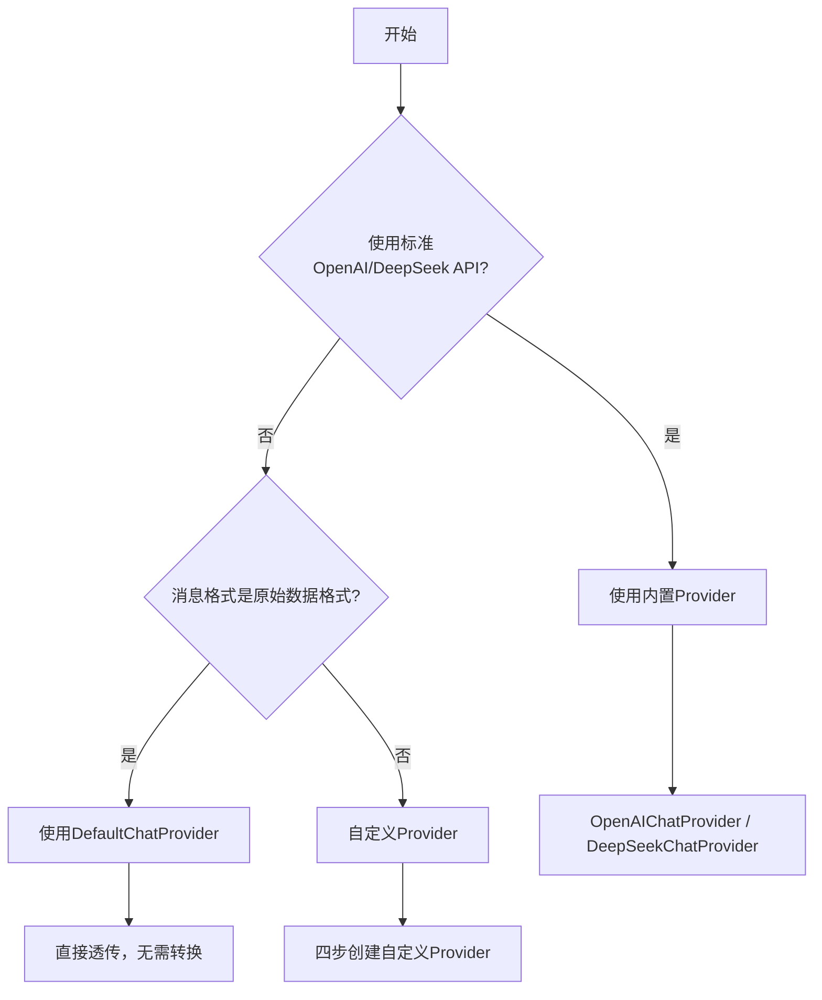

# 🎯 技能定位

**本技能专注解决一个问题**：如何将你的流式接口快速适配为 Ant Design X 的 Chat Provider。

**不涉及的**：useXChat 的使用教程（那是另一个技能）。

## 目录导航

- [📦 技术栈概览](#-技术栈概览)
- [🚀 快速开始](#-快速开始)
  - [内置 Provider](#内置-provider)
  - [何时需要自定义 Provider](#何时需要自定义-provider)
- [📋 四步实现自定义 Provider](#-四步实现自定义-provider)
- [🔑 核心类型与导出](#-核心类型与导出)
- [⚙️ XRequest 进阶配置](#️-xrequest-进阶配置)
  - [callbacks 回调](#callbacks-回调)
  - [retryInterval 重试](#retryinterval-重试)
  - [transformStream 自定义流](#transformstream-自定义流)
- [🔧 常见场景适配](#-常见场景适配)
- [⚠️ 重要提醒](#️-重要提醒)
- [⚡ 快速检查清单](#-快速检查清单)
- [🚨 开发规则](#-开发规则)
- [🔗 参考资源](#-参考资源)

# 📦 技术栈概览

| 层级       | 包名                       | 核心作用        |
| ---------- | -------------------------- | --------------- |
| **UI层**   | **@ant-design/x**          | React UI 组件库 |
| **逻辑层** | **@ant-design/x-sdk**      | 开发工具包      |
| **渲染层** | **@ant-design/x-markdown** | Markdown 渲染器 |

```ts
// ✅ 正确导入示例
import { Bubble } from '@ant-design/x';
import { AbstractChatProvider, OpenAIChatProvider, XRequest } from '@ant-design/x-sdk';
```

# 🚀 快速开始

### 🎯 Provider 选择决策树



### 🏭 内置 Provider 速览

| Provider 类型            | 适用场景                   | 导入方式                                                   |
| ------------------------ | -------------------------- | ---------------------------------------------------------- |
| **OpenAIChatProvider**   | 标准 OpenAI API 格式       | `import { OpenAIChatProvider } from '@ant-design/x-sdk'`   |
| **DeepSeekChatProvider** | 标准 DeepSeek API 格式     | `import { DeepSeekChatProvider } from '@ant-design/x-sdk'` |
| **DefaultChatProvider**  | 透传原始响应，无需格式转换 | `import { DefaultChatProvider } from '@ant-design/x-sdk'`  |

> ⚠️ 导出名是 `OpenAIChatProvider` / `DeepSeekChatProvider` / `DefaultChatProvider`，注意拼写

#### DefaultChatProvider 使用场景

`DefaultChatProvider` 会**透传原始响应数据**，不做任何转换。适用于：

- 接口返回格式已经是你想展示的格式
- 你想完全控制 `Bubble.List` 的 `contentRender` 来渲染消息

```ts
import { DefaultChatProvider, XRequest } from '@ant-design/x-sdk';

interface ChatInput {
  query: string;
  stream?: boolean;
}

interface ChatOutput {
  choices: Array<{ message: { content: string; role: string } }>;
}

// DefaultChatProvider 泛型：<ChatMessage, Input, Output>
// ChatMessage 就是你的 Output 类型（直接透传）
const provider = new DefaultChatProvider<ChatOutput | ChatInput, ChatInput, ChatOutput>({
  request: XRequest('https://your-api.com/chat', {
    manual: true,
    params: { stream: false }
  })
});

// 使用时需要在 Bubble.List 的 role.contentRender 中自行渲染
// role={{ assistant: { contentRender(content) { return content?.choices?.[0]?.message?.content } } }}
```

> ⚠️ `DefaultChatProvider` 使用时 `ChatMessage` 类型通常是你的 `Output` 类型或联合类型，渲染需要配合 `contentRender`

# 📋 四步实现自定义 Provider

## 步骤1：分析接口格式 ⏱️ 2分钟

| 信息类型     | 示例值                      |
| ------------ | --------------------------- |
| **接口URL**  | `https://your-api.com/chat` |
| **请求格式** | JSON，POST                  |
| **响应格式** | Server-Sent Events          |
| **认证方式** | Bearer Token                |

## 步骤2：创建 Provider 类 ⏱️ 5分钟

```ts
// MyChatProvider.ts
import { AbstractChatProvider } from '@ant-design/x-sdk';
import type { TransformMessage } from '@ant-design/x-sdk';
import type { XRequestOptions } from '@ant-design/x-sdk';

interface MyInput {
  query: string;
  model?: string;
  stream?: boolean;
}

interface MyOutput {
  content: string;
  finish_reason?: string;
}

interface MyMessage {
  content: string;
  role: 'user' | 'assistant';
}

export class MyChatProvider extends AbstractChatProvider<MyMessage, MyInput, MyOutput> {
  // 参数转换：将 onRequest 传入的参数 + XRequest 配置的默认参数合并
  // options 来自 XRequest(url, options) 中的 options，可取 options.params 等
  transformParams(requestParams: Partial<MyInput>, options: XRequestOptions<MyInput, MyOutput, MyMessage>): MyInput {
    return {
      ...(options?.params || {}),
      query: requestParams.query || '',
      model: 'gpt-3.5-turbo',
      stream: true
    };
  }

  // 本地消息：将 onRequest 的参数转为用户侧展示消息（支持返回数组）
  transformLocalMessage(requestParams: Partial<MyInput>): MyMessage {
    return {
      content: requestParams.query || '',
      role: 'user'
    };
  }

  // 响应转换：
  // info.originMessage：上次该消息的内容（流式累加时用）
  // info.chunk：当前流式片段
  // info.chunks：所有已收到的片段（onSuccess 时使用）
  // info.status：当前状态
  // ⚠️ 只返回 MyMessage 类型，禁止加 status 字段
  transformMessage(info: TransformMessage<MyMessage, MyOutput>): MyMessage {
    const { originMessage, chunk } = info;

    if (!chunk?.content || chunk.content === '[DONE]') {
      return { ...(originMessage || { content: '', role: 'assistant' }) };
    }

    return {
      content: `${originMessage?.content || ''}${chunk.content}`,
      role: 'assistant'
    };
  }
}
```

## 步骤3：检查验证 ⏱️ 1分钟

| 检查项                   | 说明                                                     |
| ------------------------ | -------------------------------------------------------- |
| **只实现3个方法**        | transformParams、transformLocalMessage、transformMessage |
| **transformParams 签名** | 必须包含第二个参数 `options: XRequestOptions<...>`       |
| **无 status 返回**       | transformMessage 返回值中无 status 字段                  |
| **无 request 方法**      | 确认没有实现 request 方法                                |
| **类型检查通过**         | `tsc --noEmit` 无错误                                    |

## 步骤4：使用 Provider ⏱️ 1分钟

```ts
import { MyChatProvider } from './MyChatProvider';
import { XRequest } from '@ant-design/x-sdk';

// ⚠️ 必须传 manual: true，否则 AbstractChatProvider 构造函数会抛错
const provider = new MyChatProvider({
  request: XRequest('https://your-api.com/chat', {
    manual: true,
    headers: {
      Authorization: 'Bearer your-token',
      'Content-Type': 'application/json'
    },
    params: {
      model: 'gpt-3.5-turbo',
      stream: true
    }
  })
});

export { provider };
```

# 🔑 核心类型与导出

从 `@ant-design/x-sdk` 导出的关键类型：

```ts
import type {
  // OpenAI 标准消息格式
  XModelMessage, // { role: string; content: string | { text: string; type: string } }
  XModelParams, // 完整的 OpenAI 请求参数类型（model, messages, stream, temperature 等）
  XModelResponse, // 完整的 OpenAI 响应类型（choices, usage 等）

  // SSE 流式字段类型
  SSEFields, // 'data' | 'event' | 'id' | 'retry'
  SSEOutput, // Partial<Record<SSEFields, any>>

  // Provider 相关
  TransformMessage, // { originMessage, chunk, chunks, status, responseHeaders }

  // XRequest 相关
  XRequestOptions, // 完整请求配置
  XRequestCallbacks, // { onUpdate, onSuccess, onError }

  // 消息相关
  MessageInfo // { id, message, status, extraInfo }
} from '@ant-design/x-sdk';
```

### XModelMessage 结构（OpenAI 消息格式）

```ts
// XModelMessage 就是标准 OpenAI 消息格式
// 用于 OpenAIChatProvider / DeepSeekChatProvider 的 ChatMessage 泛型
const userMessage: XModelMessage = { role: 'user', content: 'Hello' };
const systemMessage: XModelMessage = { role: 'system', content: '你是一个助手' };
const developerMessage: XModelMessage = { role: 'developer', content: '系统提示词' };
```

### SSEOutput 与 SSEFields

```ts
// SSEOutput 是 SSE 流式原始数据的类型
// { data?: string; event?: string; id?: string; retry?: number }
// DeepSeekChatProvider 使用的是 Partial<Record<SSEFields, XModelResponse>>

import { DeepSeekChatProvider, XRequest } from '@ant-design/x-sdk';
import type { SSEFields, XModelParams, XModelResponse } from '@ant-design/x-sdk';

const provider = new DeepSeekChatProvider({
  request: XRequest<XModelParams, Partial<Record<SSEFields, XModelResponse>>>(
    'https://api.deepseek.com/v1/chat/completions',
    {
      manual: true,
      params: { model: 'deepseek-chat', stream: true }
    }
  )
});
```

# ⚙️ XRequest 进阶配置

## callbacks 回调

`callbacks` 允许在 Provider 层面监听请求事件。回调中的第三个参数是经过 `transformMessage` 处理后的 `MessageInfo`：

```ts
const provider = new OpenAIChatProvider({
  request: XRequest<XModelParams, XModelResponse, XModelMessage>(BASE_URL, {
    manual: true,
    callbacks: {
      // onUpdate: 每个流式片段到达时触发
      // chunk: 当前片段；responseHeaders: 响应头；message: 当前消息的 MessageInfo
      onUpdate: (chunk, responseHeaders, message) => {
        console.log('流式更新:', message?.message?.content);
      },
      // onSuccess: 所有片段接收完成时触发
      // chunks: 所有片段数组；message: 最终消息的 MessageInfo
      onSuccess: (chunks, responseHeaders, message) => {
        console.log('请求完成:', message?.message?.content);
        // 可以在这里做数据上报、日志记录等
      },
      // onError: 请求失败时触发（包括 AbortError）
      // error: 错误对象；errorInfo: 额外错误信息；message: 失败时的消息 MessageInfo
      onError: (error, errorInfo, responseHeaders, message) => {
        console.error('请求失败:', error.message);
      }
    },
    params: { model: 'gpt-4o', stream: true }
  })
});
```

> ⚠️ `callbacks` 与 `useXChat` 的 `requestFallback` 不冲突，两者都会执行。`callbacks` 更适合日志/上报，`requestFallback` 用于控制 UI 展示

## retryInterval 重试

```ts
const request = XRequest('https://your-api.com/chat', {
  manual: true,
  // 请求失败后重试间隔（毫秒）
  retryInterval: 3000,
  // 最大重试次数限制（不设置则无限重试）
  retryTimes: 3,
  // onError 也可以返回数字来动态设置重试间隔
  callbacks: {
    onError: error => {
      if (error.name === 'AbortError') return; // 主动取消不重试
      return 5000; // 返回数字 = 5秒后重试（优先级高于 retryInterval）
    }
  }
});
```

## transformStream 自定义流

当服务端返回的流格式不是标准 SSE 时使用：

```ts
const request = XRequest('https://your-api.com/chat', {
  manual: true,
  // 固定 TransformStream
  transformStream: new TransformStream({
    transform(chunk, controller) {
      controller.enqueue(JSON.parse(chunk));
    }
  }),
  // 或基于 URL 和响应头动态决定
  transformStream: (baseURL, responseHeaders) => {
    if (responseHeaders.get('x-stream-type') === 'ndjson') {
      return new TransformStream({
        /* ... */
      });
    }
    return undefined; // 使用默认 SSE 解析
  }
});
```

# 🔧 常见场景适配

> 📖 **完整示例**：[EXAMPLES.md](reference/EXAMPLES.md)

| 场景类型         | 难度 | 说明                                |
| ---------------- | ---- | ----------------------------------- |
| **标准OpenAI**   | 🟢   | 直接使用内置 `OpenAIChatProvider`   |
| **标准DeepSeek** | 🟢   | 直接使用内置 `DeepSeekChatProvider` |
| **透传原始数据** | 🟢   | 使用 `DefaultChatProvider`          |
| **私有SSE API**  | 🟡   | 四步实现自定义 Provider             |
| **多字段响应**   | 🟡   | 自定义 Provider + 复杂 ChatMessage  |
| **非SSE流**      | 🔴   | 自定义 Provider + transformStream   |

# ⚠️ 重要提醒

### 🚨 强制规则：禁止自己写 request 方法！

```ts
// ❌ 严重错误
class MyProvider extends AbstractChatProvider {
  async request(params: any) {
    /* 禁止！ */
  }
}

// ✅ 唯一正确方式：只实现三个转换方法
class MyProvider extends AbstractChatProvider {
  transformParams(params, options) {
    /* ... */
  }
  transformLocalMessage(params) {
    /* ... */
  }
  transformMessage(info) {
    /* ... */
  }
}
```

### ⚠️ transformMessage 禁止返回 status

```ts
// ❌ 错误
transformMessage(info) {
  return { content: '...', status: 'error' }; // ❌ status 由框架管理
}

// ✅ 正确
transformMessage(info) {
  return { content: '...' }; // ✅
}
```

### ⚠️ Provider 实例化注意事项

```ts
// ✅ 在 React 组件中，用 useState 保证只创建一次
const [provider] = React.useState(
  new MyChatProvider({
    request: XRequest(URL, { manual: true })
  })
);

// ❌ 不要在渲染函数中直接创建（每次渲染都会新建）
// const provider = new MyChatProvider(...); // 放在组件体内会导致问题
```

# ⚡ 快速检查清单

创建 Provider 前：

- [ ] 已获取接口文档和响应格式
- [ ] 已确认是否需要自定义（还是内置 Provider 够用）
- [ ] 已定义好 Input、Output、ChatMessage 类型

完成后：

- [ ] **只实现了三个必需方法**
- [ ] **transformParams 包含第二个参数 options**
- [ ] **transformMessage 返回值中无 status 字段**
- [ ] **XRequest 配置了 manual: true**
- [ ] **绝对禁止实现 request 方法**
- [ ] Provider 在 React 组件中用 `useState` 包裹
- [ ] 类型检查通过（`tsc --noEmit`）

# 🚨 开发规则

- **如果用户没有明确需要测试用例，则不要添加测试文件**
- **完成编写后必须检查类型**：运行 `tsc --noEmit` 确保无类型错误
- **保持代码整洁**：移除所有未使用的变量和导入

# 🔗 参考资源

## 📚 核心参考文档

- [EXAMPLES.md](reference/EXAMPLES.md) - 实战示例代码

## 🌐 SDK 官方文档

- [useXChat 官方文档](https://github.com/ant-design/x/blob/main/packages/x/docs/x-sdk/use-x-chat.zh-CN.md)
- [XRequest 官方文档](https://github.com/ant-design/x/blob/main/packages/x/docs/x-sdk/x-request.zh-CN.md)
- [Chat Provider 官方文档](https://github.com/ant-design/x/blob/main/packages/x/docs/x-sdk/chat-provider.zh-CN.md)

## 💻 示例代码

- [custom-provider-width-ui.tsx](https://github.com/ant-design/x/blob/main/packages/x/docs/x-sdk/demos/chat-providers/custom-provider-width-ui.tsx)
- [openai-callback.tsx](https://github.com/ant-design/x/blob/main/packages/x/docs/x-sdk/demos/x-chat/openai-callback.tsx)
