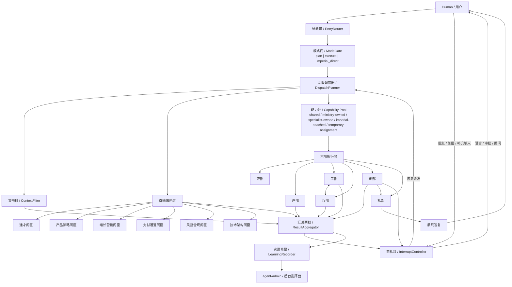

# 架构总览

状态：current
文档类型：architecture
适用范围：仓库长期架构方向
最后核对：2026-04-16

本文件描述当前仓库面向代码代理和开发者的长期架构方向。它不是逐文件 API 文档，而是帮助在实现细节变化时仍保持同一条演进主线。

当前实现形态补充阅读：

- [agent-core runtime current state](/docs/archive/agent-core/runtime-current-state.md)
- [system flow current state](/docs/integration/system-flow-current-state.md)

## 1. 产品分工

仓库当前有两个前端应用，它们职责不同，不能做成重复产品。

### `agent-chat`

- 采用 **OpenClaw 模态**
- 是前线作战面
- 面向最终使用者与日常操作者
- 聊天只是入口，不是唯一主体

长期应保持这些一等能力：

- Chat thread
- Approval cards
- Think panel
- ThoughtChain timeline
- Source / Evidence cards
- Learning suggestions
- Skill reuse badges

关键操作都在消息流中完成：

- Approve
- Reject
- Reject with feedback
- Cancel
- Recover

### `agent-admin`

- 是后台指挥面
- 面向管理员、平台运营者、团队负责人
- 不是普通 dashboard，而是自治系统控制台

长期信息架构固定为六大中心：

- Runtime Center
- Approvals Center
- Learning Center
- Skill Lab
- Evidence Center
- Connector & Policy Center

## 2. 核心架构方向

当前系统按“皇帝-首辅-六部”方向演进。

### 顶层角色

- Human / 用户：最高权限主体
- Supervisor / 首辅：负责任务规划、路由、汇总、审批挂起与恢复

### 六部治理语义

- 吏部：路由、预算、选模、能力编排
- 户部：检索、研究、外部资料与知识上下文
- 工部：代码实现与重构
- 兵部：终端、浏览器、测试、发布
- 刑部：审查、安全、合规
- 礼部：协议、文档、交付整理

### 当前现实状态

- 仓库已经有六部 registry / route / checkpoint / workflow 语义
- 共享类型与部分接口仍保留旧 `manager/research/executor/reviewer` 兼容字段
- 新实现应优先继续朝“六部真实执行主体”收敛，而不是回退到单一聊天机器人模型

### 当前大模型架构图



补充说明：

- `SP -> RA` 表示群辅层内部先完成策略票拟聚合，再把聚合结果交给 `ResultAggregator`，不在主图中逐阁臣展开原始输出。
- `ModeGate` 只做轻量标注：
  - `plan`：只读/分析/规划能力
  - `execute`：六部全量执行能力
  - `imperial_direct`：特旨直达执行链
- `Capability Pool` 采用单节点总览表达，表示统一能力治理；具体五层池不在主图中拆成 5 个独立子图。
- `LearningRecorder -> agent-admin` 表示学习沉淀默认服务后台治理，不默认回给用户。

### LangGraph 状态约束补充

在当前 `runtime / agents` 的 graph 实现里，需要明确区分：

- `zod`
  - 负责输出对象、协议字段、结构化结果的“格式正确性”
  - 重点回答：这份数据是否合法、字段对不对、枚举值对不对
- `Annotation`
  - 负责 LangGraph 中 state 字段“如何存储和合并”
  - 重点回答：这个字段要不要进 state、跨节点怎么传、重入时如何累积

简化理解：

- `zod = 数据格式层`
- `Annotation = 图状态层`

### `runtime / agents` 目录收敛

当前推荐按“runtime 主链 + 专项 agent 图”理解源码宿主：

- `packages/runtime/src/graphs`
  - 主链 graph 入口：`chat / learning / recovery / main/*`
  - graph 文件默认只保留状态定义与边编排，不直接堆叠节点业务实现
- `packages/runtime/src/flows`
  - 主链节点执行、审批、学习、会话等 runtime 级 flow
- `packages/runtime/src/runtime`、`src/session`
  - runtime 装配、会话驱动、checkpoint 与恢复协同
- `agents/supervisor/src/graphs`、`src/flows`
  - supervisor 主图、路由、delivery、ministries 与专项提示词/结构化约束
- `agents/data-report/src/graphs`、`src/flows`
  - data-report / data-report-json graph、preview/runtime facade、报表专项节点
- `packages/adapters/src/prompts`、`src/structured-output` 与各宿主 `src/utils/prompts`
  - JSON safety 附加、结构化 prompt helper 和宿主内部复用模板

收敛原则：

- `graphs` 目录优先表达状态机与编排阶段，不承载通用工具
- graph 节点默认实现、handler fallback 与业务逻辑优先放入 `flows/*`
- `flows` 目录优先表达六部/首辅的执行语义
- `runtime` 与 `session` 不应回填 graph 内部细节实现
- `src/index.ts` 只导出稳定公共入口，不继续暴露 `graphs/main/*` 内部碎片

## 3. 运行闭环

当前和后续都应优先维持这个闭环：

1. 接收任务
2. 规划与路由
3. 检索与补充上下文
4. 执行
5. 审查
6. 审批或恢复
7. 汇总答复
8. 学习沉淀
9. 后续复用

对于高风险动作，流程必须经过审批门，不能默认跳过。

### 当前聊天入口路由

`agent-chat` 不再把所有文本消息一律送进完整多 Agent 工作流。

当前默认采用“first-match”入口分流：

1. 显式 workflow 命令或非通用 preset：进入多 Agent 工作流
2. 修改类请求：进入多 Agent 工作流
3. Figma / 设计稿类请求：进入多 Agent 工作流
4. 普通文本 prompt：优先走 direct-reply 流式聊天

这条规则的目的不是弱化六部，而是保证：

- 普通聊天先像聊天一样快速返回
- 复杂任务再升级为完整自治执行链

## 4. 学习系统方向

项目主线是开发自治，不是普通聊天问答。

学习系统默认策略：

- **受控来源优先**
- **高置信自动沉淀**

学习闭环目标：

1. 户部主动研究
2. 记录来源和可信度
3. 任务中引用历史经验
4. 任务后评估是否值得沉淀
5. 沉淀为 memory / rule / skill
6. 后续任务优先复用

### 当前阶段

当前仓库已经有：

- `LearningFlow`
- memory / rule / skill 候选
- Learning suggestions
- reused skill / evidence / checkpoint 语义

但还没有完全进入“主动研究 -> 评估 -> 沉淀 -> 复用”的成熟闭环，所以相关改动应继续补强这一点。

## 4.1 Context Strategy

长对话和跨轮自治任务不能直接把全部消息原样塞回模型。

当前上下文切片至少应包含：

- conversation summary
- recent turns
- top-K reused memory / rule / skill
- top-K evidence
- 上一轮 learning evaluation 摘要

长期收敛方向补充：

- Prompt 只保留受控的 `Core Memory`
  - 用户画像核心片段
  - 当前任务约束
  - 当前会话必需状态
- 大量长期记忆默认留在 `Archival Memory`
  - 通过 runtime 主动触发的 memory retrieval / override 工具按需读取
- 不把“扩大上下文窗口”当作长期主解

记忆系统的长期蓝图详见：

- [Agent Memory Architecture](/docs/memory/agent-memory-architecture.md)

这层策略先由运行时本地实现，后续再逐步升级为向量检索、语义缓存和更细粒度的 worker-specific context slice。

在 skill 搜索链路上，当前默认先走本地闭环：

- 已安装 skill
- 本地 manifests
- profile/source policy 过滤

也就是先完成“本地 capability gap -> 本地 skill suggestion”，后续再把远程 marketplace 接上。

检索层默认继续收敛到两个抽象：

- `MemorySearchService`
  - 统一聚合 memory / rule 检索
  - session、research、learning、task route 等链路优先复用这一层
  - task 创建时会把命中结果映射为 `reusedMemories / reusedRules`
  - LearningFlow 在正式评分前也会先做 reuse enrichment
- `VectorIndexRepository`
  - 作为后续向量检索后端的接入点
  - 当前默认先由 `LocalVectorIndexRepository` 提供本地轻量排序
  - 后续可替换为真正的 embedding / vector database 后端

### 4.1.1 Skills / Deep Agents 规范

仓库级代理 skills 当前默认按 `SKILL.md + frontmatter` 规范组织，并由本地 loader 直接转成运行时 manifest。

本地 skill 闭环当前至少应支持：

- capability gap detection
- local skill suggestions
- safety evaluation
- low-risk auto install
- successRate / governanceRecommendation 回写

本地安全评估优先读取这些字段：

- `allowed-tools`
- `approval-policy`
- `risk-level`
- `compatibility`
- `license`

当前评估结果会统一收敛到：

- `SkillManifestRecord.safety`
- `LocalSkillSuggestionRecord.safety`

至少包含：

- `verdict`
- `trustScore`
- `sourceTrustClass`
- `profileCompatible`
- `maxRiskLevel`
- `riskyTools`
- `missingDeclarations`

## 4.2 Budget Guard 与 Semantic Cache

为了避免长流程自治在成本和重复调用上失控，运行时默认继续收敛到两条基础机制：

- `BudgetGuard`
  - 每轮任务都维护 `budgetState`
  - 除 step/retry/source 预算外，继续维护成本预算
  - 当 `costConsumedUsd >= costBudgetUsd` 时，模型路由优先降级到 `fallbackModelId`
- `Semantic Cache`
  - 当前先采用精确 prompt 指纹缓存
  - 命中后可直接复用同 role + 同 model + 同 prompt 的文本结果
  - 后续再升级到 embedding / vector 语义缓存

这两层都属于 runtime 基础设施，不应在具体 app 或单一 ministry 内重复实现。

## 5. Think / ThoughtChain / Evidence

这三者是 `agent-chat` 的核心能力，不是装饰层。

- `Think`
  - 表达当前谁在思考、为什么这样做、下一步是什么
- `ThoughtChain`
  - 表达已走过哪些节点、各节点的角色化解释、当前停在什么地方
- `Evidence`
  - 表达本轮引用了哪些外部来源或系统证据，它们是否可信

这些信息应当始终可见或可展开查看，不能被迁移到只有后台才能看到的隐藏区域。

补充要求：

- 大模型主链上的关键阶段不能只存在于内部实现里，至少要以 `trace / event / checkpoint summary` 之一落盘并可回放
- 默认应覆盖：
  - `plan`
  - `route`
  - `research`
  - `execution`
  - `review`
  - `delivery`
  - `interrupt`
  - `recover`
  - `learning`
- `agent-chat` 至少要能在 Think / ThoughtChain / Runtime Panel 中看到这些阶段中的当前阶段与最近阶段
- `agent-admin` 至少要能在 Runtime Center 中回放这些阶段，不允许只剩最终答案

## 6. 审批与中断

高风险动作必须经过 HITL。

支持的决策语义：

- Approve
- Reject
- Reject with feedback

支持的运行语义：

- cancel
- recover
- observe

审批和恢复是 `agent-chat` 的主链能力，应优先以内联消息卡形式完成，而不是只依赖右侧工作台或后台页面。

### 6.1 Interrupt 优先原则

后续所有“等待人类确认后才能继续”的新流程，默认应优先采用可恢复 interrupt，而不是仅依赖 `pendingApproval` 状态模拟。

收敛规则：

- `interrupt` 是执行控制原语
- `pendingApproval` 是兼容期投影
- chat/admin 优先展示中断语义，再兼容旧审批字段
- skill install approval 是第一批迁移对象

在真正接入 LangGraph checkpointer 与 `Command({ resume })` 前，允许先在共享模型中维护 interrupt record，并通过现有 approval-recovery 链兼容恢复。

## 7. MCP 与工具层

当前 MCP 仍有 skeleton / local-adapter 过渡实现。

长期方向：

- 真实 MCP transport 成为主路径
- 不再继续扩展本地硬编码工具分叉
- capability 必须带完整治理信息：
  - schema
  - risk metadata
  - approval metadata
  - trust metadata
  - health metadata

在 `agent-admin` 中，connector / capability / policy 是一等治理对象，而不是调试信息。

## 7.1 Subgraph Registry

当前主图仍未完全拆开，但已建立正式 subgraph descriptor registry，至少包含：

- `research`
- `execution`
- `review`
- `skill-install`
- `background-runner`

后续拆图和控制台展示应优先复用这层 registry。

当前运行时还应把实际命中的子图持久化到任务与 checkpoint：

- `TaskRecord.subgraphTrail`
- `ChatCheckpointRecord.subgraphTrail`

这样 admin 与审计回放可以区分“注册表里有哪些子图”和“某次 run 实际走了哪些子图”。

## 8. 共享领域模型

前后端必须共享同一套领域模型，不要各自发明平行字段。

当前优先维护这些对象：

### `TaskRecord`

- `budgetState`
- `externalSources`
- `reusedMemories`
- `reusedRules`
- `reusedSkills`
- `learningEvaluation`
- `currentMinistry`
- `currentWorker`
- `resolvedWorkflow`
- `subgraphTrail`

### `ChatCheckpointRecord`

- `externalSources`
- `learningEvaluation`
- `budgetState`
- `reusedSkills`
- `currentMinistry`
- `currentWorker`
- `subgraphTrail`
- `thoughtChain`
- `thinkState`

### `SkillCard`

- `status`
- `source`
- `riskLevel`
- `requiredTools`
- `successSignals`

### `EvidenceRecord`

- `sourceUrl`
- `sourceType`
- `trustClass`
- `summary`
- `linkedRunId`

### `McpCapability`

- `transport`
- `trustClass`
- `approvalPolicy`
- `healthState`

## 9. 工程与构建约束

## 9.1 Runtime Profile

当前运行时按 profile 区分默认治理策略，而不是所有入口共用一套默认值。

- `platform`
  - 面向平台宿主
  - `controlled-first` 来源策略
- `company`
  - 面向公司 Agent
  - `internal-only` 来源策略
  - 优先内部 skill source 与企业 connector
- `personal`
  - 面向个人 Agent
  - `open-web-allowed` 来源策略
  - 允许 marketplace 与个人 connector 作为默认来源
- `cli`
  - 面向轻量终端入口
  - 默认采取中等保守策略

profile 影响范围至少包括：

- data root
- budget policy
- skill source preset
- connector preset
- source governance
- worker routing / company specialist availability
- budget guard / fallback model policy
- semantic cache 路径与启用策略

### 包依赖规则

- 应用层只通过 `@agent/*` 依赖共享包
- 不要从应用层直连 `packages/*/src`、`agents/*/src`，也不要把 `@agent/<pkg>/<subpath>` 当成应用层稳定接口

### 构建规则

- 应用输出进入 `dist/`
- 共享包输出进入：
  - `build/cjs`
  - `build/esm`
  - `build/types`

### 当前已知坑

- `packages/*/src`、`agents/*/src` 不允许混入 `.js/.d.ts/.js.map`；这类文件一律视为误生成构建产物
- `tsup` 入口应只打 `.ts` 运行时源码
- `build:lib` 必须串行执行，避免只生成 `build/types`

如果改动涉及 `packages/*`，在验证应用前优先执行：

```bash
pnpm build:lib
```

再执行需要的应用构建或类型检查。

### `runtime / agents` 当前推荐分层

当前推荐按 `packages/runtime`、`packages/adapters` 与 `agents/*` 收敛，而不是回退到旧的 `models / agents / graph` 粗分层：

```text
packages/runtime/src/
├─ flows/
├─ governance/
├─ graphs/
├─ runtime/
├─ session/
├─ capabilities/
├─ utils/
└─ types/

agents/<domain>/src/
├─ flows/
├─ graphs/
├─ runtime/
├─ shared/
├─ utils/
└─ types/
```

约束：

- `flows/` 负责按聊天、审批、学习等流程组织节点与协议
- `governance/` 负责 worker registry、路由策略、预算与治理决策
- `graphs/` 只放图定义与编排入口
- `session/` 负责会话、checkpoint、事件流持久化
- agent 宿主下的 `shared/` 放跨流程复用的事件映射、schema、prompt 与工具
- `utils/` 放纯函数型通用工具，例如 parser、formatter、matcher、normalizer；不承载 service 和运行时状态
- `agents/supervisor/src/workflows/` 只负责预设工作流和能力组合，不与底层 graph 定义混放

## 10. Skills 目录分层

为了兼容 Codex、Claude Code 一类代理工作流，仓库需要明确区分两类 skill。

### A. 运行时 skill

- 目录：`packages/skill-runtime`
- 新代码导入名：`@agent/skill-runtime`
- 用途：运行时 skill registry、skill card、实验区/稳定区领域模型
- 被后端、shared、admin 消费

### B. 仓库级代理 skill

- 目录：`skills/*`
- 用途：给代码代理看的工作流规范、脚本和参考资料
- 采用 `Claude Code / Codex` 常见结构

推荐目录：

```text
skills/
├─ README.md
├─ <skill-name>/
│  ├─ SKILL.md
│  ├─ references/
│  ├─ scripts/
│  └─ assets/
```

规则：

- `SKILL.md` 是每个代理 skill 的入口
- `references/` 放规范、样例、领域知识
- `scripts/` 放可执行脚本
- `assets/` 放模板或静态资源
- 仓库级代理 skill 不应与运行时 `packages/skill-runtime` / `@agent/skill-runtime` 混合
- 新增代理工作流时，优先考虑放进 `skills/`，而不是塞进随机文档目录

## 11. 优先级

没有更具体用户要求时，默认按这条优先级推进：

1. 强化 `agent-chat` 的 OpenClaw 工作区体验
2. 强化 `agent-admin` 六大中心控制台
3. 把六部从治理语义升级成真实执行主体
4. 把 LearningFlow 升级成主动学习闭环
5. 把 MCP 从 skeleton 升级成真实 transport 主路径

不优先做：

- 单纯视觉模仿
- 与开发自治主线无关的平台广度
- 让 `agent-chat` 与 `agent-admin` 职责重叠

## 12. 建议阅读顺序

如果你是进入本仓库工作的代码代理，建议按这个顺序阅读：

1. [AGENTS.md](/AGENTS.md)
2. [README.md](/README.md)
3. [前后端对接文档](/docs/integration/frontend-backend-integration.md)
4. [后端规范](/docs/backend-conventions.md)
5. [前端规范](/docs/frontend-conventions.md)

## 13. 最低检查

当前最低检查命令如下，文档、代码和 CI 都应以此为基线保持一致：

```bash
pnpm exec tsc -p packages/runtime/tsconfig.json --noEmit
pnpm exec tsc -p apps/backend/agent-server/tsconfig.json --noEmit
pnpm exec tsc -p apps/frontend/agent-chat/tsconfig.app.json --noEmit
pnpm exec tsc -p apps/frontend/agent-admin/tsconfig.app.json --noEmit
```
