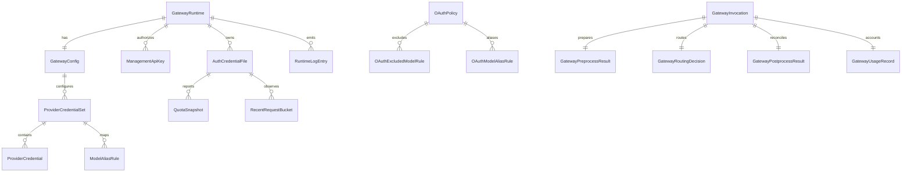

# Agent Gateway API

状态：current
文档类型：reference
适用范围：`apps/frontend/agent-gateway` 中转控制台、`agent-server` Agent Gateway API、Provider / 凭据 / 配额 / 日志治理接口
最后核对：2026-05-11

本文记录从 `/Users/dev/Desktop/Cli-Proxy-API-Management-Center` 参考项目提炼出的 Agent Gateway API 领域模型。当前仓库已落 schema-first contract、统一 Identity 登录接入、Gateway 调用方管理、client API key、client quota、OpenAI-compatible `/v1/models` 与 `/v1/chat/completions` embedded runtime engine、runtime/config/provider/auth-file/quota projection、读写命令、logs / usage / probe、token count、preprocess、accounting、legacy relay smoke、secret vault、OAuth provider adapter 生命周期第一版，以及独立 `apps/frontend/agent-gateway` 中转前端。2026-05-09 起，远程 management connection、raw config、proxy API keys、request log projection、quota detail、system version/model discovery 已有 deterministic 管理面第一版。

> 前端注意：2026-05-13 起，`apps/frontend/agent-gateway` 已直接替换为 CPAMC 页面与 `/v0/management` API client。`agent-server` 现在通过 `CliProxyManagementCompatController` 暴露 unprefixed `/v0/management/*` 兼容层，供该页面调用；本文仍是 `agent-server` 内建 TypeScript Agent Gateway 与公共 contract 的规范文档。

## 实现状态

- `current`：当前代码已提供的 HTTP 入口、schema projection 或前端消费能力。
- `compat`：迁移兼容入口，当前代码仍保留，但新前端、新 API 和新文档不得继续依赖。
- `planned`：参考项目中尚未纳入本仓库当前稳定 contract 的高级能力。CLI Proxy management parity 的 Dashboard、provider-specific config、Auth Files、OAuth policy、`api-call` quota、logs 和 system runtime 已进入 current；`/v1/models`、非 streaming `/v1/chat/completions`、OpenAI-compatible streaming SSE 投影，以及 provider-specific runtime protocol normalize 已进入 current。真实 vendor SDK 矩阵、生产级计费和数据库持久化完整收口仍属于后续生产化范围。
- 任何 projection 都不得暴露 raw vendor payload、明文 secret、未过滤 headers 或第三方错误对象。

## CLIProxyAPI Parity Contract Gate

2026-05-11 的 Full CLIProxyAPI parity 以 `@agent/core` schema 作为先行门禁。CPAMC 管理面矩阵按以下分组收敛：Dashboard / Runtime / Gateway clients / Usage / Raw config / Proxy API keys / Provider configs / Auth Files / OAuth / Migration / Quota / Logs / System。管理查询 projection 可以追加兼容字段，但必须保持 camelCase、schema-first，并且只能暴露 masked secret、`secretRef`、状态和统计信息。

Runtime executor 只接受项目自定义 adapter contract：`adapterKind` 为 `deterministic`、`http`、`process` 或 `native-ts`；`commandProfile` 是命令配置 profile 名称；`baseUrl`、`secretRef`、`timeoutMs`、`concurrencyLimit` 和 `modelAliases` 均由 `GatewayRuntimeExecutorConfigSchema` 解析。`modelAliases` 默认是 `{}`，不再使用 provider raw response、process `stderr`、headers 或 vendor SDK 对象作为 runtime 边界字段。

鉴权边界分为两套：

- `/api/*` 管理面使用 Identity access token，用于控制台、配置、OAuth、迁移、日志、配额与系统信息。
- `/v1/*` runtime 使用 Gateway client API key，用于 OpenAI-compatible runtime 调用方，不接受 Identity token 作为 runtime principal。

Secret projection 规则是硬约束：明文 API key、OAuth `accessToken` / `refreshToken`、auth file 原文、raw provider headers、raw token payload 和 raw provider response 只能存在于 create/update command 或 adapter 内部，不能进入查询 projection、runtime invocation/response/error、quota snapshot 或 migration preview/apply report。

Provider config projection 中的 `headers` 只允许承载 sanitized safe header metadata，例如 `x-team`；`authorization`、`cookie`、`set-cookie`、`x-api-key`、`api-key`、`proxy-authorization` 等敏感 header 名称必须在 schema 边界被拒绝。该字段不是 raw provider headers 的透传通道。

外部 CLIProxyAPI 只允许作为迁移 adapter：`CliProxyManagementClient` 可以读取既有实例并转换为本仓库 schema，用于 preview/apply、对比和导入；它不是默认 runtime，也不能让前端直接消费上游 raw management payload。

## Production Readiness Gate

2026-05-11 起，Agent Gateway 的“生产可用 / 0 成本迁移”按 `docs/superpowers/plans/2026-05-11-agent-gateway-production-migration.md` 收口。当前代码已有管理面、durable persistence 最小切片、OAuth adapter 边界、可配置 OAuth HTTP client token exchange / device polling 边界、provider quota inspector 边界、CLI Proxy `/api-call` quota refresh 边界和 executor 委托边界；但内建真实 vendor executor / quota adapter 仍未全量装配，OAuth 默认 DI 未配置真实 provider secret 时也会回退 deterministic provider，不能仅凭 `/v1/*` endpoint 存在就宣称 production ready。

新增生产就绪 contract 已先落在 `packages/core/src/contracts/agent-gateway/agent-gateway-internal-cli-proxy.schemas.ts`：

- `GatewayRuntimeExecutorConfigSchema`：描述可注册的 provider executor。它只允许项目自定义字段，如 `providerKind`、`enabled`、`adapterKind`、`commandProfile`、`baseUrl`、`secretRef`、`timeoutMs`、`concurrencyLimit` 和 `modelAliases`，不允许穿透 raw process stderr、raw response、headers 或 vendor SDK 对象。
- `GatewayOAuthCredentialRecordSchema`：描述 OAuth/auth file credential projection。查询面只返回 `secretRef`、账号、项目、scope、过期时间和状态；不得返回 access token、refresh token 或 raw token payload。
- `GatewayProviderQuotaSnapshotSchema`：描述 provider/auth-file/model 维度额度快照，供 `/quota` 页面和 runtime quota precheck 使用。
- `GatewayMigrationPreviewSchema` / `GatewayMigrationApplyResponseSchema`：描述从既有 CLIProxyAPI 导入配置、auth files、API keys、quota snapshots、OAuth policy 和 logs 的 preview/apply 报告。

这些 contract 是后续持久化、真实 OAuth、真实 executor、quota inspector 和迁移向导的接口门禁。实现必须先 parse 到这些 schema，再进入后端 repository 或前端页面。

当前实现入口：

- Stable contract：`packages/core/src/contracts/agent-gateway/`
- CLI Proxy parity extension：`packages/core/src/contracts/agent-gateway/agent-gateway-cli-proxy-parity.schemas.ts`
- Backend domain：`apps/backend/agent-server/src/domains/agent-gateway/`
- Backend API：`apps/backend/agent-server/src/api/agent-gateway/agent-gateway.controller.ts`
- Frontend relay app：`apps/frontend/agent-gateway/`

## Runtime Ownership

`agent-server` 内建 `apps/backend/agent-server/src/domains/agent-gateway/runtime-engine/` 是 Agent Gateway 的规范 CLIProxyAPI runtime。`GET /v1/models` 与 `POST /v1/chat/completions` 不依赖外部 CLIProxyAPI server；controller 只调用 runtime-engine facade，并通过 `@agent/core` schema 与 OpenAI-compatible response/error contract 对外暴露。

`CliProxyManagementClient` 是迁移 / 导入 adapter，不是默认 runtime。它只能在显式启用 `AGENT_GATEWAY_MANAGEMENT_MODE=cli-proxy` 时读取既有 CLIProxyAPI 实例中的 config、provider config、Auth Files、API keys、quota snapshots、request logs 和 system 信息，并在进入 controller 前归一化为项目自有 schema。该模式下 `GET /api/agent-gateway/system/models` 必须优先调用 management `discoverModels()`；`POST /api/agent-gateway/quotas/details/:providerKind/refresh` 必须通过 management `/api-call` quota source 获取真实 provider/auth-file/model 额度，不得回退到 deterministic quota placeholder。

默认 runtime readiness 要求：

- `RuntimeEngineFacade` 不得在生产 executor path 返回固定 mock 内容；当前 deterministic executor 仅作为测试和本地 smoke harness。
- `GET /v1/models` 必须来自 executor model discovery 或持久化 provider config。
- `POST /v1/chat/completions` 必须完成 client API key 鉴权、quota precheck、executor 调用、usage accounting 和 request log 写入。
- `POST /v1/chat/completions` 的 `stream: true` 必须调用 `RuntimeEngineFacade.stream()`，并只输出 OpenAI SSE `data:` chunk 与 `[DONE]` marker；不得把 raw provider response、headers、token 或 SDK object 写入 SSE。
- Provider-specific runtime routes 必须先 normalize 为严格的 `GatewayRuntimeInvocationSchema`；provider pin 只能通过项目自有 `RuntimeEngineExecutionContext.providerKind` 传入 facade/executor，不得写回 invocation，也不得保存 raw request body。
- OAuth credential、auth file、provider quota 和 migration import 均不得依赖 memory-only state 作为生产路径。OAuth callback/device poll 的 raw token 只能写入 secret vault / auth file content storage；查询 projection 只能返回 `secretRef`、auth file metadata、账号、项目、scope、过期时间和状态。

管理面 schema-first HTTP 入口在 `agent-server` 全局 `/api` 前缀下生效；OpenAI-compatible runtime 入口显式排除全局前缀，保持 `GET /v1/models` 与 `POST /v1/chat/completions`。当前 CPAMC 前端直接请求 unprefixed `/v0/management/*`，该路径同样在 `main.ts` 中排除全局 `/api` prefix。

| 能力                     | 后端入口                                                        | 前端同源访问                                                    | 状态      |
| ------------------------ | --------------------------------------------------------------- | --------------------------------------------------------------- | --------- |
| 登录                     | `POST /api/identity/login`                                      | `POST /api/identity/login`                                      | `current` |
| 刷新短 token             | `POST /api/identity/refresh`                                    | `POST /api/identity/refresh`                                    | `current` |
| Gateway legacy 登录      | `POST /api/agent-gateway/auth/login`                            | 不再由前端调用                                                  | `compat`  |
| Gateway legacy 刷新      | `POST /api/agent-gateway/auth/refresh`                          | 不再由前端调用                                                  | `compat`  |
| 总览快照                 | `GET /api/agent-gateway/snapshot`                               | `GET /api/agent-gateway/snapshot`                               | `current` |
| 上游方                   | `GET /api/agent-gateway/providers`                              | `GET /api/agent-gateway/providers`                              | `current` |
| 认证文件                 | `GET /api/agent-gateway/credential-files`                       | `GET /api/agent-gateway/credential-files`                       | `current` |
| 配额                     | `GET /api/agent-gateway/quotas`                                 | `GET /api/agent-gateway/quotas`                                 | `current` |
| 日志                     | `GET /api/agent-gateway/logs?limit=50`                          | `GET /api/agent-gateway/logs?limit=50`                          | `current` |
| 用量                     | `GET /api/agent-gateway/usage?limit=50`                         | `GET /api/agent-gateway/usage?limit=50`                         | `current` |
| 使用统计                 | `GET /api/agent-gateway/usage/analytics`                        | `GET /api/agent-gateway/usage/analytics`                        | `current` |
| Gateway clients          | `GET /api/agent-gateway/clients`                                | `GET /api/agent-gateway/clients`                                | `current` |
| Gateway client 创建      | `POST /api/agent-gateway/clients`                               | `POST /api/agent-gateway/clients`                               | `current` |
| Gateway client 更新      | `PATCH /api/agent-gateway/clients/:clientId`                    | `PATCH /api/agent-gateway/clients/:clientId`                    | `current` |
| Gateway client 启停      | `PATCH /api/agent-gateway/clients/:clientId/enable` / `disable` | `PATCH /api/agent-gateway/clients/:clientId/enable` / `disable` | `current` |
| Client API keys          | `GET /api/agent-gateway/clients/:clientId/api-keys`             | `GET /api/agent-gateway/clients/:clientId/api-keys`             | `current` |
| Client API key 创建      | `POST /api/agent-gateway/clients/:clientId/api-keys`            | `POST /api/agent-gateway/clients/:clientId/api-keys`            | `current` |
| Client quota             | `GET /api/agent-gateway/clients/:clientId/quota`                | `GET /api/agent-gateway/clients/:clientId/quota`                | `current` |
| Client quota 更新        | `PUT /api/agent-gateway/clients/:clientId/quota`                | `PUT /api/agent-gateway/clients/:clientId/quota`                | `current` |
| Client request logs      | `GET /api/agent-gateway/clients/:clientId/logs`                 | `GET /api/agent-gateway/clients/:clientId/logs`                 | `current` |
| Runtime health           | `GET /api/agent-gateway/runtime/health`                         | `GET /api/agent-gateway/runtime/health`                         | `current` |
| Runtime models           | `GET /v1/models`                                                | runtime client 直接调用                                         | `current` |
| Runtime chat completions | `POST /v1/chat/completions`                                     | runtime client 直接调用                                         | `current` |
| 探测                     | `POST /api/agent-gateway/probe`                                 | `POST /api/agent-gateway/probe`                                 | `current` |
| token 估算               | `POST /api/agent-gateway/token-count`                           | `POST /api/agent-gateway/token-count`                           | `current` |
| 前处理                   | `POST /api/agent-gateway/preprocess`                            | `POST /api/agent-gateway/preprocess`                            | `current` |
| 后处理记账               | `POST /api/agent-gateway/accounting`                            | `POST /api/agent-gateway/accounting`                            | `current` |
| 配置更新                 | `PATCH /api/agent-gateway/config`                               | `PATCH /api/agent-gateway/config`                               | `current` |
| 上游方保存               | `PUT /api/agent-gateway/providers/:id`                          | `PUT /api/agent-gateway/providers/:id`                          | `current` |
| 上游方删除               | `DELETE /api/agent-gateway/providers/:id`                       | `DELETE /api/agent-gateway/providers/:id`                       | `current` |
| 认证文件保存             | `PUT /api/agent-gateway/credential-files/:id`                   | `PUT /api/agent-gateway/credential-files/:id`                   | `current` |
| 认证文件删除             | `DELETE /api/agent-gateway/credential-files/:id`                | `DELETE /api/agent-gateway/credential-files/:id`                | `current` |
| 配额更新                 | `PATCH /api/agent-gateway/quotas/:id`                           | `PATCH /api/agent-gateway/quotas/:id`                           | `current` |
| Relay smoke              | `POST /api/agent-gateway/relay`                                 | `POST /api/agent-gateway/relay`                                 | `current` |
| OAuth adapter 启动       | `POST /api/agent-gateway/oauth/start`                           | `POST /api/agent-gateway/oauth/start`                           | `current` |
| OAuth 完成               | `POST /api/agent-gateway/oauth/complete`                        | `POST /api/agent-gateway/oauth/complete`                        | `current` |
| 连接保存                 | `PUT /api/agent-gateway/connection/profile`                     | `PUT /api/agent-gateway/connection/profile`                     | `current` |
| 连接检查                 | `POST /api/agent-gateway/connection/check`                      | `POST /api/agent-gateway/connection/check`                      | `current` |
| Raw config               | `GET /api/agent-gateway/config/raw`                             | `GET /api/agent-gateway/config/raw`                             | `current` |
| Raw config diff          | `POST /api/agent-gateway/config/raw/diff`                       | `POST /api/agent-gateway/config/raw/diff`                       | `current` |
| Raw config 保存          | `PUT /api/agent-gateway/config/raw`                             | `PUT /api/agent-gateway/config/raw`                             | `current` |
| Config reload            | `POST /api/agent-gateway/config/reload`                         | `POST /api/agent-gateway/config/reload`                         | `current` |
| Proxy API keys           | `GET /api/agent-gateway/api-keys`                               | `GET /api/agent-gateway/api-keys`                               | `current` |
| Proxy API keys 替换      | `PUT /api/agent-gateway/api-keys`                               | `PUT /api/agent-gateway/api-keys`                               | `current` |
| Proxy API key 更新       | `PATCH /api/agent-gateway/api-keys/:index`                      | `PATCH /api/agent-gateway/api-keys/:index`                      | `current` |
| Proxy API key 删除       | `DELETE /api/agent-gateway/api-keys/:index`                     | `DELETE /api/agent-gateway/api-keys/:index`                     | `current` |
| Quota detail             | `GET /api/agent-gateway/quotas/details`                         | `GET /api/agent-gateway/quotas/details`                         | `current` |
| Request logs tail        | `GET /api/agent-gateway/logs/tail`                              | `GET /api/agent-gateway/logs/tail`                              | `current` |
| Request logs search      | `POST /api/agent-gateway/logs/search`                           | `POST /api/agent-gateway/logs/search`                           | `current` |
| Request error files      | `GET /api/agent-gateway/logs/request-error-files`               | `GET /api/agent-gateway/logs/request-error-files`               | `current` |
| Logs clear               | `DELETE /api/agent-gateway/logs`                                | `DELETE /api/agent-gateway/logs`                                | `current` |
| System info              | `GET /api/agent-gateway/system/info`                            | `GET /api/agent-gateway/system/info`                            | `current` |
| System models            | `GET /api/agent-gateway/system/models`                          | `GET /api/agent-gateway/system/models`                          | `current` |
| Provider configs         | `GET /api/agent-gateway/provider-configs`                       | `GET /api/agent-gateway/provider-configs`                       | `current` |
| Provider config 保存     | `PUT /api/agent-gateway/provider-configs/:id`                   | `PUT /api/agent-gateway/provider-configs/:id`                   | `current` |
| Provider config 删除     | `DELETE /api/agent-gateway/provider-configs/:id`                | `DELETE /api/agent-gateway/provider-configs/:id`                | `current` |
| Provider models          | `GET /api/agent-gateway/provider-configs/:id/models`            | `GET /api/agent-gateway/provider-configs/:id/models`            | `current` |
| Provider model test      | `POST /api/agent-gateway/provider-configs/:id/test-model`       | `POST /api/agent-gateway/provider-configs/:id/test-model`       | `current` |
| Auth files               | `GET /api/agent-gateway/auth-files`                             | `GET /api/agent-gateway/auth-files`                             | `current` |
| Auth files 上传          | `POST /api/agent-gateway/auth-files`                            | `POST /api/agent-gateway/auth-files`                            | `current` |
| Auth files 字段修补      | `PATCH /api/agent-gateway/auth-files/fields`                    | `PATCH /api/agent-gateway/auth-files/fields`                    | `current` |
| Auth files 删除          | `DELETE /api/agent-gateway/auth-files`                          | `DELETE /api/agent-gateway/auth-files`                          | `current` |
| OAuth Gemini CLI         | `POST /api/agent-gateway/oauth/gemini-cli/start`                | `POST /api/agent-gateway/oauth/gemini-cli/start`                | `current` |
| OAuth provider auth-url  | `POST /api/agent-gateway/oauth/:providerId/start`               | `POST /api/agent-gateway/oauth/:providerId/start`               | `current` |
| OAuth browser callback   | `GET /api/agent-gateway/oauth/callback`                         | `GET /api/agent-gateway/oauth/callback`                         | `current` |
| OAuth callback           | `POST /api/agent-gateway/oauth/callback`                        | `POST /api/agent-gateway/oauth/callback`                        | `current` |
| OAuth status             | `GET /api/agent-gateway/oauth/status/:state`                    | `GET /api/agent-gateway/oauth/status/:state`                    | `current` |
| Vertex import            | `POST /api/agent-gateway/oauth/vertex/import`                   | `POST /api/agent-gateway/oauth/vertex/import`                   | `current` |
| Latest version           | `GET /api/agent-gateway/system/latest-version`                  | `GET /api/agent-gateway/system/latest-version`                  | `current` |
| Request log setting      | `PUT /api/agent-gateway/system/request-log`                     | `PUT /api/agent-gateway/system/request-log`                     | `current` |
| Clear login storage      | `POST /api/agent-gateway/system/clear-login-storage`            | `POST /api/agent-gateway/system/clear-login-storage`            | `current` |

当前 CPAMC 页面专用兼容入口：

| 能力                          | 后端入口                                                                                                                                                                  | 状态                                                                                                                                             |
| ----------------------------- | ------------------------------------------------------------------------------------------------------------------------------------------------------------------------- | ------------------------------------------------------------------------------------------------------------------------------------------------ | ----------------------------------------------------------------------------------------------------------------------------------------------- | ------------------------------------------------------------------------------------------------------------------ | --------- | -------------------------- | --------- |
| CLIProxy raw config           | `GET /v0/management/config` / `GET                                                                                                                                        | PUT /v0/management/config.yaml`                                                                                                                  | `current`                                                                                                                                       |
| CLIProxy config toggles       | `PUT /v0/management/debug`、`proxy-url`、`request-retry`、`request-log`、`logging-to-file`、`logs-max-total-size-mb`、`ws-auth`、`force-model-prefix`、`routing/strategy` | `current`                                                                                                                                        |
| CLIProxy management API keys  | `GET                                                                                                                                                                      | PUT                                                                                                                                              | PATCH                                                                                                                                           | DELETE /v0/management/api-keys`                                                                                    | `current` |
| Provider key groups           | `GET                                                                                                                                                                      | PUT                                                                                                                                              | PATCH                                                                                                                                           | DELETE /v0/management/gemini-api-key`、`codex-api-key`、`claude-api-key`、`vertex-api-key`、`openai-compatibility` | `current` |
| Auth Files                    | `GET                                                                                                                                                                      | POST                                                                                                                                             | DELETE /v0/management/auth-files`、`PATCH /auth-files/status`、`PATCH /auth-files/fields`、`GET /auth-files/download`、`GET /auth-files/models` | `current`                                                                                                          |
| OAuth policies and callback   | `GET /v0/management/:provider-auth-url`、`GET /get-auth-status`、`POST /oauth-callback`、`GET                                                                             | PUT                                                                                                                                              | PATCH                                                                                                                                           | DELETE /oauth-excluded-models`、`GET                                                                               | PATCH     | DELETE /oauth-model-alias` | `current` |
| Logs and system               | `GET                                                                                                                                                                      | DELETE /v0/management/logs`、`GET /request-error-logs`、`GET /request-error-logs/:filename`、`GET /request-log-by-id/:id`、`GET /latest-version` | `current`                                                                                                                                       |
| Model/API call/Ampcode compat | `GET /v0/management/model-definitions/:channel`、`POST /api-call`、`GET                                                                                                   | PUT                                                                                                                                              | PATCH                                                                                                                                           | DELETE /ampcode/\*`                                                                                                | `current` |

`/v0/management/*` 是 CLIProxyAPI raw/hyphen-case 兼容层，不是新的公共 schema-first contract。新增稳定能力仍应优先定义 `@agent/core` schema，并在 `/api/agent-gateway/*` 或真实宿主 service 中落地；只有 CPAMC 页面需要的 Go 原接口形态才放进该兼容层。

## 设计目标

- 将参考项目的 `/config`、`/api-keys`、`/gemini-api-key`、`/auth-files`、`/oauth-*`、`/logs`、`/api-call` 等散接口收敛为稳定领域 API。
- 在 `agent-server` 内实现简易 CLIProxyAPI runtime，而不是让后端只连接外部 CLIProxyAPI。运行时调用方通过独立 Gateway client 与 client API key 鉴权，Identity 用户只负责控制台登录与管理操作。
- `/v1/models` 与 `/v1/chat/completions` 使用 OpenAI-compatible 响应；当前非 streaming runtime 已接入 executor facade，`stream: true` 已接入 runtime stream 并投影为 OpenAI SSE 文本事件。
- runtime 错误统一返回 `{ error: { message, type, code } }`，不得泄漏 Nest 默认错误外壳、raw provider error、secret、headers 或第三方 SDK 对象。
- 前端必须是独立 workspace 项目，落点为 `apps/frontend/agent-gateway`；它只做中转站控制台，不进入 `agent-admin` 六大治理中心，也不复用 `agent-chat` 执行面。
- 独立中转前端只消费 camelCase、schema 校验后的领域模型，不直接依赖参考项目的 hyphen-case raw payload。
- 登录采用统一 Identity 的短 access token + 长 refresh token。access token 保存在 React session state；refresh token 当前按 contract 标注存放在 `localStorage`，键为 `agent-gateway.refresh-token`。Identity refresh 会轮换 refresh token，因此前端的 `GatewayRefreshResponse` 必须包含并保存新的 `refreshToken`、`refreshTokenExpiresAt` 和 `refreshTokenStorage`；继续提交旧 refresh token 会得到 `401 refresh_token_reused`。
- Agent Gateway 不再直接初始化独立数据库用户，也不要求 `AGENT_GATEWAY_ADMIN_USERNAME` / `AGENT_GATEWAY_ADMIN_PASSWORD`。控制台账号由 `agent-server` Identity 域管理；本地种子用户继续通过 `IDENTITY_ADMIN_USERNAME` / `IDENTITY_ADMIN_PASSWORD` 或用户管理 API 创建。
- `POST /api/agent-gateway/auth/login` 和 `POST /api/agent-gateway/auth/refresh` 是迁移兼容入口，仅服务旧客户端；新增前端必须接入 canonical `/api/identity/*`，允许本地开发通过同源 `/api/identity/*` 调用完成；受保护 Gateway API 只接受 Identity access token。
- 明文 secret 只允许出现在创建、替换或保存命令 payload 中；查询 projection 默认只返回 masked value 或 `secretRef`。
- 保留 `authIndex` 作为 Provider、Auth File、Quota、Log、Recent Request 的跨域关联键。
- Provider-specific response、quota payload、OAuth callback 细节和第三方错误对象必须在 adapter 层归一，不穿透到页面或公共 contract。

## 参考来源

参考项目主要类型与 API 分组：

- `src/types/config.ts`：Gateway 配置、quota exceeded policy、provider config 聚合。
- `src/types/provider.ts`：Gemini / Codex / Claude / Vertex / OpenAI-compatible provider key 与 model alias。
- `src/types/authFile.ts`：OAuth / CLI auth file 列表、状态、最近请求。
- `src/types/oauth.ts`：OAuth provider、device flow、excluded models、model alias。
- `src/types/quota.ts`：Claude、Codex、Gemini CLI、Antigravity、Kimi quota payload 与 UI state。
- `src/services/api/*`：真实 management API endpoint、raw payload normalize、批量上传/删除与 probe API。

## 领域边界



## 核心模型

### GatewayRuntime

运行时连接与版本 projection。

```ts
type ConnectionStatus = 'connected' | 'disconnected' | 'connecting' | 'error';

type GatewayRuntime = {
  apiBase: string;
  connectionStatus: ConnectionStatus;
  serverVersion: string | null;
  serverBuildDate: string | null;
  latestVersion?: string | null;
  // Snapshot-level legacy health projection. Do not use this as the
  // Runtime Engine management endpoint contract.
  health?: {
    status: 'ok' | 'degraded' | 'error';
    checkedAt: string;
    error?: string;
  };
};
```

### Runtime Engine Health

`GET /api/agent-gateway/runtime/health` 返回 `GatewayRuntimeHealthResponse`，用于控制台展示 `agent-server` 内建 CLIProxyAPI runtime engine 的执行内核状态。该接口没有请求参数，受 Identity access token 保护；鉴权失败沿用管理面 `401` 语义，运行时自身异常返回管理面标准错误，不暴露第三方 SDK error、raw payload、secret 或 headers。

```ts
type GatewayRuntimeHealthResponse = {
  status: 'ready' | 'degraded' | 'error';
  checkedAt: string;
  executors: GatewayRuntimeExecutorHealth[];
  activeRequests: number;
  activeStreams: number;
  usageQueue: {
    pending: number;
    failed: number;
  };
  cooldowns: Array<{
    subjectType: 'user' | 'client' | 'apiKey';
    subjectId: string;
    reason: string;
    recordedAt: string;
  }>;
};

type GatewayRuntimeExecutorHealth = {
  providerKind: 'codex' | 'claude' | 'gemini' | 'antigravity' | 'openaiCompatible' | 'ampcode';
  status: 'ready' | 'degraded' | 'disabled' | 'error';
  checkedAt: string;
  activeRequests: number;
  supportsStreaming: boolean;
  message?: string;
};
```

兼容策略：

- `status` 表示整体 runtime engine 状态；executor `status` 表示单个 provider executor 状态，两者枚举不同，不能与 `GatewayRuntime.health.status` 的旧 snapshot projection 混用。
- `activeRequests` 与 `activeStreams` 必须是有限非负整数；`activeRequests` 是 facade in-flight 请求数与 executor health active requests 的聚合。
- `usageQueue.pending` / `usageQueue.failed` 来自 runtime usage audit queue，只统计已进入 `RuntimeEngineFacade` 的 runtime invocation；管理面 `/v1/models` accounting 不会伪装成 provider invocation。
- `cooldowns` 只返回项目自有 quota/routing 冷却投影，例如 `quota_exceeded`，不得泄漏 vendor rate-limit headers 或 SDK error。
- 新增字段只能向后兼容追加；已有字段改名、删除或状态枚举收窄都属于破坏式变更，必须先更新 `packages/core` schema、后端返回、前端解析和本文档。
- `executors` 允许为空数组，表示 runtime engine 已启动但尚未注册真实 executor。

### Usage Analytics

`GET /api/agent-gateway/usage/analytics` 返回 `GatewayUsageAnalyticsResponse`，用于 `/usage` 使用统计页面。该接口从 runtime client request logs 聚合请求数、token、成本、趋势、Provider 统计、模型统计和请求日志表格；它是新管理面的统计 contract，旧 `GET /api/agent-gateway/usage` 只保留为 legacy 用量列表。

Query contract 由 `GatewayUsageAnalyticsQuerySchema` 定义：

```ts
type GatewayUsageAnalyticsQuery = {
  range?: 'today' | '24h' | '7d' | '30d'; // default: today
  providerId?: string;
  status?: 'all' | 'success' | 'error'; // default: all
  providerSearch?: string;
  modelSearch?: string;
  applicationId?: string;
  limit?: number; // default: 100, max: 500
};
```

Response contract：

```ts
type GatewayUsageAnalyticsResponse = {
  observedAt: string;
  range: {
    preset: 'today' | '24h' | '7d' | '30d';
    from: string;
    to: string;
    bucketMinutes: number;
  };
  activeTab: 'requestLogs' | 'providers' | 'models';
  summary: {
    requestCount: number;
    estimatedCostUsd: number;
    totalTokens: number;
    inputTokens: number;
    outputTokens: number;
    cacheCreateTokens: number;
    cacheHitTokens: number;
  };
  trend: Array<GatewayUsageAnalyticsSummary & { bucketStart: string }>;
  requestLogs: {
    items: Array<{
      id: string;
      occurredAt: string;
      providerId: string | null;
      providerName: string;
      model: string | null;
      inputTokens: number;
      outputTokens: number;
      totalTokens: number;
      cacheCreateTokens: number;
      cacheHitTokens: number;
      estimatedCostUsd: number;
      latencyMs: number;
      statusCode: number;
      source: string;
      applicationId: string | null;
    }>;
    total: number;
    nextCursor: string | null;
  };
  providerStats: Array<{
    providerId: string;
    providerName: string;
    requestCount: number;
    totalTokens: number;
    inputTokens: number;
    outputTokens: number;
    estimatedCostUsd: number;
    successRate: number;
    averageLatencyMs: number;
  }>;
  modelStats: Array<{
    model: string;
    providerId: string | null;
    requestCount: number;
    totalTokens: number;
    inputTokens: number;
    outputTokens: number;
    estimatedCostUsd: number;
    averageCostUsd: number;
  }>;
  filters: {
    providers: Array<{ id: string; label: string; count: number }>;
    models: Array<{ id: string; label: string; count: number }>;
    applications: Array<{ id: string; label: string; count: number }>;
  };
};
```

兼容与安全语义：

- 后端聚合只能消费项目自有 `GatewayClientRequestLog` / client repository projection；不得把 raw provider request、raw response、headers、token 或第三方 SDK error 暴露给页面。
- 当前成本字段沿用 runtime accounting 可得值；当 provider 真实计费 adapter 尚未提供价格时返回 `0`，前端必须展示为 `$0.0000` 而不是合成假成本。
- cache token 字段是稳定占位，当前 runtime logs 尚未记录 provider cache-create / cache-hit 时返回 `0`；后续只能向 repository/request-log contract 兼容追加字段后再填充。
- `providerName` 是展示投影，`providerId` 才是筛选和关联主键。

### Runtime Protocols, Streaming And Executor Adapters

OpenAI-compatible streaming 当前是安全投影层，不是 raw vendor stream 透传：

| Method | Path                                                                       | Status  | Request / Response                                                                             |
| ------ | -------------------------------------------------------------------------- | ------- | ---------------------------------------------------------------------------------------------- |
| `POST` | `/v1/chat/completions`                                                     | current | `GatewayOpenAIChatCompletionRequest.stream=true` -> `text/event-stream` SSE chunks             |
| `POST` | `/api/agent-gateway/runtime/provider/openai/responses`                     | current | OpenAI Responses-like body -> normalized deterministic runtime result                          |
| `POST` | `/api/agent-gateway/runtime/provider/openai/chat/completions`              | current | OpenAI Chat body pinned to `openaiCompatible` -> normalized deterministic runtime result       |
| `POST` | `/api/agent-gateway/runtime/provider/claude/messages`                      | current | Claude Messages-like body pinned to `claude` -> normalized deterministic runtime result        |
| `POST` | `/api/agent-gateway/runtime/provider/gemini/generateContent`               | current | Gemini generateContent-like body pinned to `gemini` -> normalized deterministic runtime result |
| `POST` | `/api/agent-gateway/runtime/provider/gemini/models/:model/generateContent` | current | Gemini model path + body pinned to `gemini` -> normalized deterministic runtime result         |

Streaming event rules:

- `RuntimeStreamingService` consumes `GatewayRuntimeStreamEvent` and emits only `data: <OpenAI chunk JSON>\n\n` plus `data: [DONE]\n\n`.
- `delta` events become `chat.completion.chunk` choices with `delta.content`; `usage` events become usage chunks; `done` events become `[DONE]`.
- OpenAI provider SSE input may arrive as `data: {...}` chunks and terminal `data: [DONE]`; executor adapters must parse those into project-owned `GatewayRuntimeStreamEvent` records before the controller writes SSE.
- Abort/cancel is a runtime execution context concern. `RuntimeEngineFacade.stream(invocation, { signal })` and executor `stream(..., { signal })` may stop iteration, but must not expose `AbortController`, `ChildProcess`, SDK streams or vendor objects across the facade boundary.
- SSE output must not include `rawResponse`, `rawToken`, `accessToken`, `refreshToken`, `headers`, SDK error objects, process `stderr`, or provider-native event payloads.

Runtime protocol surfaces:

- OpenAI Chat Completions, OpenAI Responses, Claude Messages and Gemini `generateContent` requests normalize to `GatewayRuntimeInvocationSchema`.
- Provider-specific route pinning is not stored on the invocation object. The pin is carried as project-owned runtime execution context, for example `{ providerKind: 'claude' }`, so `GatewayRuntimeInvocationSchema.strict()` remains the stable boundary.
- Protocol adapters live under `runtime-engine/protocols/*` and keep only `id`, `protocol`, `model`, `stream`, `messages`, `requestedAt`, `client` and safe `metadata`.
- Raw request body fragments, provider headers, access/refresh tokens, API keys, SDK response objects and raw provider payload fields are adapter-local only and must not survive serialization.

Runtime executor adapter kinds:

- `deterministic`: CI/local harness. It returns deterministic text, usage and route metadata for smoke tests; it is not evidence that a real vendor runtime is connected.
- `http`: provider HTTP boundary. It receives project-owned `{ status, headers, body, stream }` responses and maps provider JSON/SSE into runtime result/event contracts.
- `process`: command-profile boundary for CLI-backed providers. The runner receives a deterministic `ProcessProviderRuntimeCommandPlan` with the normalized invocation and optional abort signal; stdout must parse as JSON runtime result, stderr is reduced to sanitized diagnostic text, and raw child-process handles never cross the executor boundary.
- `native-ts`: reserved for in-process provider SDK adapters; SDK objects, vendor errors and streams must still be converted to project-owned result/event/error contracts before returning.

Runtime error mapping:

- Provider auth failures map to OpenAI-compatible `authentication_error` with `provider_auth_failed`.
- Provider rate limits map to `rate_limit_error` with `provider_rate_limited`.
- HTTP/server/vendor failures map to `api_error` with `provider_request_failed` or a more specific project code.
- Process adapter non-zero exit maps to `GatewayRuntimeExecutorError` code `provider_process_failed`, status `502`, retryable `true`; raw stdout and raw stderr are not exposed.
- Invalid process stdout JSON maps to `provider_process_invalid_result`, status `502`, retryable `false`.
- Facade/controller error responses must contain only `{ error: { message, type, code } }` and sanitized project codes/messages.

Deterministic harness vs real adapter:

- Deterministic executors and deterministic runners are test harnesses for protocol parity, quota/accounting and UI smoke.
- Real adapters must use the same `GatewayRuntimeInvocation`, `RuntimeEngineExecutionContext`, `RuntimeEngineInvokeResult`, `GatewayRuntimeStreamEvent` and `GatewayRuntimeExecutorError` contracts as deterministic harnesses.
- A new real provider adapter is not complete until fake/deterministic tests prove contract mapping and at least one real-adapter boundary test proves that raw response, headers, tokens, stderr and SDK/process objects are not serialized.

### GatewayConfig

配置 aggregate。字段命名使用 camelCase；adapter 负责映射参考项目 raw key，例如 `proxy-url`、`request-retry`、`logs-max-total-size-mb`。

```ts
type RoutingStrategy = 'round-robin' | 'fill-first';

type GatewayConfig = {
  debug: boolean;
  proxyUrl: string | null;
  requestRetry: number;
  requestLog: boolean;
  loggingToFile: boolean;
  logsMaxTotalSizeMb: number;
  wsAuth: boolean;
  forceModelPrefix: boolean;
  routing: {
    strategy: RoutingStrategy;
    sessionAffinity?: boolean;
    sessionAffinityTtlSeconds?: number;
  };
  quotaExceededPolicy: {
    switchProject: boolean;
    switchPreviewModel: boolean;
    antigravityCredits: boolean;
  };
  streaming?: {
    keepaliveSeconds?: number;
    bootstrapRetries?: number;
    nonstreamKeepaliveInterval?: number;
  };
  payloadRules?: {
    defaults: PayloadRule[];
    overrides: PayloadRule[];
    filters: PayloadFilterRule[];
  };
};
```

### ManagementApiKey

管理 API Key projection。查询接口不得返回未遮罩明文。

```ts
type ManagementApiKey = {
  id: string;
  index: number;
  valueMasked: string;
  createdAt?: string;
  updatedAt?: string;
  lastUsedAt?: string;
  usage?: ApiKeyUsageSummary;
};
```

创建、替换、更新命令可以短暂携带明文：

```ts
type SaveManagementApiKeysRequest = {
  keys: string[];
};
```

### ProviderCredentialSet

Provider 配置统一模型。参考项目的 Gemini / Codex / Claude / Vertex 单 key list 和 OpenAI-compatible 多 key entries 都映射为同一 aggregate。

```ts
type ProviderType = 'gemini' | 'codex' | 'claude' | 'vertex' | 'openaiCompatible' | 'ampcode';

type ProviderSpecificConfigRecord = {
  id: string;
  providerType: ProviderType;
  displayName: string;
  enabled: boolean;
  priority?: number;
  prefix?: string;
  baseUrl: string | null;
  proxyUrl?: string;
  headers?: Record<string, string>; // safe header metadata only; sensitive names rejected
  credentials: ProviderCredential[];
  models: ModelAliasRule[];
  excludedModels: string[];
  cloakPolicy?: CloakPolicy;
  testModel?: string;
  authIndex?: string;
  rawSource?: 'config' | 'runtime' | 'adapter';
};

type ProviderCredential = {
  credentialId: string;
  apiKeyMasked?: string;
  secretRef?: string;
  authIndex?: string;
  proxyUrl?: string;
  headers?: Record<string, string>; // safe header metadata only; sensitive names rejected
  status: 'valid' | 'missing' | 'disabled' | 'unavailable' | 'unknown';
};

type ModelAliasRule = {
  name: string;
  alias?: string;
  priority?: number;
  testModel?: string;
  fork?: boolean;
};

type CloakPolicy = {
  mode?: string;
  strictMode?: boolean;
  sensitiveWords: string[];
};
```

### AuthCredentialFile

Auth file 是 CLI / OAuth 凭据文件的领域 projection。文件内容读取与保存单独走 content endpoint；列表 projection 不返回 raw file。

```ts
type AuthFileType =
  | 'qwen'
  | 'kimi'
  | 'gemini'
  | 'gemini-cli'
  | 'aistudio'
  | 'claude'
  | 'codex'
  | 'antigravity'
  | 'iflow'
  | 'vertex'
  | 'unknown';

type AuthCredentialFile = {
  name: string;
  type: AuthFileType;
  provider?: string;
  size?: number;
  authIndex?: string;
  runtimeOnly: boolean;
  disabled: boolean;
  unavailable: boolean;
  status: 'valid' | 'invalid' | 'missing' | 'expired';
  statusMessage?: string;
  lastRefreshAt?: string;
  modifiedAt?: string;
  recentRequests: RecentRequestBucket[];
  editableFields?: {
    prefix?: string;
    proxyUrl?: string;
    headers?: Record<string, string>; // safe header metadata only; sensitive names rejected
    priority?: number;
    note?: string;
  };
};
```

### OAuthPolicy

OAuth start/status/callback、excluded models 和 model alias 统一归入 OAuth policy 边界。

```ts
type OAuthProvider = 'codex' | 'anthropic' | 'antigravity' | 'gemini-cli' | 'kimi';

type OAuthPolicy = {
  provider: OAuthProvider;
  webUiSupported: boolean;
  authStatus?: 'idle' | 'pending' | 'authorized' | 'expired' | 'error';
  excludedModels: string[];
  modelAliases: OAuthModelAliasRule[];
};

type OAuthModelAliasRule = {
  channel: string;
  sourceModel: string;
  alias: string;
  fork: boolean;
};
```

### QuotaSnapshot

Quota 外层状态统一，内部 display shape 保留 provider 差异。provider-specific 真实额度 API 必须先经
`ProviderQuotaSourceClient` 边界归一为项目自有 quota source record，再由
`SourceBackedProviderQuotaInspector` 聚合成 `GatewayProviderQuotaSnapshotSchema`；Claude / Codex / Gemini CLI /
Antigravity / Kimi 的 raw payload、headers、SDK error 和 secret 不得穿透到公共 contract、repository 或前端页面。

```ts
type QuotaSnapshot = {
  providerType: ProviderType | 'kimi' | 'antigravity' | 'gemini-cli';
  subjectId: string;
  authIndex?: string;
  credentialName?: string;
  status: 'idle' | 'loading' | 'success' | 'error';
  planType?: string;
  windows?: QuotaWindow[];
  buckets?: QuotaBucket[];
  rows?: QuotaRow[];
  groups?: QuotaGroup[];
  error?: {
    message: string;
    status?: number;
  };
  observedAt: string;
};

type QuotaWindow = {
  id: string;
  label: string;
  usedPercent: number | null;
  resetLabel?: string;
};

type QuotaBucket = {
  id: string;
  label: string;
  remainingFraction: number | null;
  remainingAmount?: number | null;
  resetTime?: string;
  tokenType?: string | null;
};

type QuotaRow = {
  id: string;
  label: string;
  used: number;
  limit: number;
  resetHint?: string;
};

type QuotaGroup = {
  id: string;
  label: string;
  models: string[];
  remainingFraction: number;
  resetTime?: string;
};
```

### RuntimeLogEntry

日志列表应支持增量读取，并允许按 request id 下载完整 request log。

```ts
type RuntimeLogEntry = {
  timestamp: string;
  level: 'info' | 'warn' | 'error' | 'debug';
  message: string;
  details?: unknown;
  requestId?: string;
  provider?: string;
  model?: string;
  authIndex?: string;
};
```

### ApiProbe

参考项目的 `/api-call` 是受控 probe 能力，用于模型发现或诊断。它必须独立建模，不要伪装成普通浏览器 fetch。

```ts
type ApiProbeRequest = {
  providerKind?: 'gemini' | 'codex' | 'claude' | 'vertex' | 'openai-compatible' | 'ampcode' | 'custom';
  authIndex?: string;
  method: 'GET' | 'POST' | 'PUT' | 'PATCH' | 'DELETE';
  url?: string;
  path?: string;
  header?: Record<string, string>; // safe header metadata only; sensitive names rejected
  headers?: Record<string, string>; // safe header metadata only; sensitive names rejected
  data?: string;
  body?: unknown | null;
};
// Exactly one of url or path must be provided.

type ApiProbeResult = {
  ok?: boolean;
  statusCode: number;
  header: Record<string, string[]>;
  bodyText: string;
  body: unknown | null;
  durationMs?: number;
};
```

### Gateway Invocation Pipeline

中转网关不是简单代理转发。所有 chat / completions / model probe 这类会触发上游模型调用的请求都必须进入统一 pipeline，至少包含：

```text
Inbound Request
  -> Preprocess
  -> Routing
  -> Upstream Dispatch
  -> Stream / Response Handling
  -> Postprocess
  -> Accounting & Audit
```

核心 invocation record：

```ts
type GatewayInvocation = {
  requestId: string;
  tenantId?: string;
  userId?: string;
  managementKeyId?: string;
  receivedAt: string;
  protocol: 'openai-compatible' | 'anthropic' | 'gemini' | 'internal';
  model: string;
  normalizedModel: string;
  stream: boolean;
  input: GatewayInvocationInput;
  preprocess?: GatewayPreprocessResult;
  routingDecision?: GatewayRoutingDecision;
  postprocess?: GatewayPostprocessResult;
  usage?: GatewayUsageRecord;
  trace: GatewayPipelineTraceEvent[];
};
```

`GatewayInvocationInput` 是内部 normalized request，不能直接保存 raw provider SDK object：

```ts
type GatewayInvocationInput = {
  messages?: Array<{
    role: 'system' | 'user' | 'assistant' | 'tool';
    content: string | Array<{ type: string; text?: string; url?: string }>;
    toolCallId?: string;
  }>;
  inputText?: string;
  tools?: Array<{ name: string; description?: string; parameters?: unknown }>;
  responseFormat?: 'text' | 'json' | 'json_schema';
  maxOutputTokens?: number;
  temperature?: number;
  metadata?: Record<string, string | number | boolean>;
};
```

### Tokenization

Token 计算必须按 tokenizer family 建模，不允许所有模型共用一个粗略公式。

```ts
type TokenizerFamily = 'openai-bpe' | 'anthropic' | 'gemini' | 'codex' | 'sentencepiece' | 'fallback-heuristic';

type TokenCountRequest = {
  model: string;
  providerType?: ProviderType | 'gemini-cli' | 'kimi' | 'antigravity';
  tokenizerFamily: TokenizerFamily;
  input: GatewayInvocationInput;
};

type TokenCountResult = {
  model: string;
  tokenizerFamily: TokenizerFamily;
  inputTokens: number;
  toolTokens: number;
  attachmentTokens: number;
  totalTokens: number;
  estimated: boolean;
  warnings: string[];
};
```

前处理 token 计算默认输出估算值；如果 provider 后续返回 usage，后处理阶段必须做 reconcile。

### Preprocess

前处理负责把外部请求转为可路由、可审计、可限流的内部调用。

```ts
type GatewayPreprocessResult = {
  requestId: string;
  normalizedModel: string;
  tokenizerFamily: TokenizerFamily;
  tokenCount: TokenCountResult;
  contextWindow: {
    limit: number;
    requestedOutputTokens: number;
    availableOutputTokens: number;
    fits: boolean;
  };
  budgetPreflight: {
    estimatedInputTokens: number;
    estimatedOutputTokens: number;
    estimatedTotalTokens: number;
    estimatedCost?: GatewayCostEstimate;
    allowed: boolean;
    reason?: string;
  };
  rateLimitPreflight: {
    allowed: boolean;
    policyIds: string[];
    blockedBy?: string;
    resetAt?: string;
  };
  candidateProviders: Array<{
    providerType: ProviderType;
    authIndex?: string;
    priority?: number;
    health: 'healthy' | 'degraded' | 'unavailable' | 'unknown';
  }>;
};
```

前处理必须覆盖：

- 请求规范化：OpenAI / Claude / Gemini / Codex 请求转为 `GatewayInvocationInput`。
- 模型解析：alias、prefix、fallback model、test model。
- 输入 token 计算：messages、system、tools、attachments、input text。
- 上下文窗口检查：`inputTokens + requestedOutputTokens <= contextWindow`。
- 预算预检：预计 token、预计成本、tenant/key/provider quota。
- 限流预检：RPM、TPM、并发、日限额。
- 安全策略：blocked model、disabled credential、header allowlist、probe allowlist。

### Routing

```ts
type GatewayRoutingDecision = {
  requestId: string;
  strategy: 'round-robin' | 'fill-first' | 'priority' | 'least-used' | 'quota-aware';
  selectedProvider: ProviderType;
  selectedAuthIndex?: string;
  selectedCredentialId?: string;
  selectedModel: string;
  candidates: Array<{
    providerType: ProviderType;
    authIndex?: string;
    score: number;
    skippedReason?: string;
  }>;
  fallbackChain: Array<{
    providerType: ProviderType;
    authIndex?: string;
    reason: 'quota_exceeded' | 'rate_limited' | 'timeout' | 'upstream_error' | 'model_unavailable';
  }>;
  decidedAt: string;
};
```

### Postprocess

后处理负责 output token 计算、provider usage reconcile、格式归一和敏感字段剔除。

```ts
type UsageSource = 'estimated' | 'provider' | 'reconciled';

type GatewayPostprocessResult = {
  requestId: string;
  outputTokenCount: {
    completionTokens: number;
    reasoningTokens?: number;
    toolCallTokens?: number;
    estimated: boolean;
  };
  usageReconciliation: {
    source: UsageSource;
    estimatedInputTokens: number;
    reportedInputTokens?: number;
    estimatedOutputTokens: number;
    reportedOutputTokens?: number;
    finalInputTokens: number;
    finalOutputTokens: number;
    finalTotalTokens: number;
  };
  responseShape: 'openai-compatible' | 'internal';
  sanitized: boolean;
};
```

### Accounting

每次中转请求必须形成账本记录。日志、quota、dashboard、recent requests 都应消费账本 projection，而不是重复解析 raw logs。

```ts
type GatewayCostEstimate = {
  currency: 'USD' | 'CNY' | 'credits' | 'unknown';
  inputCost: number;
  outputCost: number;
  totalCost: number;
  pricingProfileId?: string;
};

type GatewayUsageRecord = {
  requestId: string;
  tenantId?: string;
  userId?: string;
  managementKeyId?: string;
  model: string;
  providerType: ProviderType;
  authIndex?: string;
  inputTokens: number;
  outputTokens: number;
  totalTokens: number;
  cachedTokens?: number;
  reasoningTokens?: number;
  usageSource: UsageSource;
  estimatedCost?: GatewayCostEstimate;
  latencyMs: number;
  status: 'success' | 'error' | 'cancelled';
  errorCode?: string;
  createdAt: string;
};
```

### Rate Limit and Model Capability

```ts
type RateLimitPolicy = {
  id: string;
  scope: 'management-key' | 'provider-credential' | 'tenant' | 'global';
  subjectId: string;
  rpm?: number;
  tpm?: number;
  dailyTokens?: number;
  concurrency?: number;
};

type ModelCapabilityProfile = {
  model: string;
  providerType: ProviderType;
  tokenizerFamily: TokenizerFamily;
  contextWindow: number;
  maxOutputTokens: number;
  supportsTools: boolean;
  supportsVision: boolean;
  supportsJsonMode: boolean;
  supportsStreaming: boolean;
};
```

### Pipeline Trace

Preprocess 和 postprocess 都必须可观测。Trace event 只保存摘要和稳定字段，不保存 raw secret、完整 provider response 或未过滤 headers。

```ts
type GatewayPipelineTraceEvent = {
  requestId: string;
  type:
    | 'token.input.estimated'
    | 'budget.preflight.completed'
    | 'rate-limit.preflight.completed'
    | 'routing.selected'
    | 'upstream.started'
    | 'upstream.completed'
    | 'token.output.estimated'
    | 'token.output.reconciled'
    | 'accounting.committed';
  timestamp: string;
  summary: Record<string, string | number | boolean | null>;
};
```

## API 入口

当前已落地入口使用 `agent-server` 全局 `/api` 前缀。表中标记为 `planned` 的能力来自参考项目或后续生产化目标，不代表当前代码已经接线。

当前 `current` 入口的 request / response schema 对齐 `packages/core/src/contracts/agent-gateway`；登录、刷新、登出和当前用户查询对齐 `packages/core/src/contracts/auth-service` 的统一 Identity contract：

| 入口                                                                 | Request schema                                   | Response schema                                   |
| -------------------------------------------------------------------- | ------------------------------------------------ | ------------------------------------------------- |
| `POST /api/identity/login`                                           | `AuthLoginRequestSchema`                         | `AuthLoginResponseSchema`                         |
| `POST /api/identity/refresh`                                         | `AuthRefreshRequestSchema`                       | `AuthRefreshResponseSchema`                       |
| `GET /api/identity/me`                                               | Bearer token                                     | `AuthMeResponseSchema`                            |
| `POST /api/agent-gateway/auth/login`                                 | `GatewayLoginRequestSchema`                      | `GatewayLoginResponseSchema`                      |
| `POST /api/agent-gateway/auth/refresh`                               | `GatewayRefreshRequestSchema`                    | `GatewayRefreshResponseSchema`                    |
| `GET /api/agent-gateway/snapshot`                                    | none                                             | `GatewaySnapshotSchema`                           |
| `GET /api/agent-gateway/providers`                                   | none                                             | `GatewayProviderCredentialSetSchema[]`            |
| `GET /api/agent-gateway/credential-files`                            | none                                             | `GatewayCredentialFileSchema[]`                   |
| `GET /api/agent-gateway/quotas`                                      | none                                             | `GatewayQuotaSchema[]`                            |
| `GET /api/agent-gateway/logs`                                        | `GatewayListQuerySchema`                         | `GatewayLogListResponseSchema`                    |
| `GET /api/agent-gateway/usage`                                       | `GatewayListQuerySchema`                         | `GatewayUsageListResponseSchema`                  |
| `POST /api/agent-gateway/probe`                                      | `GatewayProbeRequestSchema`                      | `GatewayProbeResponseSchema`                      |
| `POST /api/agent-gateway/token-count`                                | `GatewayTokenCountRequestSchema`                 | `GatewayTokenCountResponseSchema`                 |
| `POST /api/agent-gateway/preprocess`                                 | `GatewayPreprocessRequestSchema`                 | `GatewayPreprocessResponseSchema`                 |
| `POST /api/agent-gateway/accounting`                                 | `GatewayAccountingRequestSchema`                 | `GatewayAccountingResponseSchema`                 |
| `PATCH /api/agent-gateway/config`                                    | `GatewayUpdateConfigRequestSchema`               | `GatewayConfigSchema`                             |
| `PUT /api/agent-gateway/providers/:id`                               | `GatewayUpsertProviderRequestSchema`             | `GatewayProviderCredentialSetSchema`              |
| `DELETE /api/agent-gateway/providers/:id`                            | `GatewayDeleteProviderRequestSchema`             | none                                              |
| `PUT /api/agent-gateway/credential-files/:id`                        | `GatewayUpsertCredentialFileRequestSchema`       | `GatewayCredentialFileSchema`                     |
| `DELETE /api/agent-gateway/credential-files/:id`                     | `GatewayDeleteCredentialFileRequestSchema`       | none                                              |
| `PATCH /api/agent-gateway/quotas/:id`                                | `GatewayUpdateQuotaRequestSchema`                | `GatewayQuotaSchema`                              |
| `POST /api/agent-gateway/relay`                                      | `GatewayRelayRequestSchema`                      | `GatewayRelayResponseSchema`                      |
| `POST /api/agent-gateway/oauth/start`                                | `GatewayStartOAuthRequestSchema`                 | `GatewayStartOAuthResponseSchema`                 |
| `POST /api/agent-gateway/oauth/complete`                             | `GatewayCompleteOAuthRequestSchema`              | `GatewayCompleteOAuthResponseSchema`              |
| `POST /api/agent-gateway/oauth/:providerId/start`                    | `GatewayProviderOAuthStartRequestSchema`         | `GatewayProviderOAuthStartResponseSchema`         |
| `PUT /api/agent-gateway/connection/profile`                          | `GatewaySaveConnectionProfileRequestSchema`      | `GatewayConnectionProfileSchema`                  |
| `POST /api/agent-gateway/connection/check`                           | none                                             | `GatewayConnectionStatusResponseSchema`           |
| `GET /api/agent-gateway/config/raw`                                  | none                                             | `GatewayRawConfigResponseSchema`                  |
| `POST /api/agent-gateway/config/raw/diff`                            | `GatewaySaveRawConfigRequestSchema`              | `GatewayConfigDiffResponseSchema`                 |
| `PUT /api/agent-gateway/config/raw`                                  | `GatewaySaveRawConfigRequestSchema`              | `GatewayRawConfigResponseSchema`                  |
| `POST /api/agent-gateway/config/reload`                              | none                                             | `GatewayReloadConfigResponseSchema`               |
| `GET /api/agent-gateway/api-keys`                                    | none                                             | `GatewayApiKeyListResponseSchema`                 |
| `PUT /api/agent-gateway/api-keys`                                    | `GatewayReplaceApiKeysRequestSchema`             | `GatewayApiKeyListResponseSchema`                 |
| `PATCH /api/agent-gateway/api-keys/:index`                           | `GatewayUpdateApiKeyRequestSchema`               | `GatewayApiKeyListResponseSchema`                 |
| `DELETE /api/agent-gateway/api-keys/:index`                          | `GatewayDeleteApiKeyRequestSchema`               | `GatewayApiKeyListResponseSchema`                 |
| `GET /api/agent-gateway/quotas/details`                              | none                                             | `GatewayQuotaDetailListResponseSchema`            |
| `GET /api/agent-gateway/logs/tail`                                   | `GatewayLogSearchRequestSchema`                  | `GatewayRequestLogListResponseSchema`             |
| `POST /api/agent-gateway/logs/search`                                | `GatewayLogSearchRequestSchema`                  | `GatewayRequestLogListResponseSchema`             |
| `GET /api/agent-gateway/logs/request-error-files`                    | none                                             | `GatewayLogFileListResponseSchema`                |
| `DELETE /api/agent-gateway/logs`                                     | none                                             | `GatewayClearLogsResponseSchema`                  |
| `GET /api/agent-gateway/system/info`                                 | none                                             | `GatewaySystemVersionResponseSchema`              |
| `GET /api/agent-gateway/system/models`                               | none                                             | `GatewaySystemModelsResponseSchema`               |
| `GET /api/agent-gateway/dashboard`                                   | none                                             | `GatewayDashboardSummaryResponseSchema`           |
| `GET /api/agent-gateway/provider-configs`                            | none                                             | `GatewayProviderSpecificConfigListResponseSchema` |
| `PUT /api/agent-gateway/provider-configs/:id`                        | `GatewayProviderSpecificConfigRecordSchema`      | `GatewayProviderSpecificConfigRecordSchema`       |
| `DELETE /api/agent-gateway/provider-configs/:id`                     | none                                             | `204 / void`                                      |
| `GET /api/agent-gateway/auth-files`                                  | query                                            | `GatewayAuthFileListResponseSchema`               |
| `POST /api/agent-gateway/auth-files`                                 | `GatewayAuthFileBatchUploadRequestSchema`        | `GatewayAuthFileBatchUploadResponseSchema`        |
| `PATCH /api/agent-gateway/auth-files/fields`                         | `GatewayAuthFilePatchRequestSchema`              | `GatewayAuthFileSchema`                           |
| `DELETE /api/agent-gateway/auth-files`                               | `GatewayAuthFileDeleteRequestSchema`             | `GatewayAuthFileDeleteResponseSchema`             |
| `GET /api/agent-gateway/oauth/model-aliases/:providerId`             | none                                             | `GatewayOAuthModelAliasListResponseSchema`        |
| `PATCH /api/agent-gateway/oauth/model-aliases/:providerId`           | `GatewayUpdateOAuthModelAliasRulesRequestSchema` | `GatewayOAuthModelAliasListResponseSchema`        |
| `POST /api/agent-gateway/api-call`                                   | `GatewayManagementApiCallRequestSchema`          | `GatewayManagementApiCallResponseSchema`          |
| `POST /api/agent-gateway/quotas/details/:providerKind/refresh`       | provider kind path param                         | `GatewayQuotaDetailListResponseSchema`            |
| `GET /api/agent-gateway/logs/request/:id/download`                   | none                                             | text                                              |
| `GET /api/agent-gateway/logs/request-error-files/:fileName/download` | none                                             | text                                              |
| `GET /api/agent-gateway/system/latest-version`                       | none                                             | `GatewaySystemVersionResponseSchema`              |
| `PUT /api/agent-gateway/system/request-log`                          | `{ requestLog?: boolean; enabled?: boolean }`    | `GatewayRequestLogSettingResponseSchema`          |
| `POST /api/agent-gateway/system/clear-login-storage`                 | none                                             | `GatewayClearLoginStorageResponseSchema`          |
| `POST /api/agent-gateway/migration/preview`                          | `GatewayMigrationPreviewRequest`                 | `GatewayMigrationPreviewSchema`                   |
| `POST /api/agent-gateway/migration/apply`                            | `GatewayMigrationApplyRequest`                   | `GatewayMigrationApplyResponseSchema`             |

Planned endpoints must be added schema-first in `packages/core/src/contracts/agent-gateway` before being promoted to `current`.

CLI Proxy parity extension contracts are schema-first. The HTTP surface is split by ownership: foundational config, quota detail, logs, and system routes stay on `AgentGatewayController`; dashboard, provider config, Auth Files, OAuth policy, management api-call, and system utility routes stay on `AgentGatewayManagementController`. Both controllers must parse requests and responses through the same `@agent/core` schemas:

- Dashboard: `GatewayDashboardSummaryResponseSchema`
- Provider-specific config: `GatewayProviderSpecificConfigRecordSchema`、`GatewayProviderSpecificConfigListResponseSchema`
- OAuth alias rules: `GatewayOAuthModelAliasRuleSchema`、`GatewayOAuthModelAliasListResponseSchema`、`GatewayUpdateOAuthModelAliasRulesRequestSchema`
- Vertex import: `GatewayVertexCredentialImportRequestSchema`、`GatewayVertexCredentialImportResponseSchema`
- Management api-call: `GatewayManagementApiCallRequestSchema`、`GatewayManagementApiCallResponseSchema`
- Ampcode: `GatewayAmpcodeConfigResponseSchema`、`GatewayAmpcodeUpstreamApiKeyMappingSchema`、`GatewayAmpcodeModelMappingSchema`、`GatewayUpdateAmpcode*RequestSchema`

### External CLIProxyAPI Import Mode

`CliProxyManagementClient` is migration-only. It may import config, auth files, provider config, API keys, quota snapshots, request logs, and system information from an existing CLIProxyAPI instance. It is not the default Agent Gateway runtime and must not be required for `/v1/*` requests.

The canonical runtime is the embedded `agent-server` runtime engine under `apps/backend/agent-server/src/domains/agent-gateway/runtime-engine/`.

Current import endpoints:

- `POST /api/agent-gateway/migration/preview`
  - Request: `{ apiBase: string; managementKey: string; timeoutMs?: number }`
  - Response: `GatewayMigrationPreviewSchema`
  - Behavior: creates a short-lived CLIProxyAPI management source adapter, reads config/provider configs/auth files/API key metadata/quota details/request logs, normalizes each item through project schemas, and compares it with local repositories. Preview must not mutate local repository state.
- `POST /api/agent-gateway/migration/apply`
  - Request: `{ apiBase: string; managementKey: string; timeoutMs?: number; selectedSourceIds?: string[]; confirmUnsafeConflicts?: boolean }`
  - Response: `GatewayMigrationApplyResponseSchema`
  - Behavior: imports selected compatible resources into local Agent Gateway repositories. Unsafe conflicts, including existing auth files and masked-only API key metadata, are skipped unless `confirmUnsafeConflicts` is true. Response includes `imported[]`, `skipped[]`, `failed[]`, and `warnings[]`; it must never include source management key, raw upstream payload, raw API key secrets, OAuth tokens, vendor headers, or raw auth file contents.

Compatible import mapping:

- `config`: imports only recognized stable config fields, currently retry/audit/circuit breaker style fields.
- `providerConfig`: imports as local provider credential-set metadata.
- `authFile`: imports metadata projection only; existing local ids are conflicts.
- `quota`: imports quota detail snapshots as local quota records with source metadata already normalized by the management client.
- `requestLog`: imports log metadata only, with token counts initialized to zero when upstream only exposes management log fields.
- `apiKey`: imports masked metadata only after explicit unsafe confirmation, under the `cli-proxy-import` client; it must be stored as `disabled` metadata and never recreates a usable raw secret. Runtime callers must generate a fresh local client API key instead of using imported masked prefixes.

### Runtime

| Method | Path                          | Status  | Response          |
| ------ | ----------------------------- | ------- | ----------------- |
| `GET`  | `/api/agent-gateway/snapshot` | current | `GatewaySnapshot` |

### Config

| Method  | Path                                          | Status  | Request / Response                                                       |
| ------- | --------------------------------------------- | ------- | ------------------------------------------------------------------------ |
| `GET`   | `/api/agent-gateway/snapshot`                 | current | snapshot 内含 `GatewayConfig`                                            |
| `PATCH` | `/api/agent-gateway/config`                   | current | `GatewayUpdateConfigRequest` -> `GatewayConfig`                          |
| `GET`   | `/api/agent-gateway/config`                   | planned | `GatewayConfig`                                                          |
| `GET`   | `/api/agent-gateway/config/raw`               | current | `GatewayRawConfigResponseSchema`                                         |
| `PUT`   | `/api/agent-gateway/config/raw`               | current | `GatewaySaveRawConfigRequestSchema` -> `GatewayRawConfigResponseSchema`  |
| `POST`  | `/api/agent-gateway/config/raw/diff`          | current | `GatewaySaveRawConfigRequestSchema` -> `GatewayConfigDiffResponseSchema` |
| `POST`  | `/api/agent-gateway/config/reload`            | current | `GatewayReloadConfigResponseSchema`                                      |
| `PATCH` | `/api/agent-gateway/config/sections/:section` | planned | section-specific `{ value }` command                                     |

`section` 允许值必须枚举化，不允许任意路径写入。初始枚举可覆盖：

```text
debug
proxyUrl
requestRetry
requestLog
loggingToFile
logsMaxTotalSizeMb
wsAuth
forceModelPrefix
routing.strategy
quotaExceeded.switchProject
quotaExceeded.switchPreviewModel
quotaExceeded.antigravityCredits
```

### Management Keys

| Method   | Path                                       | Status  | Request / Response                   |
| -------- | ------------------------------------------ | ------- | ------------------------------------ |
| `GET`    | `/api/agent-gateway/api-keys`              | current | `GatewayApiKeyListResponseSchema`    |
| `PUT`    | `/api/agent-gateway/api-keys`              | current | `GatewayReplaceApiKeysRequestSchema` |
| `PATCH`  | `/api/agent-gateway/api-keys/:index`       | current | `GatewayUpdateApiKeyRequestSchema`   |
| `DELETE` | `/api/agent-gateway/api-keys/:index`       | current | `GatewayDeleteApiKeyRequestSchema`   |
| `GET`    | `/api/agent-gateway/management-keys/usage` | planned | API key usage projection             |

### Providers

| Method   | Path                                                         | Status  | Request / Response                                               |
| -------- | ------------------------------------------------------------ | ------- | ---------------------------------------------------------------- |
| `GET`    | `/api/agent-gateway/providers`                               | current | `ProviderCredentialSet[]`                                        |
| `PUT`    | `/api/agent-gateway/providers/:providerId`                   | current | `GatewayUpsertProviderRequest` -> `GatewayProviderCredentialSet` |
| `DELETE` | `/api/agent-gateway/providers/:providerId`                   | current | no body                                                          |
| `GET`    | `/api/agent-gateway/provider-configs`                        | current | `GatewayProviderSpecificConfigListResponseSchema`                |
| `PUT`    | `/api/agent-gateway/provider-configs/:providerId`            | current | `GatewayProviderSpecificConfigRecordSchema`                      |
| `DELETE` | `/api/agent-gateway/provider-configs/:providerId`            | current | `204 / void`                                                     |
| `GET`    | `/api/agent-gateway/provider-configs/:providerId/models`     | current | `GatewaySystemModelsResponseSchema`                              |
| `POST`   | `/api/agent-gateway/provider-configs/:providerId/test-model` | current | `GatewayProbeResponseSchema`                                     |
| `PUT`    | `/api/agent-gateway/providers/:providerType`                 | planned | replace provider set                                             |
| `PATCH`  | `/api/agent-gateway/providers/:providerType/:index`          | planned | partial provider update                                          |
| `PATCH`  | `/api/agent-gateway/providers/:providerType/:index/status`   | planned | `{ enabled: boolean }`                                           |
| `DELETE` | `/api/agent-gateway/providers/:providerType/:index`          | planned | no body                                                          |
| `POST`   | `/api/agent-gateway/providers/:providerType/model-discovery` | planned | probe models through adapter                                     |

### Auth Files

| Method   | Path                                                    | Status  | Request / Response                                                                                                                                                                                                |
| -------- | ------------------------------------------------------- | ------- | ----------------------------------------------------------------------------------------------------------------------------------------------------------------------------------------------------------------- |
| `GET`    | `/api/agent-gateway/credential-files`                   | current | `GatewayCredentialFile[]`                                                                                                                                                                                         |
| `PUT`    | `/api/agent-gateway/credential-files/:credentialFileId` | current | `GatewayUpsertCredentialFileRequest` -> `GatewayCredentialFile`                                                                                                                                                   |
| `DELETE` | `/api/agent-gateway/credential-files/:credentialFileId` | current | no body                                                                                                                                                                                                           |
| `GET`    | `/api/agent-gateway/auth-files`                         | current | `GatewayAuthFileListResponseSchema`                                                                                                                                                                               |
| `POST`   | `/api/agent-gateway/auth-files`                         | current | `GatewayAuthFileBatchUploadResponseSchema`                                                                                                                                                                        |
| `PATCH`  | `/api/agent-gateway/auth-files/fields`                  | current | `GatewayAuthFilePatchRequestSchema` -> `GatewayAuthFileSchema`; request supports `disabled`, `prefix`, `proxyUrl`, `priority`, `headers`, `note`, `providerId`, `accountEmail`, `projectId`, `status`, `metadata` |
| `DELETE` | `/api/agent-gateway/auth-files`                         | current | `GatewayAuthFileDeleteRequestSchema` -> response                                                                                                                                                                  |
| `GET`    | `/api/agent-gateway/auth-files/:name/download`          | current | text/blob                                                                                                                                                                                                         |
| `PUT`    | `/api/agent-gateway/auth-files/:name/content`           | planned | text/json content                                                                                                                                                                                                 |
| `GET`    | `/api/agent-gateway/auth-files/:name/models`            | current | `GatewayAuthFileModelListResponseSchema`                                                                                                                                                                          |
| `GET`    | `/api/agent-gateway/model-definitions/:channel`         | planned | normalized model definitions                                                                                                                                                                                      |

Batch upload/delete response:

```ts
type BatchFileMutationResult = {
  status: 'ok' | 'partial' | 'error';
  succeeded: number;
  files: string[];
  failed: Array<{ name: string; error: string }>;
};
```

### OAuth

| Method   | Path                                                 | Status  | Request / Response                                                                                               |
| -------- | ---------------------------------------------------- | ------- | ---------------------------------------------------------------------------------------------------------------- |
| `POST`   | `/api/agent-gateway/oauth/start`                     | current | OAuth provider adapter lifecycle: `GatewayStartOAuthRequest` -> `GatewayStartOAuthResponse`                      |
| `POST`   | `/api/agent-gateway/oauth/complete`                  | current | `GatewayCompleteOAuthRequest` -> `GatewayCompleteOAuthResponse`                                                  |
| `GET`    | `/api/agent-gateway/oauth/policies`                  | planned | `OAuthPolicy[]`                                                                                                  |
| `POST`   | `/api/agent-gateway/oauth/:providerId/start`         | current | CLI Proxy auth-url parity: `GatewayProviderOAuthStartRequestSchema` -> `GatewayProviderOAuthStartResponseSchema` |
| `POST`   | `/api/agent-gateway/oauth/gemini-cli/start`          | current | `GatewayGeminiCliOAuthStartRequestSchema` -> url projection                                                      |
| `GET`    | `/api/agent-gateway/oauth/status/:state`             | current | `GatewayOAuthStatusResponseSchema`                                                                               |
| `GET`    | `/api/agent-gateway/oauth/callback`                  | current | browser redirect callback, no Gateway access token required                                                      |
| `POST`   | `/api/agent-gateway/oauth/callback`                  | current | `GatewayOAuthCallbackRequestSchema` -> response                                                                  |
| `PATCH`  | `/api/agent-gateway/oauth/:provider/excluded-models` | planned | `{ models: string[] }`                                                                                           |
| `DELETE` | `/api/agent-gateway/oauth/:provider/excluded-models` | planned | no body                                                                                                          |
| `GET`    | `/api/agent-gateway/oauth/model-aliases/:providerId` | current | `GatewayOAuthModelAliasListResponseSchema`                                                                       |
| `PATCH`  | `/api/agent-gateway/oauth/model-aliases/:providerId` | current | `GatewayUpdateOAuthModelAliasRulesRequestSchema`                                                                 |
| `DELETE` | `/api/agent-gateway/oauth/:channel/model-aliases`    | planned | no body                                                                                                          |

Provider auth-url start 在内建模式下不得把 Agent Gateway 自己的 `GET /api/agent-gateway/oauth/callback` 当作用户要打开的授权链接返回。默认 fallback 必须生成 provider-native authorize URL：Codex 使用 `https://auth.openai.com/oauth/authorize` 且 `redirect_uri=http://localhost:1455/auth/callback`，Claude 使用 `https://claude.ai/oauth/authorize` 且 `redirect_uri=http://localhost:54545/callback`，Antigravity 使用 Google OAuth 且 `redirect_uri=http://localhost:51121/oauth-callback`。内建 adapter 在收到 provider config 与 `GatewayOAuthHttpClient` 时会使用配置化 `authUrl` / `tokenUrl` / `deviceUrl` / `scopes` 完成 authorization-code token exchange 或 device polling；未配置时使用 deterministic provider harness 表达 CI fallback，但授权链接仍必须是 provider-native URL。Kimi 是 device flow，不需要 callback URL；Gemini CLI 使用单独的 Gemini CLI start 入口。任何 OAuth start 路径都不得返回 `gateway.local/*-auth-url`、把 Agent Gateway callback 作为顶层授权 URL、access token 或 refresh token。显式启用 `AGENT_GATEWAY_MANAGEMENT_MODE=cli-proxy` 时，adapter 默认保留 CLI Proxy 返回的原始授权 URL；但如果上游返回的是 `/api/agent-gateway/oauth/callback?...` 这类占位 callback，必须改写为对应 provider-native authorize URL。

真实 CLI Proxy adapter 继续保持项目稳定 camelCase contract，但上游调用必须使用 CLIProxyAPI 原生协议：

- management key 同时发送 `Authorization: Bearer <key>` 和 `X-Management-Key: <key>`。
- connection check 调用 `GET /v0/management/config`，版本来自 `X-CPA-VERSION`，构建时间来自 `X-CPA-BUILD-DATE`。
- API keys：`GET /api-keys` 读取 `{ "api-keys": [...] }`；`PUT /api-keys` body 是字符串数组；`PATCH /api-keys` body 是 `{ index, value }`；`DELETE /api-keys?index=<n>` 删除。
- Auth files：上传是 `POST /auth-files?name=<file.json>` + 原始 JSON 内容，删除支持 `DELETE /auth-files?name=<file>`、`DELETE /auth-files?all=true` 或字符串数组 body。
- OAuth status：CLI Proxy 的 `status: "wait"` 映射为 `pending`，`status: "ok"` 映射为 `completed`；callback body 使用 `redirect_url`；provider auth-url 响应中的 `user_code` 会映射为前端 `userCode`。

### Quota

| Method  | Path                                                      | Status  | Response                                      |
| ------- | --------------------------------------------------------- | ------- | --------------------------------------------- |
| `GET`   | `/api/agent-gateway/quotas`                               | current | `GatewayQuota[]`                              |
| `PATCH` | `/api/agent-gateway/quotas/:quotaId`                      | current | `GatewayUpdateQuotaRequest` -> `GatewayQuota` |
| `GET`   | `/api/agent-gateway/quotas/details`                       | current | `GatewayQuotaDetailListResponseSchema`        |
| `POST`  | `/api/agent-gateway/quotas/details/:providerKind/refresh` | current | `GatewayQuotaDetailListResponseSchema`        |
| `POST`  | `/api/agent-gateway/api-call`                             | current | `GatewayManagementApiCallResponseSchema`      |
| `GET`   | `/api/agent-gateway/quota`                                | planned | `QuotaSnapshot[]`                             |

Quota endpoint 可由后端并发聚合 provider-specific quota API；前端不直接调用 vendor quota API。

真实 provider 额度抓取边界：

- `ProviderQuotaSourceClient.fetchQuota()` 的输入是 `{ providerKind, authFile }`，输出只能是项目内归一化 record：
  `{ providerKind, authFileId, accountEmail?, model?, scope, window, limit, used, resetAt }`，其中 `scope` 为
  `account | project | model | apiKey`，`window` 为 `5h | daily | weekly | monthly | rolling`。
- 同一 `providerKind + authFileId + model + scope + window` 的多条 record 由 adapter 聚合：`used` 求和，`limit`
  使用非空最大值，`remaining = max(limit - used, 0)`；`limit = null` 表示额度未知，投影为 `unknown`。
- 无法读取额度、账号过期、权限不足分别归一为 `unreadable | account_expired | permission_denied` source error；
  对外 quota detail 仍保持 `GatewayQuotaDetailListResponseSchema` 不变，并以 `warning` status 展示 unknown/error
  projection，避免前端 `QuotasPage` 解析新 raw 字段。
- `POST /api/agent-gateway/quotas/details/:providerKind/refresh` 必须把本次 provider snapshot 写入持久化或当前
  management client cache；随后 `GET /api/agent-gateway/quotas/details` 返回最新 snapshot projection。
- `AGENT_GATEWAY_MANAGEMENT_MODE=cli-proxy` 下，`CliProxyManagementClient.refreshQuotaDetails()` 使用 management
  `/api-call` 拉取真实上游 quota payload，并把 provider/auth-file/model/window 归一到
  `GatewayQuotaDetailListResponseSchema`；不得用固定 provider placeholder 作为 refresh 结果。
- 真实 API 接入待办：为 Codex、Claude、Gemini CLI、Antigravity、Kimi 分别实现 source client，补齐 OAuth/session
  失效检测、provider rate-limit/backoff、权限错误映射、真实响应 fixture 回归，以及持久化 repository 写入路径。

### Logs

| Method   | Path                                                         | Status  | Request / Response                |
| -------- | ------------------------------------------------------------ | ------- | --------------------------------- |
| `GET`    | `/api/agent-gateway/logs`                                    | current | `{ items: GatewayLogEntry[] }`    |
| `GET`    | `/api/agent-gateway/usage`                                   | current | `{ items: GatewayUsageRecord[] }` |
| `DELETE` | `/api/agent-gateway/logs`                                    | current | `GatewayClearLogsResponseSchema`  |
| `GET`    | `/api/agent-gateway/logs/request-error-files`                | current | error log file list               |
| `GET`    | `/api/agent-gateway/logs/request-error-files/:name/download` | current | blob/text                         |
| `GET`    | `/api/agent-gateway/logs/request/:requestId/download`        | current | blob/text                         |

### Probe

| Method | Path                       | Status  | Request / Response                |
| ------ | -------------------------- | ------- | --------------------------------- |
| `POST` | `/api/agent-gateway/probe` | current | `GatewayProbeRequest` -> response |

Probe 必须经过服务端 allowlist / policy 校验；不得成为任意 SSRF 通道。

### Invocation Pipeline

| Method | Path                                       | Status  | Request / Response                              |
| ------ | ------------------------------------------ | ------- | ----------------------------------------------- |
| `POST` | `/api/agent-gateway/token-count`           | current | `GatewayTokenCountRequest` -> response          |
| `POST` | `/api/agent-gateway/preprocess`            | current | `GatewayPreprocessRequest` -> response          |
| `POST` | `/api/agent-gateway/accounting`            | current | `GatewayAccountingRequest` -> response          |
| `POST` | `/api/agent-gateway/relay`                 | current | `GatewayRelayRequest` -> `GatewayRelayResponse` |
| `POST` | `/api/agent-gateway/invocations/:id/route` | planned | `GatewayRoutingDecision`                        |
| `GET`  | `/api/agent-gateway/invocations/:id`       | planned | `GatewayInvocation`                             |
| `GET`  | `/api/agent-gateway/usage-records`         | planned | paginated `GatewayUsageRecord[]`                |

当前 `relay` 是 legacy deterministic smoke 闭环，用于验证项目自定义 router、provider adapter、usage 和 log contract；它不是 `/v1/*` 的规范 runtime。生产 chat/completions vendor SDK 转发必须接入 `runtime-engine/` facade。当前 legacy relay 生命周期是：

```text
preprocess -> route -> provider adapter -> accounting -> log
```

其中 `preprocess` 做 prompt 标准化、input token 估算、上下文窗口与预算预检；`route` 只消费 normalized provider projection；`provider adapter` 负责屏蔽 vendor SDK / raw response；`accounting` 归一 provider usage 与 fallback token 估算；`log` 只保存 requestId、providerId、model、usage、latency、status 和摘要字段，不保存 raw request body、raw provider response、明文 secret 或未过滤 headers。

## Adapter 映射

| Agent Gateway model     | 参考项目 raw source                                                                                            |
| ----------------------- | -------------------------------------------------------------------------------------------------------------- |
| `GatewayConfig`         | `GET /config`、`GET /config.yaml`                                                                              |
| `ManagementApiKey[]`    | `GET /api-keys`                                                                                                |
| `ProviderCredentialSet` | `/gemini-api-key`、`/codex-api-key`、`/claude-api-key`、`/vertex-api-key`、`/openai-compatibility`、`/ampcode` |
| `AuthCredentialFile[]`  | `GET /auth-files`                                                                                              |
| `OAuthPolicy`           | `/oauth-excluded-models`、`/oauth-model-alias`、`/:provider-auth-url`、`/get-auth-status`、`/oauth-callback`   |
| `QuotaSnapshot`         | provider/auth-file quota payloads                                                                              |
| `RuntimeLogEntry`       | `/logs`、`/request-error-logs`、`/request-log-by-id`                                                           |
| `ApiProbeResult`        | `/api-call`                                                                                                    |
| `GatewayUsageRecord`    | request log、provider usage、stream aggregation、postprocess token reconcile                                   |
| `TokenCountResult`      | tokenizer provider 或 fallback heuristic                                                                       |

## 错误语义

统一错误结构：

```ts
type GatewayApiError = {
  code:
    | 'GATEWAY_UNAUTHENTICATED'
    | 'GATEWAY_FORBIDDEN'
    | 'GATEWAY_NOT_FOUND'
    | 'GATEWAY_VALIDATION_FAILED'
    | 'GATEWAY_PROVIDER_UNAVAILABLE'
    | 'GATEWAY_CONTEXT_WINDOW_EXCEEDED'
    | 'GATEWAY_RATE_LIMITED'
    | 'GATEWAY_BUDGET_EXCEEDED'
    | 'GATEWAY_SECRET_REQUIRED'
    | 'GATEWAY_PROBE_BLOCKED'
    | 'GATEWAY_UPSTREAM_FAILED'
    | 'GATEWAY_INTERNAL_ERROR';
  message: string;
  details?: unknown;
  requestId?: string;
};
```

兼容策略：

- adapter 可读取 raw `error`、`message`、HTTP status 和 vendor body，但对外只返回 `GatewayApiError`。
- `GATEWAY_SECRET_REQUIRED` 用于需要明文 secret 才能保存或测试的命令。
- `GATEWAY_PROBE_BLOCKED` 用于 SSRF / policy / allowlist 拒绝。
- `GATEWAY_CONTEXT_WINDOW_EXCEEDED`、`GATEWAY_RATE_LIMITED`、`GATEWAY_BUDGET_EXCEEDED` 必须由 preprocess 阶段返回，不能等上游调用失败后再补记。
- vendor 原始错误只允许放入服务端日志，不直接出现在公共 response。

## 实现边界

独立中转前端职责：

- 只消费本文定义的 normalized projection。
- 不保存未遮罩 secret 到长期 store。
- Provider、Auth File、Quota、Logs 之间通过 `authIndex`、`providerType`、`requestId` 关联展示。
- 不自行解析参考项目 raw payload。
- 不承载 Runtime Center、Approvals Center、Learning Center、Skill Lab、Evidence Center、Connector & Policy Center；这些仍属于 `agent-admin`。
- 不承载 Chat thread、审批卡片、Think panel 或 ThoughtChain；这些仍属于 `agent-chat`。

后端 / adapter 职责：

- 负责 raw endpoint 兼容、hyphen-case 到 camelCase 映射、dedupe、排序、mask secret。
- 负责 provider-specific model discovery、quota payload normalization、OAuth callback provider name mapping。
- 负责 tokenizer family 选择、输入 token 估算、上下文窗口检查、预算和限流预检。
- 负责输出 token 估算、provider usage reconcile、账本提交和 pipeline trace 摘要。
- 负责 probe allowlist、timeout、headers 过滤和错误归一。
- 负责 schema parse；不允许 `JSON.parse` + 手写 if 作为长期稳定 contract。

公共 contract 职责：

- 稳定 DTO 默认落到 `packages/core/src/contracts/agent-gateway/*`；宿主内部-only runtime aggregate 可放在真实宿主 `schemas/`。
- TypeScript 类型必须由 zod schema 推导。
- 查询 projection 与命令 payload 要分离，避免 secret 字段误出现在 response contract。

## 当前落地顺序

1. 已有第一阶段：`GatewaySnapshotSchema`、provider / credential-file / quota projection、logs / usage、probe、token-count、preprocess、accounting 与 auth session schema。
2. Task 1：补写操作、relay、OAuth/Auth File lifecycle 的 command schema 与 parse 回归。
3. Task 2：把 backend 静态 demo 状态收敛到 repository 边界，并补 config/provider/credential/quota 写入回归。
4. Task 3：补 provider adapter、router 与 relay runtime；relay endpoint 落地后才可把真实 relay 从 `planned` 调整为 `current`。
5. Task 4：前端从占位导航升级为总览、上游方、认证文件、配额、调用管线、日志与探测等真实页面。
6. Task 5：补 secret vault / provider credential / quota / runtime config 写链路，查询 projection 继续只返回 masked value 或 `secretRef`。
7. Task 6：补 OAuth provider adapter / Auth File 生命周期；vendor-specific OAuth 细节仍不得进入公共 contract。
8. Task 7：在代码与验证落地后再次更新本文，把已验证 endpoint、schema、错误语义和验证命令提升为 `current`。
