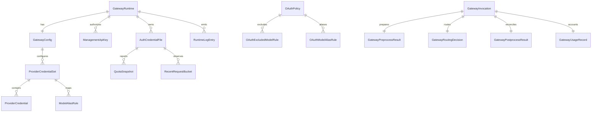

# Agent Gateway API

状态：current
文档类型：reference
适用范围：`apps/frontend/agent-gateway` 中转控制台、`agent-server` Agent Gateway API、Provider / 凭据 / 配额 / 日志治理接口
最后核对：2026-05-08

本文记录从 `/Users/dev/Desktop/Cli-Proxy-API-Management-Center` 参考项目提炼出的 Agent Gateway API 领域模型。当前仓库已落 schema-first contract、双 token 登录、runtime/config/provider/auth-file/quota 只读 projection、logs / usage / probe、token count、preprocess 与 accounting 最小后端入口，以及独立 `apps/frontend/agent-gateway` 中转前端骨架；真实 relay 转发、OAuth 写链路和 provider 持久化仍按本文作为后续扩展契约推进。

当前实现入口：

- Stable contract：`packages/core/src/contracts/agent-gateway/`
- Backend domain：`apps/backend/agent-server/src/domains/agent-gateway/`
- Backend API：`apps/backend/agent-server/src/api/agent-gateway/agent-gateway.controller.ts`
- Frontend relay app：`apps/frontend/agent-gateway/`

当前 HTTP 入口在 `agent-server` 全局 `/api` 前缀下生效；Vite 开发代理从前端侧以无 `/api` 的 `/agent-gateway/*` 访问后端：

| 能力         | 后端入口                                  | 前端开发访问                          |
| ------------ | ----------------------------------------- | ------------------------------------- |
| 登录         | `POST /api/agent-gateway/auth/login`      | `POST /agent-gateway/auth/login`      |
| 刷新短 token | `POST /api/agent-gateway/auth/refresh`    | `POST /agent-gateway/auth/refresh`    |
| 总览快照     | `GET /api/agent-gateway/snapshot`         | `GET /agent-gateway/snapshot`         |
| 上游方       | `GET /api/agent-gateway/providers`        | `GET /agent-gateway/providers`        |
| 认证文件     | `GET /api/agent-gateway/credential-files` | `GET /agent-gateway/credential-files` |
| 配额         | `GET /api/agent-gateway/quotas`           | `GET /agent-gateway/quotas`           |
| 日志         | `GET /api/agent-gateway/logs?limit=50`    | `GET /agent-gateway/logs?limit=50`    |
| 用量         | `GET /api/agent-gateway/usage?limit=50`   | `GET /agent-gateway/usage?limit=50`   |
| 探测         | `POST /api/agent-gateway/probe`           | `POST /agent-gateway/probe`           |
| token 估算   | `POST /api/agent-gateway/token-count`     | `POST /agent-gateway/token-count`     |
| 前处理       | `POST /api/agent-gateway/preprocess`      | `POST /agent-gateway/preprocess`      |
| 后处理记账   | `POST /api/agent-gateway/accounting`      | `POST /agent-gateway/accounting`      |

## 设计目标

- 将参考项目的 `/config`、`/api-keys`、`/gemini-api-key`、`/auth-files`、`/oauth-*`、`/logs`、`/api-call` 等散接口收敛为稳定领域 API。
- 前端必须是独立 workspace 项目，落点为 `apps/frontend/agent-gateway`；它只做中转站控制台，不进入 `agent-admin` 六大治理中心，也不复用 `agent-chat` 执行面。
- 独立中转前端只消费 camelCase、schema 校验后的领域模型，不直接依赖参考项目的 hyphen-case raw payload。
- 登录采用短 access token + 长 refresh token。access token 保存在 React session state；refresh token 当前按 contract 标注存放在 `localStorage`，键为 `agent-gateway.refresh-token`。
- 后端不提供默认账号、默认密码或生产 fallback secret；启用登录必须显式配置 `AGENT_GATEWAY_AUTH_SECRET`、`AGENT_GATEWAY_ADMIN_USERNAME` 与 `AGENT_GATEWAY_ADMIN_PASSWORD`。
- 明文 secret 只允许出现在创建、替换或保存命令 payload 中；查询 projection 默认只返回 masked value 或 `secretRef`。
- 保留 `authIndex` 作为 Provider、Auth File、Quota、Log、Recent Request 的跨域关联键。
- Provider-specific response、quota payload、OAuth callback 细节和第三方错误对象必须在 adapter 层归一，不穿透到页面或公共 contract。

## 参考来源

参考项目主要类型与 API 分组：

- `src/types/config.ts`：Gateway 配置、quota exceeded policy、provider config 聚合。
- `src/types/provider.ts`：Gemini / Codex / Claude / Vertex / OpenAI-compatible provider key 与 model alias。
- `src/types/authFile.ts`：OAuth / CLI auth file 列表、状态、最近请求。
- `src/types/oauth.ts`：OAuth provider、device flow、excluded models、model alias。
- `src/types/quota.ts`：Claude、Codex、Gemini CLI、Antigravity、Kimi quota payload 与 UI state。
- `src/services/api/*`：真实 management API endpoint、raw payload normalize、批量上传/删除与 probe API。

## 领域边界



## 核心模型

### GatewayRuntime

运行时连接与版本 projection。

```ts
type ConnectionStatus = 'connected' | 'disconnected' | 'connecting' | 'error';

type GatewayRuntime = {
  apiBase: string;
  connectionStatus: ConnectionStatus;
  serverVersion: string | null;
  serverBuildDate: string | null;
  latestVersion?: string | null;
  health?: {
    status: 'ok' | 'degraded' | 'error';
    checkedAt: string;
    error?: string;
  };
};
```

### GatewayConfig

配置 aggregate。字段命名使用 camelCase；adapter 负责映射参考项目 raw key，例如 `proxy-url`、`request-retry`、`logs-max-total-size-mb`。

```ts
type RoutingStrategy = 'round-robin' | 'fill-first';

type GatewayConfig = {
  debug: boolean;
  proxyUrl: string | null;
  requestRetry: number;
  requestLog: boolean;
  loggingToFile: boolean;
  logsMaxTotalSizeMb: number;
  wsAuth: boolean;
  forceModelPrefix: boolean;
  routing: {
    strategy: RoutingStrategy;
    sessionAffinity?: boolean;
    sessionAffinityTtlSeconds?: number;
  };
  quotaExceededPolicy: {
    switchProject: boolean;
    switchPreviewModel: boolean;
    antigravityCredits: boolean;
  };
  streaming?: {
    keepaliveSeconds?: number;
    bootstrapRetries?: number;
    nonstreamKeepaliveInterval?: number;
  };
  payloadRules?: {
    defaults: PayloadRule[];
    overrides: PayloadRule[];
    filters: PayloadFilterRule[];
  };
};
```

### ManagementApiKey

管理 API Key projection。查询接口不得返回未遮罩明文。

```ts
type ManagementApiKey = {
  id: string;
  index: number;
  valueMasked: string;
  createdAt?: string;
  updatedAt?: string;
  lastUsedAt?: string;
  usage?: ApiKeyUsageSummary;
};
```

创建、替换、更新命令可以短暂携带明文：

```ts
type SaveManagementApiKeysRequest = {
  keys: string[];
};
```

### ProviderCredentialSet

Provider 配置统一模型。参考项目的 Gemini / Codex / Claude / Vertex 单 key list 和 OpenAI-compatible 多 key entries 都映射为同一 aggregate。

```ts
type ProviderType = 'gemini' | 'codex' | 'claude' | 'vertex' | 'openaiCompatible' | 'ampcode';

type ProviderCredentialSet = {
  providerType: ProviderType;
  displayName: string;
  enabled: boolean;
  priority?: number;
  prefix?: string;
  baseUrl?: string;
  proxyUrl?: string;
  headers?: Record<string, string>;
  credentials: ProviderCredential[];
  models: ModelAliasRule[];
  excludedModels: string[];
  cloakPolicy?: CloakPolicy;
  testModel?: string;
  authIndex?: string;
  rawSource?: 'config' | 'runtime' | 'adapter';
};

type ProviderCredential = {
  credentialId: string;
  apiKeyMasked?: string;
  secretRef?: string;
  authIndex?: string;
  proxyUrl?: string;
  headers?: Record<string, string>;
  status: 'enabled' | 'disabled' | 'unavailable' | 'unknown';
};

type ModelAliasRule = {
  sourceModel: string;
  alias?: string;
  priority?: number;
  testModel?: string;
  fork?: boolean;
};

type CloakPolicy = {
  mode?: string;
  strictMode?: boolean;
  sensitiveWords: string[];
};
```

### AuthCredentialFile

Auth file 是 CLI / OAuth 凭据文件的领域 projection。文件内容读取与保存单独走 content endpoint；列表 projection 不返回 raw file。

```ts
type AuthFileType =
  | 'qwen'
  | 'kimi'
  | 'gemini'
  | 'gemini-cli'
  | 'aistudio'
  | 'claude'
  | 'codex'
  | 'antigravity'
  | 'iflow'
  | 'vertex'
  | 'unknown';

type AuthCredentialFile = {
  name: string;
  type: AuthFileType;
  provider?: string;
  size?: number;
  authIndex?: string;
  runtimeOnly: boolean;
  disabled: boolean;
  unavailable: boolean;
  status: 'enabled' | 'disabled' | 'unavailable' | 'unknown';
  statusMessage?: string;
  lastRefreshAt?: string;
  modifiedAt?: string;
  recentRequests: RecentRequestBucket[];
  editableFields?: {
    prefix?: string;
    proxyUrl?: string;
    headers?: Record<string, string>;
    priority?: number;
    note?: string;
  };
};
```

### OAuthPolicy

OAuth start/status/callback、excluded models 和 model alias 统一归入 OAuth policy 边界。

```ts
type OAuthProvider = 'codex' | 'anthropic' | 'antigravity' | 'gemini-cli' | 'kimi';

type OAuthPolicy = {
  provider: OAuthProvider;
  webUiSupported: boolean;
  authStatus?: 'idle' | 'pending' | 'authorized' | 'expired' | 'error';
  excludedModels: string[];
  modelAliases: OAuthModelAliasRule[];
};

type OAuthModelAliasRule = {
  channel: string;
  sourceModel: string;
  alias: string;
  fork: boolean;
};
```

### QuotaSnapshot

Quota 外层状态统一，内部 display shape 保留 provider 差异。adapter 从 Claude / Codex / Gemini CLI / Antigravity / Kimi payload 归一到这些 display rows。

```ts
type QuotaSnapshot = {
  providerType: ProviderType | 'kimi' | 'antigravity' | 'gemini-cli';
  subjectId: string;
  authIndex?: string;
  credentialName?: string;
  status: 'idle' | 'loading' | 'success' | 'error';
  planType?: string;
  windows?: QuotaWindow[];
  buckets?: QuotaBucket[];
  rows?: QuotaRow[];
  groups?: QuotaGroup[];
  error?: {
    message: string;
    status?: number;
  };
  observedAt: string;
};

type QuotaWindow = {
  id: string;
  label: string;
  usedPercent: number | null;
  resetLabel?: string;
};

type QuotaBucket = {
  id: string;
  label: string;
  remainingFraction: number | null;
  remainingAmount?: number | null;
  resetTime?: string;
  tokenType?: string | null;
};

type QuotaRow = {
  id: string;
  label: string;
  used: number;
  limit: number;
  resetHint?: string;
};

type QuotaGroup = {
  id: string;
  label: string;
  models: string[];
  remainingFraction: number;
  resetTime?: string;
};
```

### RuntimeLogEntry

日志列表应支持增量读取，并允许按 request id 下载完整 request log。

```ts
type RuntimeLogEntry = {
  timestamp: string;
  level: 'info' | 'warn' | 'error' | 'debug';
  message: string;
  details?: unknown;
  requestId?: string;
  provider?: string;
  model?: string;
  authIndex?: string;
};
```

### ApiProbe

参考项目的 `/api-call` 是受控 probe 能力，用于模型发现或诊断。它必须独立建模，不要伪装成普通浏览器 fetch。

```ts
type ApiProbeRequest = {
  authIndex?: string;
  method: 'GET' | 'POST' | 'PUT' | 'PATCH' | 'DELETE';
  url: string;
  headers?: Record<string, string>;
  bodyText?: string;
};

type ApiProbeResult = {
  statusCode: number;
  headers: Record<string, string[]>;
  bodyText: string;
  body: unknown | null;
};
```

### Gateway Invocation Pipeline

中转网关不是简单代理转发。所有 chat / completions / model probe 这类会触发上游模型调用的请求都必须进入统一 pipeline，至少包含：

```text
Inbound Request
  -> Preprocess
  -> Routing
  -> Upstream Dispatch
  -> Stream / Response Handling
  -> Postprocess
  -> Accounting & Audit
```

核心 invocation record：

```ts
type GatewayInvocation = {
  requestId: string;
  tenantId?: string;
  userId?: string;
  managementKeyId?: string;
  receivedAt: string;
  protocol: 'openai-compatible' | 'anthropic' | 'gemini' | 'internal';
  model: string;
  normalizedModel: string;
  stream: boolean;
  input: GatewayInvocationInput;
  preprocess?: GatewayPreprocessResult;
  routingDecision?: GatewayRoutingDecision;
  postprocess?: GatewayPostprocessResult;
  usage?: GatewayUsageRecord;
  trace: GatewayPipelineTraceEvent[];
};
```

`GatewayInvocationInput` 是内部 normalized request，不能直接保存 raw provider SDK object：

```ts
type GatewayInvocationInput = {
  messages?: Array<{
    role: 'system' | 'user' | 'assistant' | 'tool';
    content: string | Array<{ type: string; text?: string; url?: string }>;
    toolCallId?: string;
  }>;
  inputText?: string;
  tools?: Array<{ name: string; description?: string; parameters?: unknown }>;
  responseFormat?: 'text' | 'json' | 'json_schema';
  maxOutputTokens?: number;
  temperature?: number;
  metadata?: Record<string, string | number | boolean>;
};
```

### Tokenization

Token 计算必须按 tokenizer family 建模，不允许所有模型共用一个粗略公式。

```ts
type TokenizerFamily = 'openai-bpe' | 'anthropic' | 'gemini' | 'codex' | 'sentencepiece' | 'fallback-heuristic';

type TokenCountRequest = {
  model: string;
  providerType?: ProviderType | 'gemini-cli' | 'kimi' | 'antigravity';
  tokenizerFamily: TokenizerFamily;
  input: GatewayInvocationInput;
};

type TokenCountResult = {
  model: string;
  tokenizerFamily: TokenizerFamily;
  inputTokens: number;
  toolTokens: number;
  attachmentTokens: number;
  totalTokens: number;
  estimated: boolean;
  warnings: string[];
};
```

前处理 token 计算默认输出估算值；如果 provider 后续返回 usage，后处理阶段必须做 reconcile。

### Preprocess

前处理负责把外部请求转为可路由、可审计、可限流的内部调用。

```ts
type GatewayPreprocessResult = {
  requestId: string;
  normalizedModel: string;
  tokenizerFamily: TokenizerFamily;
  tokenCount: TokenCountResult;
  contextWindow: {
    limit: number;
    requestedOutputTokens: number;
    availableOutputTokens: number;
    fits: boolean;
  };
  budgetPreflight: {
    estimatedInputTokens: number;
    estimatedOutputTokens: number;
    estimatedTotalTokens: number;
    estimatedCost?: GatewayCostEstimate;
    allowed: boolean;
    reason?: string;
  };
  rateLimitPreflight: {
    allowed: boolean;
    policyIds: string[];
    blockedBy?: string;
    resetAt?: string;
  };
  candidateProviders: Array<{
    providerType: ProviderType;
    authIndex?: string;
    priority?: number;
    health: 'healthy' | 'degraded' | 'unavailable' | 'unknown';
  }>;
};
```

前处理必须覆盖：

- 请求规范化：OpenAI / Claude / Gemini / Codex 请求转为 `GatewayInvocationInput`。
- 模型解析：alias、prefix、fallback model、test model。
- 输入 token 计算：messages、system、tools、attachments、input text。
- 上下文窗口检查：`inputTokens + requestedOutputTokens <= contextWindow`。
- 预算预检：预计 token、预计成本、tenant/key/provider quota。
- 限流预检：RPM、TPM、并发、日限额。
- 安全策略：blocked model、disabled credential、header allowlist、probe allowlist。

### Routing

```ts
type GatewayRoutingDecision = {
  requestId: string;
  strategy: 'round-robin' | 'fill-first' | 'priority' | 'least-used' | 'quota-aware';
  selectedProvider: ProviderType;
  selectedAuthIndex?: string;
  selectedCredentialId?: string;
  selectedModel: string;
  candidates: Array<{
    providerType: ProviderType;
    authIndex?: string;
    score: number;
    skippedReason?: string;
  }>;
  fallbackChain: Array<{
    providerType: ProviderType;
    authIndex?: string;
    reason: 'quota_exceeded' | 'rate_limited' | 'timeout' | 'upstream_error' | 'model_unavailable';
  }>;
  decidedAt: string;
};
```

### Postprocess

后处理负责 output token 计算、provider usage reconcile、格式归一和敏感字段剔除。

```ts
type UsageSource = 'estimated' | 'provider' | 'reconciled';

type GatewayPostprocessResult = {
  requestId: string;
  outputTokenCount: {
    completionTokens: number;
    reasoningTokens?: number;
    toolCallTokens?: number;
    estimated: boolean;
  };
  usageReconciliation: {
    source: UsageSource;
    estimatedInputTokens: number;
    reportedInputTokens?: number;
    estimatedOutputTokens: number;
    reportedOutputTokens?: number;
    finalInputTokens: number;
    finalOutputTokens: number;
    finalTotalTokens: number;
  };
  responseShape: 'openai-compatible' | 'internal';
  sanitized: boolean;
};
```

### Accounting

每次中转请求必须形成账本记录。日志、quota、dashboard、recent requests 都应消费账本 projection，而不是重复解析 raw logs。

```ts
type GatewayCostEstimate = {
  currency: 'USD' | 'CNY' | 'credits' | 'unknown';
  inputCost: number;
  outputCost: number;
  totalCost: number;
  pricingProfileId?: string;
};

type GatewayUsageRecord = {
  requestId: string;
  tenantId?: string;
  userId?: string;
  managementKeyId?: string;
  model: string;
  providerType: ProviderType;
  authIndex?: string;
  inputTokens: number;
  outputTokens: number;
  totalTokens: number;
  cachedTokens?: number;
  reasoningTokens?: number;
  usageSource: UsageSource;
  estimatedCost?: GatewayCostEstimate;
  latencyMs: number;
  status: 'success' | 'error' | 'cancelled';
  errorCode?: string;
  createdAt: string;
};
```

### Rate Limit and Model Capability

```ts
type RateLimitPolicy = {
  id: string;
  scope: 'management-key' | 'provider-credential' | 'tenant' | 'global';
  subjectId: string;
  rpm?: number;
  tpm?: number;
  dailyTokens?: number;
  concurrency?: number;
};

type ModelCapabilityProfile = {
  model: string;
  providerType: ProviderType;
  tokenizerFamily: TokenizerFamily;
  contextWindow: number;
  maxOutputTokens: number;
  supportsTools: boolean;
  supportsVision: boolean;
  supportsJsonMode: boolean;
  supportsStreaming: boolean;
};
```

### Pipeline Trace

Preprocess 和 postprocess 都必须可观测。Trace event 只保存摘要和稳定字段，不保存 raw secret、完整 provider response 或未过滤 headers。

```ts
type GatewayPipelineTraceEvent = {
  requestId: string;
  type:
    | 'token.input.estimated'
    | 'budget.preflight.completed'
    | 'rate-limit.preflight.completed'
    | 'routing.selected'
    | 'upstream.started'
    | 'upstream.completed'
    | 'token.output.estimated'
    | 'token.output.reconciled'
    | 'accounting.committed';
  timestamp: string;
  summary: Record<string, string | number | boolean | null>;
};
```

## API 入口

当前已落地入口使用 `agent-server` 全局 `/api` 前缀。表中标记为 planned 的写链路、OAuth 与真实 relay 仍是后续契约，不代表当前代码已经接线。

### Runtime

| Method | Path                          | Status  | Response          |
| ------ | ----------------------------- | ------- | ----------------- |
| `GET`  | `/api/agent-gateway/snapshot` | current | `GatewaySnapshot` |

### Config

| Method  | Path                                          | Status  | Request / Response                   |
| ------- | --------------------------------------------- | ------- | ------------------------------------ |
| `GET`   | `/api/agent-gateway/snapshot`                 | current | snapshot 内含 `GatewayConfig`        |
| `GET`   | `/api/agent-gateway/config`                   | planned | `GatewayConfig`                      |
| `GET`   | `/api/agent-gateway/config/raw`               | planned | raw YAML text 或 raw config object   |
| `PUT`   | `/api/agent-gateway/config/raw`               | planned | raw YAML text                        |
| `PATCH` | `/api/agent-gateway/config/sections/:section` | planned | section-specific `{ value }` command |

`section` 允许值必须枚举化，不允许任意路径写入。初始枚举可覆盖：

```text
debug
proxyUrl
requestRetry
requestLog
loggingToFile
logsMaxTotalSizeMb
wsAuth
forceModelPrefix
routing.strategy
quotaExceeded.switchProject
quotaExceeded.switchPreviewModel
quotaExceeded.antigravityCredits
```

### Management Keys

| Method   | Path                                        | Status  | Request / Response             |
| -------- | ------------------------------------------- | ------- | ------------------------------ |
| `GET`    | `/api/agent-gateway/management-keys`        | planned | `ManagementApiKey[]`           |
| `PUT`    | `/api/agent-gateway/management-keys`        | planned | `SaveManagementApiKeysRequest` |
| `PATCH`  | `/api/agent-gateway/management-keys/:index` | planned | `{ value: string }`            |
| `DELETE` | `/api/agent-gateway/management-keys/:index` | planned | no body                        |
| `GET`    | `/api/agent-gateway/management-keys/usage`  | planned | API key usage projection       |

### Providers

| Method   | Path                                                         | Status  | Request / Response           |
| -------- | ------------------------------------------------------------ | ------- | ---------------------------- |
| `GET`    | `/api/agent-gateway/providers`                               | current | `ProviderCredentialSet[]`    |
| `PUT`    | `/api/agent-gateway/providers/:providerType`                 | planned | replace provider set         |
| `PATCH`  | `/api/agent-gateway/providers/:providerType/:index`          | planned | partial provider update      |
| `PATCH`  | `/api/agent-gateway/providers/:providerType/:index/status`   | planned | `{ enabled: boolean }`       |
| `DELETE` | `/api/agent-gateway/providers/:providerType/:index`          | planned | no body                      |
| `POST`   | `/api/agent-gateway/providers/:providerType/model-discovery` | planned | probe models through adapter |

### Auth Files

| Method   | Path                                            | Status  | Request / Response                 |
| -------- | ----------------------------------------------- | ------- | ---------------------------------- |
| `GET`    | `/api/agent-gateway/credential-files`           | current | `GatewayCredentialFile[]`          |
| `GET`    | `/api/agent-gateway/auth-files`                 | planned | `{ files: AuthCredentialFile[] }`  |
| `POST`   | `/api/agent-gateway/auth-files`                 | planned | multipart batch upload             |
| `PATCH`  | `/api/agent-gateway/auth-files/:name/status`    | planned | `{ disabled: boolean }`            |
| `PATCH`  | `/api/agent-gateway/auth-files/:name/fields`    | planned | editable fields patch              |
| `DELETE` | `/api/agent-gateway/auth-files`                 | planned | `{ names?: string[], all?: true }` |
| `GET`    | `/api/agent-gateway/auth-files/:name/download`  | planned | text/blob                          |
| `PUT`    | `/api/agent-gateway/auth-files/:name/content`   | planned | text/json content                  |
| `GET`    | `/api/agent-gateway/auth-files/:name/models`    | planned | normalized model list              |
| `GET`    | `/api/agent-gateway/model-definitions/:channel` | planned | normalized model definitions       |

Batch upload/delete response:

```ts
type BatchFileMutationResult = {
  status: 'ok' | 'partial' | 'error';
  succeeded: number;
  files: string[];
  failed: Array<{ name: string; error: string }>;
};
```

### OAuth

| Method   | Path                                                 | Status  | Request / Response      |
| -------- | ---------------------------------------------------- | ------- | ----------------------- |
| `GET`    | `/api/agent-gateway/oauth/policies`                  | planned | `OAuthPolicy[]`         |
| `POST`   | `/api/agent-gateway/oauth/:provider/start`           | planned | `{ projectId? }` -> url |
| `GET`    | `/api/agent-gateway/oauth/status`                    | planned | `{ state }` query       |
| `POST`   | `/api/agent-gateway/oauth/:provider/callback`        | planned | `{ redirectUrl }`       |
| `PATCH`  | `/api/agent-gateway/oauth/:provider/excluded-models` | planned | `{ models: string[] }`  |
| `DELETE` | `/api/agent-gateway/oauth/:provider/excluded-models` | planned | no body                 |
| `PATCH`  | `/api/agent-gateway/oauth/:channel/model-aliases`    | planned | aliases list            |
| `DELETE` | `/api/agent-gateway/oauth/:channel/model-aliases`    | planned | no body                 |

### Quota

| Method | Path                        | Status  | Response          |
| ------ | --------------------------- | ------- | ----------------- |
| `GET`  | `/api/agent-gateway/quotas` | current | `GatewayQuota[]`  |
| `GET`  | `/api/agent-gateway/quota`  | planned | `QuotaSnapshot[]` |

Quota endpoint 可由后端并发聚合 provider-specific quota API；前端不直接调用 vendor quota API。

### Logs

| Method   | Path                                          | Status  | Request / Response                |
| -------- | --------------------------------------------- | ------- | --------------------------------- |
| `GET`    | `/api/agent-gateway/logs`                     | current | `{ items: GatewayLogEntry[] }`    |
| `GET`    | `/api/agent-gateway/usage`                    | current | `{ items: GatewayUsageRecord[] }` |
| `DELETE` | `/api/agent-gateway/logs`                     | planned | clear runtime logs                |
| `GET`    | `/api/agent-gateway/request-error-logs`       | planned | error log file list               |
| `GET`    | `/api/agent-gateway/request-error-logs/:name` | planned | blob/text                         |
| `GET`    | `/api/agent-gateway/request-logs/:requestId`  | planned | blob/text                         |

### Probe

| Method | Path                       | Status  | Request / Response                |
| ------ | -------------------------- | ------- | --------------------------------- |
| `POST` | `/api/agent-gateway/probe` | current | `GatewayProbeRequest` -> response |

Probe 必须经过服务端 allowlist / policy 校验；不得成为任意 SSRF 通道。

### Invocation Pipeline

| Method | Path                                       | Status  | Request / Response                     |
| ------ | ------------------------------------------ | ------- | -------------------------------------- |
| `POST` | `/api/agent-gateway/token-count`           | current | `GatewayTokenCountRequest` -> response |
| `POST` | `/api/agent-gateway/preprocess`            | current | `GatewayPreprocessRequest` -> response |
| `POST` | `/api/agent-gateway/accounting`            | current | `GatewayAccountingRequest` -> response |
| `POST` | `/api/agent-gateway/invocations/:id/route` | planned | `GatewayRoutingDecision`               |
| `GET`  | `/api/agent-gateway/invocations/:id`       | planned | `GatewayInvocation`                    |
| `GET`  | `/api/agent-gateway/usage-records`         | planned | paginated `GatewayUsageRecord[]`       |

真实 chat/completions relay endpoint 可在后续文档单独定义，但必须复用本文 pipeline contract。

## Adapter 映射

| Agent Gateway model     | 参考项目 raw source                                                                                            |
| ----------------------- | -------------------------------------------------------------------------------------------------------------- |
| `GatewayConfig`         | `GET /config`、`GET /config.yaml`                                                                              |
| `ManagementApiKey[]`    | `GET /api-keys`                                                                                                |
| `ProviderCredentialSet` | `/gemini-api-key`、`/codex-api-key`、`/claude-api-key`、`/vertex-api-key`、`/openai-compatibility`、`/ampcode` |
| `AuthCredentialFile[]`  | `GET /auth-files`                                                                                              |
| `OAuthPolicy`           | `/oauth-excluded-models`、`/oauth-model-alias`、`/:provider-auth-url`、`/get-auth-status`、`/oauth-callback`   |
| `QuotaSnapshot`         | provider/auth-file quota payloads                                                                              |
| `RuntimeLogEntry`       | `/logs`、`/request-error-logs`、`/request-log-by-id`                                                           |
| `ApiProbeResult`        | `/api-call`                                                                                                    |
| `GatewayUsageRecord`    | request log、provider usage、stream aggregation、postprocess token reconcile                                   |
| `TokenCountResult`      | tokenizer provider 或 fallback heuristic                                                                       |

## 错误语义

统一错误结构：

```ts
type GatewayApiError = {
  code:
    | 'GATEWAY_UNAUTHENTICATED'
    | 'GATEWAY_FORBIDDEN'
    | 'GATEWAY_NOT_FOUND'
    | 'GATEWAY_VALIDATION_FAILED'
    | 'GATEWAY_PROVIDER_UNAVAILABLE'
    | 'GATEWAY_CONTEXT_WINDOW_EXCEEDED'
    | 'GATEWAY_RATE_LIMITED'
    | 'GATEWAY_BUDGET_EXCEEDED'
    | 'GATEWAY_SECRET_REQUIRED'
    | 'GATEWAY_PROBE_BLOCKED'
    | 'GATEWAY_UPSTREAM_FAILED'
    | 'GATEWAY_INTERNAL_ERROR';
  message: string;
  details?: unknown;
  requestId?: string;
};
```

兼容策略：

- adapter 可读取 raw `error`、`message`、HTTP status 和 vendor body，但对外只返回 `GatewayApiError`。
- `GATEWAY_SECRET_REQUIRED` 用于需要明文 secret 才能保存或测试的命令。
- `GATEWAY_PROBE_BLOCKED` 用于 SSRF / policy / allowlist 拒绝。
- `GATEWAY_CONTEXT_WINDOW_EXCEEDED`、`GATEWAY_RATE_LIMITED`、`GATEWAY_BUDGET_EXCEEDED` 必须由 preprocess 阶段返回，不能等上游调用失败后再补记。
- vendor 原始错误只允许放入服务端日志，不直接出现在公共 response。

## 实现边界

独立中转前端职责：

- 只消费本文定义的 normalized projection。
- 不保存未遮罩 secret 到长期 store。
- Provider、Auth File、Quota、Logs 之间通过 `authIndex`、`providerType`、`requestId` 关联展示。
- 不自行解析参考项目 raw payload。
- 不承载 Runtime Center、Approvals Center、Learning Center、Skill Lab、Evidence Center、Connector & Policy Center；这些仍属于 `agent-admin`。
- 不承载 Chat thread、审批卡片、Think panel 或 ThoughtChain；这些仍属于 `agent-chat`。

后端 / adapter 职责：

- 负责 raw endpoint 兼容、hyphen-case 到 camelCase 映射、dedupe、排序、mask secret。
- 负责 provider-specific model discovery、quota payload normalization、OAuth callback provider name mapping。
- 负责 tokenizer family 选择、输入 token 估算、上下文窗口检查、预算和限流预检。
- 负责输出 token 估算、provider usage reconcile、账本提交和 pipeline trace 摘要。
- 负责 probe allowlist、timeout、headers 过滤和错误归一。
- 负责 schema parse；不允许 `JSON.parse` + 手写 if 作为长期稳定 contract。

公共 contract 职责：

- 后续落到 `packages/core/src/contracts/agent-gateway/*` 或真实宿主 `schemas/`。
- TypeScript 类型必须由 zod schema 推导。
- 查询 projection 与命令 payload 要分离，避免 secret 字段误出现在 response contract。

## 后续落地顺序

1. 在 `packages/core` 或真实宿主补 `GatewayConfigSchema`、`ProviderCredentialSetSchema`、`AuthCredentialFileSchema`、`QuotaSnapshotSchema`、`GatewayApiErrorSchema`。
2. 写 adapter parse 回归，固定参考项目 raw payload 到 normalized model 的映射。
3. 补 `TokenCountResultSchema`、`GatewayPreprocessResultSchema`、`GatewayRoutingDecisionSchema`、`GatewayPostprocessResultSchema`、`GatewayUsageRecordSchema` 与 trace event schema。
4. 实现只读 projection：runtime、config、providers、auth-files、logs。
5. 实现写命令：config sections、management keys、providers、auth-files。
6. 接入 preprocess token 估算、预算/限流预检、postprocess usage reconcile 和 accounting ledger。
7. 接入 quota / OAuth / api-probe，并补 policy 和 error normalization 测试。
8. 继续完善 `apps/frontend/agent-gateway` 独立中转前端；页面不得绕过稳定 contract 直接消费 raw payload。
