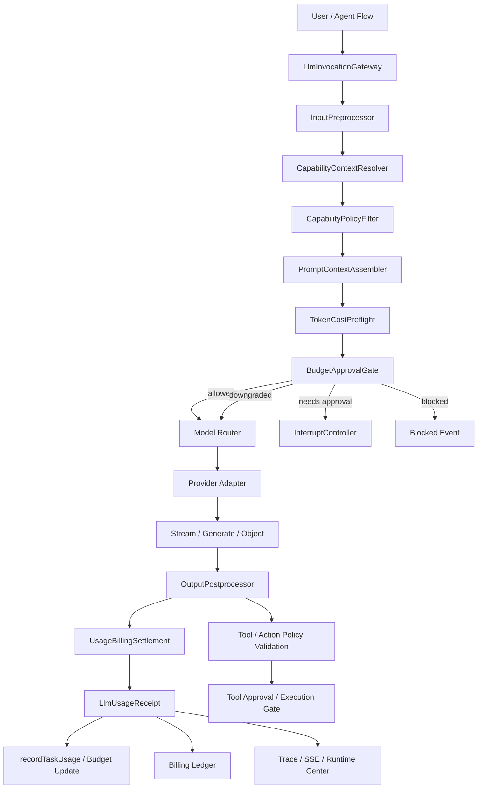

# LLM Invocation Lifecycle 计划

状态：snapshot
文档类型：plan
适用范围：`packages/runtime`、`packages/core`、`packages/adapters`、`packages/platform-runtime`、`packages/skill-runtime`、`packages/tools`、`apps/backend/agent-server`
最后核对：2026-04-23

本文定义一条统一的 LLM 调用生命周期计划，用于把用户输入、大模型前处理、skills/tools/connectors 能力注入、token/cost 预检、模型调用、后处理、usage 结算、计费与审计收敛到稳定 runtime contract。

本计划不是普通聊天接口优化，而是面向自治 Agent 主链的治理能力。后续所有稳定模型调用默认不得绕过本文定义的生命周期网关。

## 1. 背景与问题

当前仓库已经具备若干基础能力：

- provider 侧通过 `onUsage` 返回 usage。
- runtime 侧已有 `recordTaskUsage(...)` 聚合 `llmUsage` 与 `budgetState`。
- capability pool 已能承接 skill search、capability attachment、worker/ministry preference。
- skill install、connector governance、高风险工具已能进入 interrupt / approval 链路。
- runtime center / admin 侧已有 usage、pricing source、provider billing audit 展示基础。

但当前仍缺少一条统一的模型调用生命周期：

- 用户输入进入模型前，缺少统一前处理入口。
- token 预估没有覆盖最终 prompt 全量上下文。
- skills、tools、connectors、MCP capability、审批策略没有统一注入 contract。
- provider usage、估算 usage、事后对账 usage 没有统一 receipt。
- streaming、cache、retry、fallback、失败和取消场景的 usage 语义不够稳定。
- 不同 agent / flow 可能各自传 `onUsage`，长期会导致计费、预算和审计口径分叉。

## 2. 目标

本轮长期目标是新增 `Capability-Aware LLM Invocation Gateway`，把模型调用拆成可治理、可审计、可恢复的生命周期：

```text
User / Agent / Flow
  -> LlmInvocationGateway
      -> InputPreprocessor
      -> CapabilityContextResolver
      -> CapabilityPolicyFilter
      -> PromptContextAssembler
      -> TokenCostPreflight
      -> BudgetApprovalGate
      -> ProviderCall
      -> OutputPostprocessor
      -> UsageBillingSettlement
      -> CapabilityUsageRecorder
```

实现后需要满足：

- 所有主链 LLM 调用都有 `invocationId`。
- 所有稳定 LLM 调用都先经过前处理和预算/能力治理。
- 模型看到的 skills/tools/connectors 是按需、受控、可审计的能力上下文。
- token/cost 预检基于最终 prompt，而不是只看用户原始输入。
- provider usage 优先，本地估算兜底，后续 provider billing 可对账修正。
- 高风险工具、skill 安装、connector 配置、超预算动作进入 interrupt / approval。
- runtime center 能按 task/session/model/provider/skill/tool/pricingSource 观察 usage。

## 3. 非目标

第一阶段不做完整企业账务系统：

- 不做发票、充值、余额账户、支付。
- 不做多租户财务结算。
- 不强制所有非主链调试接口立即迁移。
- 不把 provider SDK 的原始 usage/error/event 结构暴露给业务层。
- 不把完整 `SKILL.md`、工具文档、connector 文档无差别塞进 prompt。

这些能力可在第三阶段通过 billing ledger 与 reconciliation 扩展。

## 4. 总体架构



## 5. 前处理设计

前处理不只是 token 计算，而是 runtime 模型调用前的“上下文与能力装配层”。

### 5.1 InputPreprocessor

职责：

- 归一化用户输入，不改变用户意图。
- 识别语言、文件路径、URL、命令、外部系统名称。
- 标记潜在风险信号，例如删除、发布、安装依赖、发消息、外部计费、凭据操作。
- 为后续 intent/mode/capability 解析提供轻量特征。

输出建议：

```ts
type NormalizedInvocationInput = {
  rawText: string;
  normalizedText: string;
  language: 'zh' | 'en' | 'mixed' | 'unknown';
  detectedRefs: string[];
  riskSignals: string[];
};
```

### 5.2 Intent & Mode Classifier

职责：

- 判断本轮是 `plan`、`execute`、`imperial_direct`、`clarification`、`skill_discovery` 还是 `capability_gap`。
- 决定模型调用是否需要工具能力、是否允许执行外部副作用。
- 将显式用户模型偏好写入 `requestedHints.preferredModelId`，但仍交给 runtime governance 最终路由。

模式约束：

- `plan`：只读分析，工具只能作为建议或只读上下文。
- `execute`：允许执行，但高风险动作必须审批。
- `imperial_direct`：只跳过不必要规划，不跳过安全、预算、审批和计费。

### 5.3 CapabilityContextResolver

这是本计划的核心新增模块。

职责：

- 从 runtime skill registry 读取已安装、已启用、与任务相关的 skills。
- 从 tool registry 读取当前可用工具。
- 从 connector registry / MCP capability registry 读取外部能力。
- 读取 task 上已有的 `capabilityAttachments`、`capabilityAugmentations`、`usedInstalledSkills`、`skillSearch`。
- 读取 workflow / ministry / specialist 路由对能力的要求。
- 检测缺失能力，并生成 skill / connector / MCP 推荐。

能力来源：

- `@agent/skill-runtime`：运行时 skill registry、skill search、install receipt。
- `@agent/tools`：tool definition、risk classifier、approval preflight。
- `packages/runtime/src/capabilities/*`：capability pool、attachment、governance preference。
- `@agent/core`：稳定 capability、skill、tool、connector、approval contract。
- `packages/platform-runtime`：官方 agent / workflow / provider 组合根。

输出建议：

```ts
type CapabilityContextSnapshot = {
  invocationId: string;
  taskId?: string;
  mode: 'plan' | 'execute' | 'imperial_direct';
  skills: InjectedSkillContext[];
  tools: InjectedToolContext[];
  connectors: InjectedConnectorContext[];
  missingCapabilities: CapabilityGapRecord[];
  recommendedSkills: SkillSuggestionRecord[];
  generatedAt: string;
};
```

### 5.4 CapabilityPolicyFilter

职责：

- 按用户、session、task、mode、profile policy 过滤能力。
- 判断能力是可直接使用、需要审批、仅可建议、缺凭据、未安装还是被策略禁止。
- 防止模型误以为未配置或禁用工具可用。
- 对高风险工具、skill install、connector configure 写入 approval hint。

建议状态：

```ts
type CapabilityAvailability =
  | 'available'
  | 'available_with_approval'
  | 'suggestion_only'
  | 'missing_secret'
  | 'not_installed'
  | 'disabled_by_policy'
  | 'blocked';
```

规则：

- 高风险工具只注入“如何申请审批”，不注入“可以直接执行”。
- 未安装 skill 只能作为 recommendation 注入。
- 缺少 secret 的 connector 不能作为可执行能力注入。
- 只读模式下写操作工具必须降级为 suggestion 或 blocked。

### 5.5 PromptContextAssembler

职责：

- 把用户输入、系统提示词、历史上下文、memory、evidence、skills、tools、connectors、输出 contract 组装成最终 prompt。
- 控制 capability context 的 token 占比。
- 只注入本轮相关能力，不注入全量 registry。
- 对能力上下文做摘要压缩与排序。

能力注入分三层：

- 第一层：能力摘要，告诉模型当前有哪些能力类别。
- 第二层：命中能力卡，只注入和当前任务相关的 skill/tool/connector 摘要。
- 第三层：按需展开，当模型计划使用某个 skill/tool 时再加载更详细 contract。

示例片段：

```text
# Runtime Capability Context

Execution mode: execute
Budget: 8000 tokens remaining

Available skills:
- code-review: Review TypeScript changes and identify regression risks.
- lark-doc: Create and update Lark documents.

Available tools:
- filesystem.read: allowed
- filesystem.write: requires approval for protected paths
- shell.command: requires approval for destructive commands
- skill.install: requires approval

Connectors:
- github: configured
- lark: configured
- browser: unavailable

Policy:
- Prefer existing skills before raw tool use.
- If required capability is missing, request skill or connector setup.
- Do not execute high-risk actions directly.
```

### 5.6 TokenCostPreflight

职责：

- 对最终 prompt 做 token 估算。
- 区分 user/system/history/memory/evidence/capability/schema 各部分 token。
- 结合 selected model 的 context window 做检查。
- 估算 max output、total tokens、cost。
- 若超限，触发压缩、降级、换模型或阻断。

估算对象必须包括：

- 用户输入。
- system prompt。
- 会话历史。
- memory。
- evidence。
- skill context。
- tool context。
- connector context。
- schema / output contract。
- retry / fallback instruction。

输出建议：

```ts
type TokenCostPreflightResult = {
  estimatedPromptTokens: number;
  estimatedCapabilityTokens: number;
  estimatedHistoryTokens: number;
  estimatedMaxOutputTokens: number;
  projectedTotalTokens: number;
  projectedCostUsd: number;
  contextWindowStatus: 'ok' | 'needs_compression' | 'blocked';
};
```

压缩优先级：

1. 压缩历史消息。
2. 压缩 evidence。
3. 只保留 top skills/tools/connectors。
4. 移除低相关候选 skill。
5. 降低 max output。
6. 切换长上下文模型。
7. 仍超限则阻断并请求用户缩小范围。

### 5.7 BudgetApprovalGate

职责：

- 基于 `budgetState`、profile policy、preflight result 决定是否调用模型。
- 对预计超预算、单次高成本、上下文超限、高风险能力使用发起 interrupt。
- 支持模型降级、输出长度缩减、能力上下文压缩后继续。

决策建议：

```ts
type CapabilityPreflightDecision =
  | { status: 'allowed' }
  | { status: 'allowed_with_compression' }
  | { status: 'downgraded_model' }
  | { status: 'needs_approval' }
  | { status: 'needs_skill_install_approval' }
  | { status: 'needs_connector_setup' }
  | { status: 'blocked_over_budget' }
  | { status: 'blocked_policy' };
```

## 6. 模型调用设计

`LlmInvocationGateway` 对外提供统一调用入口：

```ts
interface LlmInvocationGateway {
  generateText(request: LlmInvocationRequest): Promise<LlmInvocationResult>;
  streamText(
    request: LlmInvocationRequest,
    onToken: (token: string, metadata?: LlmTokenMetadata) => void
  ): Promise<LlmInvocationResult>;
  generateObject<T>(request: LlmInvocationRequest, schema: z.ZodType<T>): Promise<LlmObjectInvocationResult<T>>;
}
```

调用要求：

- 每次调用必须有 `invocationId`。
- 每次调用必须带 `taskId` 或明确标记为 `debug / detached`。
- 每次调用必须声明 `purpose`，例如 planning、routing、research、execution、review、final-response。
- 每次调用必须产出 preflight trace。
- 每次 provider 调用必须产出 usage receipt，即使失败、取消、cache hit 或 fallback。

## 7. 后处理设计

后处理不只是 output token 统计，还要做策略校验与 usage 结算。

### 7.1 OutputPostprocessor

职责：

- 汇总 streaming token 或非流式 output。
- 校验模型是否声称使用了不存在的 skill。
- 校验模型是否建议或触发被 policy 禁止的工具。
- 解析 action intent / tool call plan。
- 对需要执行的 tool call 进入 tool preflight / approval，而不是直接执行。
- 清理不应展示给用户的内部策略片段。

### 7.2 UsageBillingSettlement

职责：

- 优先读取 provider usage。
- provider 没有 usage 时使用本地估算。
- streaming 期间只做 provisional usage，结束后 settle。
- 对失败、取消、partial response 做 partial receipt。
- 对 retry/fallback 的每次 provider call 分别记录 receipt。
- 对 cache hit 记录内部 usage saving，但不按 provider 成本计费。
- 计算 `costUsd / costCny / pricingSource`。
- 调用 `recordTaskUsage(...)` 更新 `llmUsage` 和 `budgetState`。

pricing source：

- `provider`：provider response 直接返回 usage/cost。
- `estimated`：本地估算。
- `reconciled`：后续 provider billing API 对账修正。

### 7.3 CapabilityUsageRecorder

职责：

- 记录本轮实际注入了哪些 skill/tool/connector。
- 记录模型实际使用或建议了哪些能力。
- 将能力使用反馈给 learning signals。
- 支持 admin 侧观察 skill reuse、capability gap、tool approval、connector missing secret 等指标。

## 8. 稳定 Contract 计划

`packages/core` 新增 schema-first contract：

```text
packages/core/src/llm-invocation/
├─ schemas/
│  ├─ llm-invocation.schema.ts
│  ├─ capability-context.schema.ts
│  ├─ llm-usage-receipt.schema.ts
│  └─ billing-ledger.schema.ts
├─ types/
│  └─ llm-invocation.types.ts
└─ index.ts
```

建议第一批 contract：

- `LlmInvocationRequestSchema`
- `LlmInvocationResultSchema`
- `CapabilityContextSnapshotSchema`
- `InjectedSkillContextSchema`
- `InjectedToolContextSchema`
- `InjectedConnectorContextSchema`
- `CapabilityPreflightDecisionSchema`
- `TokenCostPreflightResultSchema`
- `LlmUsageReceiptSchema`
- `CapabilityUsageReceiptSchema`

兼容原则：

- 先新增字段，不破坏现有 `ProviderUsage` / `TaskRecord.llmUsage`。
- `recordTaskUsage(...)` 先兼容旧 usage 输入，再逐步迁移到 receipt。
- provider 原始 usage 不进入 `core`，必须先经 adapter normalize。

## 9. 代码落点计划

### 9.1 `packages/core`

负责：

- schema-first 稳定 contract。
- 不包含 runtime 处理逻辑。
- 不依赖 provider、runtime、skill-runtime、tools。

### 9.2 `packages/runtime`

负责：

- `LlmInvocationGateway` 主实现。
- 前处理、能力上下文解析、prompt 组装、token/cost 预检、预算门、后处理、usage settlement。
- 与 `recordTaskUsage(...)`、`budgetState`、`activeInterrupt`、`pendingApproval`、trace、checkpoint 对接。

建议目录：

```text
packages/runtime/src/llm-invocation/
├─ gateway/
├─ preflight/
├─ capabilities/
├─ prompts/
├─ settlement/
├─ receipts/
├─ runtime/
└─ index.ts
```

### 9.3 `packages/adapters`

负责：

- provider SDK 调用。
- vendor usage/error/event normalize。
- model router 与 provider registry 继续保留。
- 不承载 task budget、skill policy、billing ledger 主语义。

### 9.4 `packages/platform-runtime`

负责：

- 注入默认 gateway dependencies。
- 注入 pricing table、provider billing reconciliation adapter。
- 将官方 agent / workflow / provider registry 与 gateway 组合。

### 9.5 `packages/skill-runtime`

负责：

- skill registry、skill search、install receipt。
- 提供 gateway 可消费的 skill 摘要与 availability。
- 不直接拼 LLM prompt。

### 9.6 `packages/tools`

负责：

- tool registry、risk classifier、approval preflight、tool capability definition。
- 提供 gateway 可消费的 tool 摘要与审批要求。
- 不承载 agent orchestration。

### 9.7 `apps/backend/agent-server`

负责：

- 通过 platform/runtime facade 调用 gateway。
- 不直接拼 skill/tool/cost 前处理流程。
- 继续作为 HTTP/SSE/BFF adapter。

## 10. 事件与观测

新增或复用事件建议：

- `llm_preflight_started`
- `llm_preflight_completed`
- `capability_context_resolved`
- `capability_context_compressed`
- `llm_invocation_started`
- `llm_usage_settled`
- `llm_budget_interrupted`
- `capability_usage_recorded`
- `billing_receipt_recorded`

如果短期不扩展 `ChatEventRecordSchema`，可先落入 task trace；一旦需要前端展示，再补稳定 SSE 事件 contract。

runtime center 需要展示：

- invocation count。
- prompt/completion/total tokens。
- capability context tokens。
- model/provider/pricingSource。
- skill/tool/connector 注入与使用情况。
- estimated vs provider vs reconciled usage。
- budget preflight decision。
- approval / block reason。

## 11. 分阶段实施计划

### Phase 0：文档与边界确认

完成条件：

- 本文档创建并挂入 `docs/runtime/README.md`。
- 确认 `runtime` 是 gateway 主宿主。
- 确认 `core` 只承载 schema-first contract。
- 确认 `adapters` 不承载业务计费策略。

验证：

- `pnpm check:docs`

### Phase 1：Core Contract

工作项：

- 新增 `packages/core/src/llm-invocation/*`。
- 定义 request、capability context、preflight decision、usage receipt schema。
- 补 zod parse tests。
- 从 `@agent/core` 根入口导出。

验收：

- schema 可以 parse allowed / approval / blocked / receipt 典型样例。
- 不引入对 runtime/adapters/tools/skill-runtime 的依赖。

验证：

- `pnpm test:spec`
- `pnpm exec tsc -p packages/core/tsconfig.json --noEmit`

### Phase 2：Runtime Gateway Skeleton

工作项：

- 新增 `packages/runtime/src/llm-invocation/*`。
- 实现 `LlmInvocationGateway` skeleton。
- 实现 `InputPreprocessor`、`CapabilityContextResolver`、`CapabilityPolicyFilter` 的最小版本。
- 先接入已有 skillSearch、capabilityAttachments、tool attachment。
- 生成 preflight trace，但先不迁移所有调用点。

验收：

- gateway 能产出 capability context snapshot。
- 高风险 skill install / connector missing / over budget 能产出明确 decision。
- 不破坏现有 direct provider 调用。

验证：

- `pnpm exec tsc -p packages/runtime/tsconfig.json --noEmit`
- `pnpm --dir packages/runtime test`

### Phase 3：Token/Cost Preflight 与 Prompt Assembly

工作项：

- 实现 prompt segment 模型。
- 实现 user/system/history/memory/evidence/capability/schema token 分段估算。
- 实现 capability context top-K 与压缩策略。
- 接入 model context window。
- 接入 budget soft/hard threshold。

验收：

- 估算对象覆盖最终 prompt。
- capability context 过长时会压缩，而不是无限注入。
- 超上下文窗口时不会调用 provider。

验证：

- token preflight unit tests。
- budget gate tests。
- runtime package typecheck。

### Phase 4：Usage Settlement 与 Receipt

工作项：

- 实现 `LlmUsageReceipt` 生成。
- provider usage 优先，本地估算兜底。
- streaming settle。
- retry/fallback/cache/failed/cancelled receipt 语义。
- `recordTaskUsage(...)` 兼容 receipt。

验收：

- 每次 provider 调用都有 receipt。
- task `llmUsage` 与 `budgetState` 按 receipt 更新。
- pricingSource 能区分 provider / estimated。

验证：

- usage receipt parse tests。
- recordTaskUsage compatibility tests。
- runtime center projection tests。

### Phase 5：调用点迁移

优先迁移：

- supervisor planning / routing。
- ministry research / execution / review。
- data-report JSON generation。
- chat final response generation。
- reviewer agent 调用。

迁移规则：

- 不允许新增长期直接 provider 调用。
- 若短期必须保留，必须标记 `debug / detached` 并说明原因。
- 每迁移一类调用，补最小回归测试。

验收：

- 主链 task 调用统一经过 gateway。
- 现有 `onUsage` 不再散落成主要计费入口。
- runtime center 可观测迁移后的 usage receipt。

验证：

- runtime integration tests。
- backend chat/session SSE tests。
- `pnpm build:lib`
- `pnpm --dir apps/backend/agent-server build`

### Phase 6：Admin / Chat 可观测增强

工作项：

- agent-admin Runtime Center 展示 invocation / capability / pricing source。
- agent-chat 在需要时展示 budget / approval / skill missing 卡片。
- 支持按 model、provider、pricingSource、skill、tool、connector 过滤。

验收：

- admin 能解释一次模型调用为什么选这个模型、注入了哪些能力、花了多少 token。
- chat 不暴露内部噪音，只展示对用户有行动价值的审批/能力缺口。

验证：

- agent-admin typecheck。
- agent-chat typecheck。
- frontend contract tests。

### Phase 7：Provider Billing Reconciliation

工作项：

- 接入 provider billing audit。
- 将 `estimated/provider` receipt 对账修正为 `reconciled`。
- billing ledger 只追加，不覆盖历史。
- 支持 daily reconciliation job。

验收：

- admin 可查看估算和对账差异。
- 对账不会破坏 task 原始 trace。
- provider billing 失败不阻塞主链。

验证：

- provider audit tests。
- runtime metrics refresh tests。
- platform runtime tests。

## 12. TDD 与验证矩阵

所有非文档实现必须遵守 Red-Green-Refactor。

最低验证：

- Type：相关 package `tsc --noEmit`。
- Spec：core schema parse 回归。
- Unit：preflight、policy filter、usage settlement、receipt merge。
- Demo：最小 gateway smoke。
- Integration：chat session / runtime task / runtime center usage projection。

推荐命令：

```bash
pnpm verify
pnpm build:lib
pnpm --dir apps/backend/agent-server build
```

如果 `pnpm verify` 被既有红灯或环境阻断，必须逐层说明 Type、Spec、Unit、Demo、Integration 哪些已完成，哪些被阻断。

## 13. 风险与约束

### 13.1 Token 膨胀风险

风险：skills/tools/connectors 全量注入会污染 prompt 并提高成本。

约束：

- 只注入 top relevant capabilities。
- capability context 必须有 token budget。
- 详细 skill/tool contract 按需展开。

### 13.2 权限误导风险

风险：模型看到 unavailable tool 后误以为可以执行。

约束：

- 注入时必须带 availability。
- blocked / missing secret / not installed 只能作为缺口说明，不能作为可执行能力。

### 13.3 计费重复风险

风险：streaming chunk、retry、fallback 重复累计 usage。

约束：

- 每次 provider call 一个 receipt。
- streaming 只在 settle 时最终入账。
- retry/fallback 分 receipt，再由 task 聚合。

### 13.4 Provider 差异风险

风险：不同 provider usage 字段不同。

约束：

- adapter normalize 成项目 `LlmUsageReceipt`。
- vendor 原始对象不得穿透 runtime/core。

### 13.5 绕过 Gateway 风险

风险：新 flow 继续直接调用 provider。

约束：

- 新增 lint/test 检查主链调用点。
- 允许 debug/detached 例外，但必须显式标注。

## 14. 后续 AI 修改须知

后续改动应优先阅读：

- [runtime 文档目录](/docs/runtime/README.md)
- [runtime 包结构规范](/docs/runtime/package-structure-guidelines.md)
- [Runtime Interrupts](/docs/runtime/runtime-interrupts.md)
- [skill-runtime 文档目录](/docs/skill-runtime/README.md)
- [tools runtime governance](/docs/tools/runtime-governance-and-sandbox.md)
- [API 文档目录](/docs/api/README.md)
- [前后端集成链路](/docs/integration/frontend-backend-integration.md)

后续实现必须保持：

- `core` 只放 schema-first contract。
- `runtime` 承载 gateway 和生命周期主语义。
- `adapters` 只适配 provider，不承载业务计费策略。
- `skill-runtime` 只管理 skill 资产，不直接拼 prompt。
- `tools` 只管理 tool definition / risk / executor，不承载 agent orchestration。
- `apps/backend` 只做 HTTP/SSE/BFF 装配，不内联前处理或计费流程。
