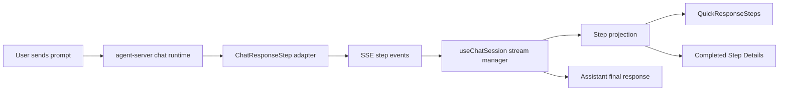

# Agent Chat Codex-Style Response Steps Design

状态：snapshot
文档类型：plan
适用范围：`apps/frontend/agent-chat`、`apps/backend/agent-server`、`packages/core`
最后核对：2026-05-02

## 背景

`agent-chat` 当前已经能展示消息、审批、Think、ThoughtChain、Evidence、Learning 与 Skill reuse，但用户在任务执行过程中更希望看到类似 Codex 的两层反馈：

- 运行中先快速响应：收到请求、读取文件、运行命令、编辑文件、等待审批、自动审核等步骤应及时出现在主线程里。
- 完成后再收束：最终回复给出结果、验证、风险与残留差异；步骤详情可以展开回看，而不是把主线程永久刷成长流水账。

这个能力要作为前后端稳定链路补齐，不能只在前端凭当前事件文案临时拼 UI。

## 目标

- 定义稳定 `ChatResponseStep` contract，作为前端快速步骤流和完成后详情的共同数据源。
- 后端通过 SSE 输出步骤增量与快照，让前端能低延迟展示进展。
- 前端在主聊天消息内展示 Codex-style 快速响应层，完成后折叠为结果摘要 + 步骤详情。
- 保留现有 OpenClaw 语义：审批、Cancel、Recover、Think、ThoughtChain、Evidence、Learning、Skill reuse 都不能被新 UI 替代或隐藏成不可用。
- 先覆盖 `agent-chat` 主会话执行链路，避免扩成全平台轨迹回放系统。

## 非目标

- 不做完整运行轨迹回放平台。
- 不重做 `agent-admin` 的 Runtime / Evidence 中心。
- 不像素级复刻 Codex UI，只参考“快速步骤 + 完成摘要 + 可展开细节”的交互格式。
- 不要求本轮一次性改造所有 graph 和所有 agent；先通过稳定 adapter 覆盖 chat 主链，后续逐步接入更多来源。

## 用户体验

### 运行中快速响应

当用户发起请求后，assistant 消息区域先显示轻量步骤流：

- `收到请求，正在确认上下文`
- `Read chat-home-page.tsx`
- `Read chat-message-adapter.tsx`
- `Ran pnpm typecheck`
- `Edited 3 files`
- `Auto review passed`

展示规则：

- 默认只显示最近若干条和聚合摘要，避免主线程噪音过大。
- 步骤状态用轻量图标或点表示：running、completed、blocked、failed。
- 审批类步骤必须显式可操作，不能只显示为普通日志。
- 命令、文件、URL、测试等 target 使用 monospace 或 pill 形式展示。

### 完成后详情

任务结束后，assistant 最终消息展示：

- 结果摘要：做了什么。
- 验证摘要：跑了什么命令，是否通过。
- 风险或残留：未完成项、外部阻断、既有红灯。
- 可展开步骤详情：按阶段回看所有步骤、命令、文件和错误。

完成态默认收起长步骤，只保留类似 `已处理 4m 1s` 的入口。用户展开后才能看到详细步骤列表。

## Contract

稳定 contract 放在 `packages/core`，采用 schema-first。

建议新增：

- `packages/core/src/tasking/schemas/chat-response-step.ts`
- `packages/core/src/tasking/types/chat-response-step.ts`
- 通过 `packages/core/src/tasking/schemas/index.ts`、`packages/core/src/tasking/types/index.ts`、`packages/core/src/index.ts` 暴露。

核心结构：

```ts
type ChatResponseStepPhase = 'intake' | 'context' | 'explore' | 'approve' | 'execute' | 'edit' | 'verify' | 'summarize';

type ChatResponseStepStatus = 'queued' | 'running' | 'completed' | 'blocked' | 'failed' | 'cancelled';

type ChatResponseStepTarget =
  | { kind: 'file'; label: string; path: string }
  | { kind: 'url'; label: string; href: string }
  | { kind: 'command' | 'approval' | 'test' | 'artifact' | 'message' | 'other'; label: string };

type ChatResponseStep = {
  id: string;
  sessionId: string;
  messageId: string;
  phase: ChatResponseStepPhase;
  status: ChatResponseStepStatus;
  title: string;
  detail?: string;
  detail?: string;
  target?: ChatResponseStepTarget;
  startedAt?: string;
  completedAt?: string;
  order: number;
  source?: 'supervisor' | 'runtime' | 'tool' | 'approval' | 'frontend';
};
```

字段约束：

- `id` 在同一 session 内稳定，重复 delta 更新同一 step。
- `order` 用于前端排序，不依赖到达顺序。
- `detail` 可较长，但不得包含敏感凭据、原始 token、完整私密日志。
- `target.command` 仅记录用户可见命令，不记录环境密钥。
- `phase` / `status` 使用枚举，禁止靠自由文本推断状态。

## Backend

### SSE 事件

`agent-server` 的 chat SSE 增加稳定事件：

- `chat.response.step.started`
- `chat.response.step.updated`
- `chat.response.step.completed`
- `chat.response.step.failed`
- `chat.response.step.snapshot`
- `chat.response.completed`

事件 payload 应通过 `packages/core` schema parse 后再发出。

### Adapter

后端不要求所有 graph 节点立刻直接产出新 contract。先新增 adapter，把现有来源收敛为 `ChatResponseStep`：

- session lifecycle -> intake / summarize
- node status / streamStatus -> context / execute
- execution step events -> execute / verify
- approval interrupt -> approve
- final response / session finished -> summarize

后续 graph 可以逐步原生写入 `ChatResponseStep`，但 controller/service 不应内联长提示词、节点逻辑或手写临时解析。

## Frontend

### Projection

`agent-chat` 新增本地 projection 层，将 SSE step delta 合并成 `ChatResponseStep[]`：

- 同 id upsert。
- 按 `order` 排序。
- 终态 step 保留。
- 运行中最多主显最近 5 条，其余折叠为计数。
- failed / blocked 永远露出，不被折叠隐藏。

推荐落点：

- `src/lib/chat-response-step-projections.ts`
- `src/types/chat-response-step.ts` 如需前端局部 facade。

### Components

推荐新增小组件，避免继续扩写大文件：

- `src/components/chat-response-steps/quick-response-steps.tsx`
- `src/components/chat-response-steps/response-step-detail.tsx`
- `src/components/chat-response-steps/response-step-summary.tsx`

主消息适配：

- `chat-message-adapter.tsx` 在 assistant running / final message 周围接入步骤组件。
- structured cards 继续负责审批、Evidence、Learning、Skill 等业务卡片。
- ThoughtChain 继续保留为认知/治理详情，不与快速步骤流互相替代。

## 数据流



## 错误与审批语义

- `blocked` 用于等待人工审批、外部确认或策略门。
- `failed` 用于不可恢复错误或本轮执行失败。
- `cancelled` 用于用户取消或 runtime cancel。
- 审批 step 必须携带 `target.kind = 'approval'`，并与现有 approval card / interrupt action 共享同一 intent 或 approval id。
- 如果 SSE 断线，前端保留最后 snapshot，并显示连接错误；不要清空已经收到的步骤。

## 测试策略

### Core

- schema parse：合法 step、非法 phase/status、target command/path、snapshot list。
- 类型推导：`z.infer` 与导出入口。

### Backend

- adapter 单测：现有 session/node/execution/approval events 能映射为稳定 steps。
- SSE contract 测试：事件名、payload schema、snapshot 顺序。
- 断线或重复 delta：同 id 更新而非重复追加。

### Frontend

- projection 单测：upsert、排序、折叠、blocked/failed 常显。
- component render：运行中快速步骤、完成后 summary、detail 展开。
- chat message adapter 测试：assistant running 时显示 quick steps，final response 后显示完成摘要入口。

### 验证命令

按受影响范围优先：

```bash
pnpm exec vitest run --config vitest.config.js packages/core/test/<step-contract-test>.test.ts
pnpm exec vitest run --config vitest.config.js apps/backend/agent-server/test/<chat-step-sse-test>.spec.ts
pnpm exec vitest run --config vitest.config.js apps/frontend/agent-chat/test/<step-ui-test>.test.tsx
pnpm exec tsc -p apps/frontend/agent-chat/tsconfig.app.json --noEmit
pnpm exec tsc -p apps/backend/agent-server/tsconfig.json --noEmit
```

## Rollout

1. 先定义 core schema 与最小 parse 测试。
2. 后端 adapter 输出 step snapshot / delta，先覆盖已有事件来源。
3. 前端 hook 接入并投影 steps。
4. 前端消息 UI 展示 quick steps 与完成详情。
5. 补文档，说明新增 contract、SSE 事件与前端展示边界。

## 风险

- 事件重复：通过稳定 id + upsert 解决。
- 主线程噪音过大：运行中只展示摘要和最近步骤，完成后默认折叠。
- 敏感日志泄露：后端 adapter 只输出用户可见摘要，命令和文件 target 做白名单字段。
- 与 ThoughtChain 重叠：快速步骤展示操作轨迹，ThoughtChain 展示认知/治理详情，语义分离。
- 既有事件不完整：MVP 允许部分 step 从现有事件投影，后续逐步让 graph 原生补齐。

## 完成标准

- 用户发起任务后，在最终回复前能看到持续更新的快速步骤流。
- 任务完成后，主回复收束为结果摘要，并可展开查看步骤详情。
- 后端 SSE payload 有稳定 schema，前端不再依赖自由文本猜测步骤状态。
- Approval / Cancel / Recover / Evidence / Learning / Skill reuse 仍按现有能力可用。
- core、backend、frontend 都有最小回归测试和对应文档。
